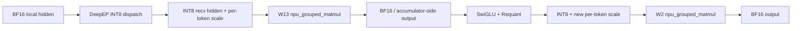
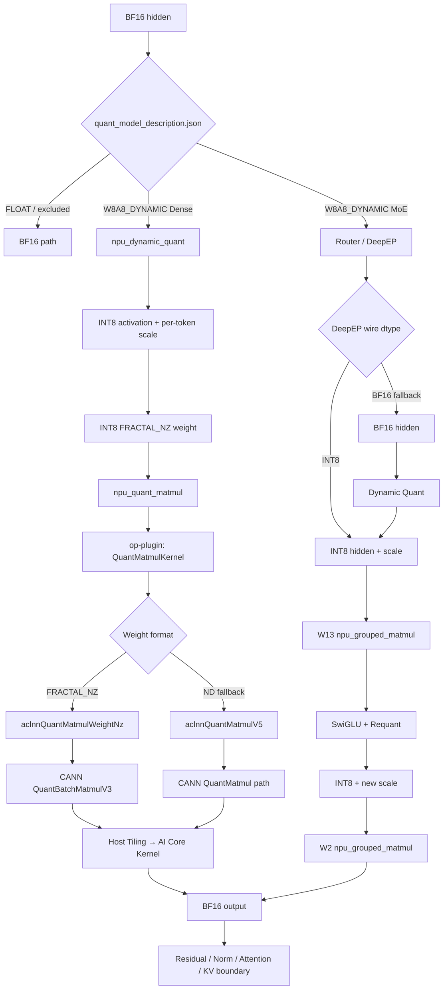

# DeepSeek-V4 W8A8 推理在 Ascend 910C 上到底发生了什么？从量化权重到 INT8 MatMul Kernel

看到模型名：

```text
DeepSeek-V4-Flash-0731-w8a8
```

再看到启动参数：

```bash
--quantization modelslim
```

很容易把它理解成：

> “整个 DeepSeek-V4 都被变成 INT8，然后所有算子都以 INT8 一路跑到底。”

这并不准确。

对当前 DeepSeek-V4-Flash W8A8 + SGLang + Ascend 910C 路径，更接近真实实现的描述是：

```text
BF16 hidden
   │
   ├── 某个被 ModelSlim 标记为 W8A8_DYNAMIC 的 Linear
   │
   ▼
动态 Activation Quant
   │
   ├── INT8 activation
   └── per-token scale
   │
   ▼
INT8 × INT8 Quant MatMul
   │
   ▼
Scale / Bias Epilogue
   │
   ▼
BF16 output
```

到了 MoE，链路又会变成：

```text
BF16 routed hidden
   │
   ├── DeepEP dispatch 可直接量化为 INT8
   │
   ▼
INT8 hidden + per-token scale
   │
   ▼
W13 Grouped INT8 MatMul
   │
   ▼
SwiGLU + Requant
   │
   ▼
INT8 hidden + new scale
   │
   ▼
W2 Grouped INT8 MatMul
   │
   ▼
BF16 output
```

所以 W8A8 真正改变的是**部分计算密集型 GEMM 的数据通路**，而不是把整个推理系统永久改成 INT8。

本文固定到以下源码版本：

| 组件 | 版本 / 快照 |
| --- | --- |
| SGLang | `b63f8416b3b73bafdec029005c5db36bad207b44` |
| msModelSlim | `85d6c6f0266fd1fd77aa19ac26086670ca92d1db` |
| Ascend op-plugin | `e89cc608309341298193f957fa87c964ee561781` |
| CANN ops-nn | 公开 `8.5.0` / master 代码，核对日期 2026-09-21 |

这里使用“Ascend 910C”作为统一硬件称呼。上游文档和 CI 中仍可能使用 Atlas A3 系列名称；本文只在引用源码分支条件时保留上游语义。

---

## 一、先纠正一个最关键的误区：DeepSeek-V4-Flash W8A8 的主线其实是 W8A8_DYNAMIC

SGLang 的 ModelSlim 并不是看到模型名里有 `w8a8`，就把所有 Linear 一刀切成同一种量化实现。

真正决定某一层如何运行的是模型目录中的：

```text
quant_model_description.json
```

SGLang 启动时会在 `ModelConfig._find_quant_modelslim_config()` 中寻找这个文件，并将量化方法解析为 `modelslim`。随后 `ModelSlimConfig` 再根据每个模块的权重描述选择具体 Scheme。

当前映射包括：

```text
"W8A8"
    ↓
ModelSlimW8A8Int8
    ↓
NPUW8A8Int8LinearMethod

"W8A8_DYNAMIC"
    ↓
ModelSlimW8A8Int8
    ↓
NPUW8A8Int8DynamicLinearMethod

"FLOAT"
    ↓
UnquantizedLinearMethod
```

所以判断某个 Linear 是否真的走 INT8，最可靠的问题不是：

> 模型名字是不是 W8A8？

而是：

> `quant_model_description.json` 里这个模块的 `.weight` 被标成了什么 Scheme？

### 官方 DeepSeek-V4-Flash W8A8 配方到底量化哪些层

当前 msModelSlim 的 `deepseek_v4_flash_w8a8.yaml` 给出的主配方非常明确：

```yaml
act:
  scope: per_token
  dtype: int8
  symmetric: true

weight:
  scope: per_channel
  dtype: int8
  symmetric: true
```

也就是：

```text
Activation:
per-token INT8

Weight:
per-channel INT8
```

对应的正是：

```text
W8A8_DYNAMIC
```

配方对 Attention 使用：

```yaml
include:
  - "*attn*"
```

但明确排除：

```text
*wo_a
*wo_b
*compressor.wgate
*compressor.wkv
*indexer.weights_proj
*indexer.compressor.wgate
*indexer.compressor.wkv
```

对 FFN 使用：

```yaml
include:
  - "*ffn*"
```

并排除：

```text
*gate
```

因此对官方 DeepSeek-V4-Flash W8A8 配方，最准确的心智模型不是：

```text
所有 Linear → W8A8
```

而是：

```text
Attention / FFN 中命中的 Linear
        ↓
W8A8_DYNAMIC

wo_a / wo_b
compressor 某些投影
indexer 某些投影
FFN gate
        ↓
保持非该 W8A8_DYNAMIC 路径
```

公开的 DeepSeek-V4-Flash-0731 W8A8 部署资料也明确标注其 `quant_model_description.json` 为 `W8A8_DYNAMIC`。

但这里仍然要保留一个工程边界：

> **具体拿到某一个 checkpoint 时，最终事实仍以它自己的 `quant_model_description.json` 为准。**

同名模型可以被不同量化流程重新导出，不能只靠目录名推断每一层的 Scheme。

### Expert 又落到哪里？

ModelSlim 对普通 Linear 和 MoE Expert 是两套路径。

普通 Linear：

```text
ModelSlimConfig.get_linear_scheme()
```

MoE：

```text
ModelSlimConfig.get_moe_scheme()
```

当前 MoE Scheme 表中：

```text
W8A8_DYNAMIC
    ↓
ModelSlimW8A8Int8MoE
    ↓
NPUW8A8Int8MoEMethod
```

并且 W13 与 W2 会各自建立一个 Scheme：

```text
W13:
gate_proj + up_proj

W2:
down_proj
```

因此官方配方里命中的 FFN / Expert W8A8 并不是调用普通 `npu_quant_matmul` 循环执行很多次，而是后面进入 NPU MoE Runner 的 Grouped MatMul 路径。

这已经给出了全文第一条关键结论：

> **DeepSeek-V4-Flash W8A8 的主路径是“逐模块 W8A8_DYNAMIC”，Dense Linear 和 MoE Expert 最终进入不同 NPU Kernel family。**

---

## 二、Dense W8A8_DYNAMIC：一层 Linear 从 BF16 到 INT8，再回到 BF16

先看最简单的普通 Linear：

```text
Y = XW
```

假设运行时：

```text
X:
[M, K]
BF16

W:
[N, K]
INT8 checkpoint weight
```

### Weight 在加载阶段已经是 INT8

ModelSlim 的 W8A8 Scheme 创建 Parameter 时，直接申请：

```python
weight = torch.empty(
    (output_size_per_partition,
     input_size_per_partition),
    dtype=torch.int8,
)
```

这意味着权重不是每次 Forward 才从 BF16 在线量化。

量化动作已经发生在离线 ModelSlim 阶段。

运行时加载后主要做两件事：

```text
[N,K] INT8
   │
   ├── transpose
   ▼
[K,N] INT8
   │
   ├── npu_format_cast
   ▼
FRACTAL_NZ weight
```

当前 SGLang 的 `npu_format_cast()` 默认目标是：

```text
ACL_FORMAT_FRACTAL_NZ
```

只有 shape 不满足 NZ alignment 时才退回 ND，并打印性能警告。

所以 Weight 的 steady-state 状态更接近：

```text
离线 INT8 Weight
        ↓
加载时转换为 NPU-friendly FRACTAL_NZ
        ↓
后续多次 Forward 复用
```

而不是每轮 Decode 都重新转置和 format cast。

---

### Activation 是在 Forward 时动态量化的

对 `W8A8_DYNAMIC`，当前 SGLang 进入：

```python
NPUW8A8Int8DynamicLinearMethod.apply()
```

核心逻辑非常短：

```python
quant_out, dynamic_scale =
    torch.ops.npu.npu_dynamic_quant(x)

output =
    torch.ops.npu.npu_quant_matmul(
        quant_out,
        layer.weight,
        layer.weight_scale,
        pertoken_scale=dynamic_scale.flatten(),
        bias=bias,
        output_dtype=original_dtype,
    )
```

所以真实 dtype 时间线是：

```text
BF16 X
[M,K]
   │
   ├── npu_dynamic_quant
   ▼
INT8 X
[M,K]

同时生成：
per-token scale
[M]
   │
   ▼
npu_quant_matmul
   │
   ├── X: INT8
   ├── W: INT8
   ├── x scale: per-token
   └── W scale: per-channel
   │
   ▼
BF16 Y
[M,N]
```

注意最后这一点：

```python
output_dtype = original_dtype
```

如果进入这一层的 hidden 是 BF16，Quant MatMul 最终直接返回 BF16。

所以 W8A8 并不意味着：

```text
INT8 → INT8 → INT8 → INT8
```

而更像很多离散的“量化计算岛”：

```text
BF16
 ↓
INT8 GEMM Island
 ↓
BF16
 ↓
Attention / Residual / Norm
 ↓
INT8 GEMM Island
 ↓
BF16
```

这也是为什么官方 DeepSeek-V4-Flash W8A8 配置仍然可以使用：

```bash
--kv-cache-dtype bfloat16
```

W8A8 Weight / Activation 与 KV Cache dtype 是两套完全独立的设计维度。

---

## 三、静态 W8A8 的 `deq_scale / quant_bias` 到底是什么：公式成立，但不是这个 checkpoint 的主路径

初稿把静态 W8A8 当成主线解释了 `deq_scale` 和 `quant_bias`。

严格 Review 后，这部分需要重新定位。

结论是：

> **公式本身是对的，但对当前官方 DeepSeek-V4-Flash W8A8 动态配方，它应该是对照知识，而不是主执行链。**

### ModelSlim 的真实导出公式

当前 msModelSlim 的 AscendV1 saver 对静态 W8A8 明确执行：

```python
deq_scale =
    input_scale * weight_scale
```

如果原始浮点 Bias 为 `fp_bias`，量化权重为 `Qw`，激活 zero-point / offset 为 `input_offset`，还会计算：

```python
correction =
    Qw.float().sum(dim=1)
    * input_offset.float()
```

最终：

```python
quant_bias =
    round(
        fp_bias / deq_scale
        - correction
    ).int32()
```

所以更完整的关系是：

```text
deq_scale
=
activation_scale × weight_scale
```

以及：

```text
quant_bias
=
round(
    fp_bias / deq_scale
    -
    Σ(Qw) × input_offset
)
```

不能把 `quant_bias` 简化成：

```text
bias / deq_scale
```

因为当 activation quantization 有非零 offset 时，需要把 offset 对 MatMul 累加结果造成的系统性偏移预先折进 quantized bias。

### 静态 W8A8 在 SGLang 中怎么使用这些量

静态路径是：

```text
BF16 X
   │
   ├── 固定 input_scale / input_offset
   ▼
npu_quantize
   │
   ▼
INT8 X
   │
   ├── INT8 W
   ├── deq_scale
   └── quant_bias
   ▼
npu_quant_matmul
   │
   ▼
BF16 Y
```

SGLang 调用：

```python
torch.ops.npu.npu_quant_matmul(
    x,
    layer.weight,
    layer.deq_scale,
    bias=quant_bias,
    output_dtype=original_dtype,
)
```

对 BF16 原模型，ModelSlim 会把综合 dequant scale 以对应 BF16 输出路径可消费的格式导出；SGLang 再直接把 checkpoint 中的 `deq_scale` 传给 NPU QuantMatmul。

### 为什么 DeepSeek-V4-Flash 0731 W8A8 主文不应该围绕它写

因为官方 W8A8 配方实际选择的是：

```text
W8A8_DYNAMIC
```

动态路径不携带这套：

```text
input_scale
input_offset
deq_scale
quant_bias
```

作为 Dense Linear 主执行参数。

动态路径真正传进 Quant MatMul 的是：

```text
weight_scale
+
runtime per-token scale
+
optional floating bias
```

因此本文后面默认讨论的 Dense 主线应该是：

```text
npu_dynamic_quant
        ↓
INT8 + per-token scale
        ↓
npu_quant_matmul
```

静态 W8A8 只作为“为什么某些其他 ModelSlim checkpoint 会出现 `deq_scale/quant_bias`”的补充理解。

---

## 四、MoE W8A8：为什么 Expert 走 `npu_grouped_matmul`，而不是普通 QuantMatmul

DeepSeek-V4 的 MoE 与普通 Linear 有一个根本区别：

同一层不是只有一个 Weight Matrix，而是很多 Expert：

```text
Expert 0
Expert 1
Expert 2
...
Expert E-1
```

Router 会把当前 Token 分给不同 Expert。

假设路由之后：

```text
Expert 0: 12 tokens
Expert 1:  7 tokens
Expert 2:  0 tokens
Expert 3: 19 tokens
...
```

如果逐 Expert 在 Python 层调用很多次 `npu_quant_matmul`，会产生大量小 GEMM 和 launch overhead。

所以当前 NPU MoE Runner 使用：

```python
torch.ops.npu.npu_grouped_matmul(...)
```

并通过：

```text
expert_tokens / group_list
```

告诉 Kernel 每个 Expert 有多少行。

### W13 与 W2 是两次不同的 Grouped GEMM

ModelSlim W8A8 MoE 创建：

```text
W13:
[E, 2I, H]
INT8

W2:
[E, H, I]
INT8
```

经过加载后，权重同样会转置并进入 NPU-friendly layout。

Ascend Runner 的主执行链是：

```text
Routed Hidden
    ↓
W13 Grouped MatMul
    ↓
SwiGLU
    ↓
Requant
    ↓
W2 Grouped MatMul
    ↓
BF16 Hidden
```

对 W8A8 INT8 Expert，当前 Kernel class 是：

```text
NPUW8A8Int8MoEMethod
```

其内部持有：

```python
GroupedMatmul()
HiddenStatesDynamicQuant(
    quant_dtype=torch.int8
)
```

而普通 GroupedMatmul 最终就是：

```python
torch.ops.npu.npu_grouped_matmul(
    x=[hidden_states],
    weight=[weight],
    scale=[weight_scale],
    per_token_scale=[pertoken_scale],
    group_list=expert_tokens,
    ...
)
```

因此 Dense 与 MoE 可以非常清楚地区分：

```text
Dense Linear
    ↓
npu_quant_matmul

MoE Expert
    ↓
npu_grouped_matmul
```

两者都可以是 INT8×INT8，但 Kernel 的 workload shape 和调度方式完全不同。

---

## 五、DeepEP W8A8：INT8 Dispatch 后，到 W13 之前会不会再量化一次？

这是最容易因为模块分层而误判的一段。

如果只看：

```python
NPUW8A8Int8MoEMethod
```

会发现它内部有：

```python
HiddenStatesDynamicQuant(
    quant_dtype=torch.int8
)
```

于是很容易认为：

```text
DeepEP Dispatch:
BF16 → INT8

到了 Expert:
INT8 → 又 quant 一次？
```

当前官方 W8A8 + DeepEP 正常路径**不会这样做**。

### 第一步：W8A8 Expert 会要求 DeepEP 输出 INT8

`NPUW8A8Int8MoEMethod` 在 W13 Weight 后处理阶段会把 Dispatcher output dtype 设置为：

```text
int8
```

DeepEP dispatcher 因此选择 INT8 数据面。

在当前 Python API 较新的 DeepEP Buffer 上，SGLang 会传：

```text
quant_mode = "int8"
```

旧的 Ascend 910C / A3 legacy pybind 如果不暴露这个参数，SGLang 则让 vendor DeepEP runtime 根据运行环境选择 BF16/INT8；官方 DeepSeek-V4-Flash W8A8 CI 当前仍设置：

```bash
DEEP_NORMAL_MODE_USE_INT8_QUANT=1
```

用于这一兼容链路。

所以 Dispatch 可以把：

```text
BF16 local hidden
```

直接变成：

```text
INT8 recv hidden
+
per-token scale
```

然后跨 EP Group 传输。

### 第二步：DeepEP 把 scale 和 payload 一起交给 Ascend Runner

`DeepEPNormalDispatchOutput` 本身就包含：

```text
hidden_states
hidden_states_scale
topk_ids
topk_weights
num_recv_tokens_per_expert
```

如果 DeepEP 返回的是 tuple：

```text
(hidden_states, hidden_states_scale)
```

SGLang 会把它拆出来并一直传给 Ascend Runner。

`pre_permute_deepep_normal_to_ascend()` 没有丢掉这个 scale，而是构造：

```text
AscendRunnerInput:
  hidden_states
  hidden_states_scale
  expert_tokens
```

### 第三步：W13 只有在 scale 缺失时才重新量化

`NPUW8A8Int8MoEMethod.apply()` 的关键判断是：

```python
if pertoken_scale is None:
    hidden_states, pertoken_scale =
        self.hidden_states_quantizer(hidden_states)
```

也就是说：

```text
DeepEP 已经输出：
INT8 hidden + scale
        ↓
pertoken_scale != None
        ↓
跳过 HiddenStatesDynamicQuant
        ↓
直接进入 W13 GroupedMatmul
```

所以正确配置下完整路径是：



这里 DeepEP Dispatch → W13 之间确实避免了第二次 activation quant。

但必须加上条件：

> **只有当 DeepEP 实际按 INT8 dispatch，并且返回了匹配的 `hidden_states_scale` 时，W13 才完全跳过二次量化。**

如果因为配置、runtime 能力或 fallback 路径导致 DeepEP 输出 BF16：

```text
hidden_states_scale = None
```

W13 就会在 GEMM 前调用自己的 `HiddenStatesDynamicQuant`。

所以最准确的结论是：

```text
正确的 INT8 DeepEP 路径：
一次量化，不二次量化

BF16 fallback：
Expert 前补做一次动态量化
```

这也是为什么 Profile 时不能只看到“模型是 W8A8”就假设通信线上一定是 INT8；要同时确认 DeepEP dispatcher dtype。

---

## 六、`npu_quant_matmul` 往下到底去哪：SGLang → op-plugin → ACLNN → CANN AI Core

现在进入本文最底层。

对 DeepSeek-V4-Flash W8A8 的 Dense 动态量化路径，SGLang 最终调用：

```python
torch.ops.npu.npu_quant_matmul(
    quant_out,
    layer.weight,
    layer.weight_scale,
    pertoken_scale=dynamic_scale,
    output_dtype=torch.bfloat16,
)
```

这还不是最终 NPU Kernel。

真实链路至少还有三层：

```text
SGLang
  ↓
torch.ops.npu
  ↓
Ascend op-plugin
  ↓
ACLNN
  ↓
CANN Operator Host / Tiling
  ↓
AI Core Device Kernel
```

### 1. SGLang 先把 Weight 转成 FRACTAL_NZ

前面已经看到：

```python
weight = weight.transpose(...)
weight = npu_format_cast(weight)
```

而默认目标：

```text
ACL_FORMAT_FRACTAL_NZ
```

这一步非常关键，因为它直接影响 op-plugin 后面选择哪个 ACLNN 接口。

### 2. op-plugin 会先检查 Weight 是不是 NZ

当前 Ascend op-plugin 的：

```text
QuantMatmulKernelNpuOpApi.cpp
```

并不是无条件调用一个固定接口。

它先判断：

```cpp
if (is_nz_format(x2)) {
    ...
} else {
    ...
}
```

其中 NZ 包括：

```text
ACL_FORMAT_FRACTAL_NZ
ACL_FORMAT_FRACTAL_NZ_C0_4
ACL_FORMAT_FRACTAL_NZ_C0_16
```

如果 Weight 是 NZ，op-plugin 会要求：

```text
aclnnQuantMatmulWeightNz
```

可用。

如果 Weight 是普通 ND，则检查：

```text
aclnnQuantMatmulV5
```

### 3. 因此 DeepSeek-V4 W8A8 的典型路径不是 V5，而是 WeightNz

对 SGLang 正常成功完成 FRACTAL_NZ format cast 的 INT8 Weight：

```text
x2 format = FRACTAL_NZ
```

于是实际 dispatch 是：

```text
torch.ops.npu.npu_quant_matmul
        ↓
op-plugin
QuantMatmulKernelNpuOpApi.cpp
        ↓
is_nz_format(x2) == true
        ↓
aclnnQuantMatmulWeightNz
```

这是比“`torch.ops.npu` 往下进入 CANN QuantMatmul”更精确的一层。

如果 Weight shape 不满足 NZ requirement，SGLang 的 `npu_format_cast()` 会退回 ND。

这种情况下链路会变成：

```text
npu_quant_matmul
    ↓
op-plugin
    ↓
aclnnQuantMatmulV5
```

所以不能把：

```text
npu_quant_matmul == aclnnQuantMatmulWeightNz
```

写成无条件恒等式。

更准确的是：

```text
FRACTAL_NZ Weight
→ aclnnQuantMatmulWeightNz

ND Weight
→ aclnnQuantMatmulV5
```

### 4. WeightNz 在当前 CANN 里落到 QuantBatchMatmulV3

CANN 公开 `ops-nn` 代码中：

```text
matmul/
└── quant_batch_matmul_v3/
    ├── op_api
    ├── op_host
    ├── op_kernel
    └── tests
```

其 README 明确写出：

```text
aclnnQuantMatmulV3
aclnnQuantMatmulV4
aclnnQuantMatmulWeightNz
aclnnQuantMatmulV5
```

等接口可以进入 QuantBatchMatmulV3 家族；而当前公开目录中 `aclnnQuantMatmulWeightNz` 的 API 头仍位于 `quant_batch_matmul_v3`。

对 Ascend 910C 所属的 Atlas A3 产品分支，公开算子说明支持：

```text
INT8 x1
INT8 x2
FLOAT32 per-token scale
BF16 output
```

与 SGLang W8A8_DYNAMIC Dense 路径吻合。

因此一条典型执行链可以明确写成：

```text
DeepSeek-V4 Linear
        ↓
ModelSlimW8A8Int8
(W8A8_DYNAMIC)
        ↓
NPUW8A8Int8DynamicLinearMethod
        ↓
npu_dynamic_quant
        ↓
INT8 activation + per-token scale
        ↓
torch.ops.npu.npu_quant_matmul
        ↓
Ascend op-plugin
QuantMatmulKernelNpuOpApi.cpp
        ↓
Weight = FRACTAL_NZ ?
        │
        ├── Yes
        │     ↓
        │  aclnnQuantMatmulWeightNz
        │     ↓
        │  QuantBatchMatmulV3
        │
        └── No
              ↓
           aclnnQuantMatmulV5
              ↓
           newer QuantMatmul dispatch path
```

### 5. 再往下就是 Host Tiling → AI Core Kernel

CANN `quant_batch_matmul_v3` 公开目录明确包含：

```text
op_host/
op_kernel/
```

也就是说 ACLNN 接口进入算子后，仍要经历：

```text
Host-side shape / dtype / format check
        ↓
Tiling strategy selection
        ↓
Workspace planning
        ↓
Tiling data
        ↓
AI Core device kernel launch
```

CANN 当前算子列表也将 `quant_batch_matmul_v3` 标记为：

```text
AI Core
```

而不是 AICPU 算子。

这一步终于把我们从：

```text
Python Linear
```

追到了：

```text
Ascend 910C AI Core Quantized MatMul
```

---

## 七、为什么这里仍然不能写死某个 Tiling Key 或 Kernel Variant

到这里很容易继续写：

> “DeepSeek-V4 Decode 一定进入 XXX TilingKey，然后执行 XXX Kernel。”

当前公开源码还不足以支持这个结论。

因为真正的 Tiling 选择会受到至少这些变量影响：

```text
M:
当前 Token / Batch rows

N:
当前投影输出维

K:
hidden / input width

Weight format:
FRACTAL_NZ or ND

Input dtype:
INT8

Scale mode:
per-token / per-channel

Output dtype:
BF16

SoC:
Ascend 910C

CANN build/version:
实际容器中的版本
```

而 Prefill 和 Decode 的 M 差异尤其巨大：

```text
Prefill:
M 可能很大

Decode:
M 往往很小
```

所以即便它们都叫：

```text
QuantBatchMatmulV3
```

内部也可能进入完全不同的 tiling strategy / kernel specialization。

本文能从公开源码严格证明的是：

```text
SGLang API
→ op-plugin branch
→ ACLNN entry
→ CANN operator family
→ host tiling exists
→ AI Core kernel
```

但不能在没有实际运行证据时把最后一步进一步写成某个固定：

```text
tiling_key = ...
kernel_variant = ...
```

真正要把这一段钉死，需要在目标 Ascend 910C 环境上做：

```text
msprof / torch_npu profiler
+
operator dump
+
tiling log / kernel metadata
```

然后用真实的：

```text
M/N/K
operator name
kernel name
stream
duration
```

反查 CANN 的 tiling branch。

这也是下一篇“从 Operator 到 Kernel”文章真正应该开始的地方。

---

## 八、把 DeepSeek-V4-Flash W8A8 的真实一层重新画出来

经过四轮严格 Review 后，这篇文章最应该留下的不是“W8A8=INT8”的概念，而是下面这张执行图：



这张图也解释了为什么一个 W8A8 模型仍然会在 profiler 里看到大量：

```text
BF16
RMSNorm
Attention
HCCL / DeepEP
KV Cache
```

W8A8 不是把系统里所有 Tensor 都压成 INT8。

它真正做的是：

> **在 ModelSlim 指定的量化 Layer 上，把 GEMM 的 Weight 和 Activation 数据通路切换到 INT8；在 GEMM 边界之外，系统仍大量以 BF16 作为计算和状态交换格式。**

---

## 九、源码阅读地图

如果要自己复核，建议按下面顺序追：

### 1. Checkpoint 到 Scheme

```text
SGLang:
configs/model_config.py
    ↓
_find_quant_modelslim_config()

quantization/modelslim/modelslim.py
    ↓
ModelSlimConfig
    ↓
get_linear_scheme()
get_moe_scheme()
```

### 2. 官方 DeepSeek-V4-Flash W8A8 量化规则

```text
msModelSlim:
lab_practice/deepseek_v4/
deepseek_v4_flash_w8a8.yaml
```

重点看：

```text
W8A8_DYNAMIC
include
exclude
```

### 3. Dense INT8

```text
modelslim_w8a8_int8.py
    ↓
NPUW8A8Int8DynamicLinearMethod
    ↓
npu_dynamic_quant
    ↓
npu_quant_matmul
```

### 4. MoE INT8

```text
modelslim_w8a8_int8_moe.py
    ↓
NPUW8A8Int8MoEMethod
    ↓
DeepEP dispatcher
    ↓
AscendMoeRunner
    ↓
npu_grouped_matmul
```

### 5. PyTorch NPU 到 CANN

```text
Ascend/op-plugin:
QuantMatmulKernelNpuOpApi.cpp
    ↓
FRACTAL_NZ?
    ├── aclnnQuantMatmulWeightNz
    └── aclnnQuantMatmulV5

CANN ops-nn:
quant_batch_matmul_v3/
    ├── op_host
    └── op_kernel
```

---

## 十、这篇文章最终能证明到哪里

为了避免“越往底层越靠猜”，最后把证据边界明确列出来。

### 已经由源码直接确认

- DeepSeek-V4-Flash 官方 W8A8 配方主线是 `W8A8_DYNAMIC`；
- Activation 是 per-token INT8，Weight 是 per-channel INT8；
- 多个 `wo_a / wo_b / compressor / indexer` 投影以及 FFN gate 被官方配方排除；
- SGLang Dense 动态 W8A8 使用 `npu_dynamic_quant → npu_quant_matmul`；
- Weight 在加载阶段被尝试转为 FRACTAL_NZ；
- W8A8 MoE 使用 `NPUW8A8Int8MoEMethod → npu_grouped_matmul`；
- DeepEP INT8 dispatch 能把 `hidden_states_scale` 一路传到 W13，从而避免第二次 activation quant；
- op-plugin 对 FRACTAL_NZ Weight 选择 `aclnnQuantMatmulWeightNz`；
- `aclnnQuantMatmulWeightNz` 属于当前公开 CANN `QuantBatchMatmulV3` 家族；
- 该算子由 AI Core 执行，并存在独立 host tiling 与 device kernel 层。

### 必须结合具体 checkpoint / runtime 再确认

- 某个下载下来的 `DeepSeek-V4-Flash-0731-w8a8` 是否完全按当前官方 recipe 导出；
- 每一个具体模块在它的 `quant_model_description.json` 中最终是什么 Scheme；
- DeepEP legacy runtime 是否真正启用了 INT8 wire path；
- FRACTAL_NZ cast 是否因为某个特殊 shape 失败并退回 ND；
- 实际容器中的 CANN 版本最终命中哪个 tiling strategy。

### 没有 profiler / tiling log 就不应该宣称

- 某个固定 tiling key；
- 某个固定内部 kernel specialization；
- Prefill / Decode 必然使用同一个 QuantBatchMatmul kernel variant；
- “INT8 MatMul Kernel 就一定是当前端到端瓶颈”。

到这里，我们才真正把：

```text
DeepSeek-V4 W8A8
```

从一个模型目录上的标签，拆成了：

```text
量化配置
→ Layer Scheme
→ Weight Layout
→ Activation Quant
→ INT8 GEMM
→ DeepEP / MoE Grouped GEMM
→ op-plugin
→ ACLNN
→ CANN Tiling
→ Ascend 910C AI Core
```

一条可以逐层用源码和 profiler 验证的工程执行链。


## 参考源码

- SGLang `b63f8416b3b73bafdec029005c5db36bad207b44`
  - `python/sglang/srt/layers/quantization/modelslim/modelslim.py`
  - `python/sglang/srt/layers/quantization/modelslim/schemes/modelslim_w8a8_int8.py`
  - `python/sglang/srt/layers/quantization/modelslim/schemes/modelslim_w8a8_int8_moe.py`
  - `python/sglang/srt/hardware_backend/npu/quantization/linear_method_npu.py`
  - `python/sglang/srt/hardware_backend/npu/quantization/moe_methods.py`
  - `python/sglang/srt/layers/moe/moe_runner/ascend.py`
  - `python/sglang/srt/layers/moe/token_dispatcher/deepep.py`
- msModelSlim `85d6c6f0266fd1fd77aa19ac26086670ca92d1db`
  - `lab_practice/deepseek_v4/deepseek_v4_flash_w8a8.yaml`
  - `msmodelslim/core/quant_service/modelslim_v1/save/ascendv1.py`
- Ascend op-plugin `e89cc608309341298193f957fa87c964ee561781`
  - `op_plugin/ops/opapi/QuantMatmulKernelNpuOpApi.cpp`
- CANN ops-nn
  - `matmul/quant_batch_matmul_v3`
  - `matmul/quant_batch_matmul_v4`

版本变化后，请重新核对这些入口；尤其是 DeepEP dispatcher dtype、QuantMatmul ACLNN 分流和 CANN tiling。
