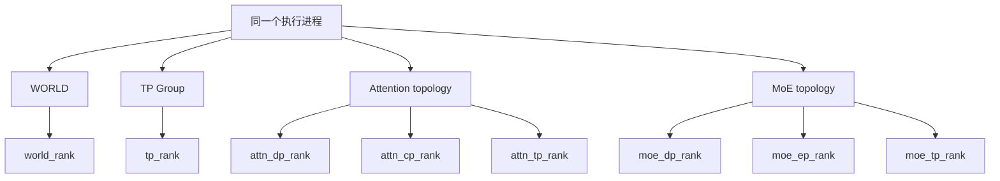
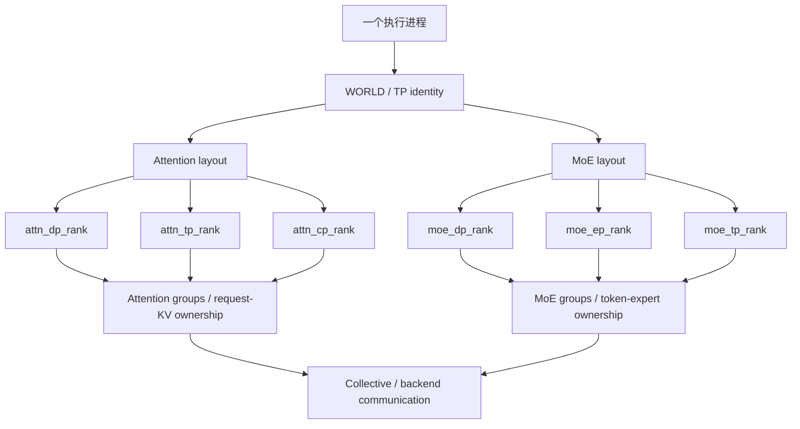

# SGLang 里的 Rank 和 Group 到底是什么？用 DeepSeek-V4 画清 TP Rank、DP Rank、EP Rank

刚开始阅读 SGLang 的分布式源码时，最容易让人困惑的往往不是 AllReduce、All-to-All，而是一些看起来非常基础的变量：

```python
tp_rank
dp_rank

attn_tp_rank
attn_dp_rank
attn_cp_rank

moe_dp_rank
moe_ep_rank
moe_tp_rank
```

为什么一个进程同时有这么多个 Rank？`tp_rank=6` 和 `moe_ep_rank=6` 是不是同一件事？`dp_rank=1` 是不是“第二张卡”？为什么 DeepSeek-V4 的 Attention 和 MoE 又各自有一套 Rank？

这些问题如果只用“TP 是切 Tensor、DP 是切数据、EP 是切 Expert”来回答，很快就会卡住。因为在 SGLang 里，真正需要建立的不是三个缩写的定义，而是一套**坐标系意识**：

> **Rank 表示一个执行进程在某个并行坐标系中的位置；Group 则决定这套坐标系里谁和谁是一组、哪些 Rank 会共同参与某次通信。**

同一个执行进程完全可以同时拥有：

```text
world_rank      = 6
tp_rank         = 6
attn_dp_rank    = 3
attn_tp_rank    = 0
moe_dp_rank     = 1
moe_ep_rank     = 2
moe_tp_rank     = 0
```

这些数字并不矛盾，只是在回答不同的问题。

本文以 DeepSeek-V4 的 SGLang 推理场景作为贯穿案例，重点解释 TP、DP Attention 与 MoE EP 的 Rank / Group 关系。源码固定到：

```text
sgl-project/sglang
commit: 176dbcb85d3b7737564e4911947035cc0af65f0a
核对日期：2026-09-21
```

主要源码入口包括：

- [`runtime_context.py`](https://github.com/sgl-project/sglang/blob/176dbcb85d3b7737564e4911947035cc0af65f0a/python/sglang/srt/runtime_context.py)
- [`distributed/parallel_state.py`](https://github.com/sgl-project/sglang/blob/176dbcb85d3b7737564e4911947035cc0af65f0a/python/sglang/srt/distributed/parallel_state.py)
- [`managers/data_parallel_controller.py`](https://github.com/sgl-project/sglang/blob/176dbcb85d3b7737564e4911947035cc0af65f0a/python/sglang/srt/managers/data_parallel_controller.py)
- [`layers/dp_attention.py`](https://github.com/sgl-project/sglang/blob/176dbcb85d3b7737564e4911947035cc0af65f0a/python/sglang/srt/layers/dp_attention.py)
- [`entrypoints/engine.py`](https://github.com/sgl-project/sglang/blob/176dbcb85d3b7737564e4911947035cc0af65f0a/python/sglang/srt/entrypoints/engine.py)
- [`managers/scheduler.py`](https://github.com/sgl-project/sglang/blob/176dbcb85d3b7737564e4911947035cc0af65f0a/python/sglang/srt/managers/scheduler.py)

SGLang 的并行实现仍在快速演进，因此下面讲的是这个固定 commit 的实现语义，而不是把某个类名或参数组合当成永久 API。

---

## 一、Rank 不是“第几张卡”，而是“你在这个 Group 里排第几”

先不要管 TP、DP、EP，只看四个执行进程：

```text
Process A
Process B
Process C
Process D
```

假设它们共同组成一个 WORLD：

```text
WORLD Group

┌────────┬────────┬────────┬────────┐
│ Rank 0 │ Rank 1 │ Rank 2 │ Rank 3 │
└────────┴────────┴────────┴────────┘
```

此时：

```text
world_size = 4
```

而每个进程都有一个 WORLD Rank：

```text
A → world_rank = 0
B → world_rank = 1
C → world_rank = 2
D → world_rank = 3
```

这里的 Rank 描述的是**进程在一个通信集合中的位置**。它不等价于 NPU ID、GPU ID、PCIe 序号，也不等价于操作系统 PID。

一个真实进程完全可能是：

```text
PID         = 40580
device_id   = 3
world_rank  = 6
```

三个数字各自描述不同的东西。

再把八个 WORLD Rank 分成两个 Group：

```text
WORLD
0 1 2 3 4 5 6 7

Group A = [0, 1, 2, 3]
Group B = [4, 5, 6, 7]
```

对于 WORLD Rank 6 来说，它在整个 WORLD 中当然还是 6，但在 Group B 中的位置是 2：

```text
Group B

WORLD rank:  4   5   6   7
local rank:  0   1   2   3
                     ↑
```

因此：

```text
world_rank   = 6
rank_in_group = 2
```

SGLang 当前的 `get_tensor_model_parallel_rank()` 本质上就是返回当前进程在 TP Group 中的 `rank_in_group`；`get_moe_expert_parallel_rank()` 同样返回它在 MoE EP Group 中的 `rank_in_group`。对应 getter 可以直接在 [`parallel_state.py`](https://github.com/sgl-project/sglang/blob/176dbcb85d3b7737564e4911947035cc0af65f0a/python/sglang/srt/distributed/parallel_state.py#L3088-L3168) 中看到。

所以以后在源码里看到：

```python
rank = 2
```

第一反应不应该是“第三张卡”，而应该先问：

> **这是哪个 Group / 哪套并行坐标系里的 Rank 2？**

这个问题没有回答之前，单独一个 `rank=2` 几乎没有完整含义。

对于 DeepSeek-V4，一批相同的物理 Rank 在不同计算阶段还会被重新解释：



这张图后面会不断用到。

---

## 二、SGLang 里的 `dp_rank` 最特殊：Native DP 与 DPA 下不是同一种拓扑语义

TP Rank 相对直观：你属于哪个 TP Group，在里面排第几。

真正容易写错的是 `dp_rank`。

当前 SGLang 同一个 `--dp-size` 参数可以出现在两种很不一样的运行方式里：

1. **Native DP**：复制完整模型并把不同请求路由到不同 replica；
2. **DP Attention / DPA**：在一个 TP model-parallel world 内，让 Attention 按 DP shard 处理不同请求 / KV，再在后续 MoE 阶段重新组织数据。

官方 DPA 文档也明确区分了这两种模式。最关键的是：**不要因为它们都叫 `dp_size`，就认为 `dp_rank` 永远表示同一种进程拓扑。**

### Native DP：`dp_rank` 是第几个完整 replica

当前 `DataParallelController` 在未启用 DP Attention 时走 `launch_dp_schedulers()`：

```python
for dp_rank in range(get_parallel().dp_size):
    ...
    launch_tensor_parallel_group(..., dp_rank)
```

对应源码在 [`data_parallel_controller.py`](https://github.com/sgl-project/sglang/blob/176dbcb85d3b7737564e4911947035cc0af65f0a/python/sglang/srt/managers/data_parallel_controller.py#L366-L428)。

假设：

```text
tp_size = 4
dp_size = 2
enable_dp_attention = False
PP = 1
```

那么直觉上就是两套完整的 4-way TP replica：

```text
Native DP replica 0
TP ranks: 0 1 2 3

Native DP replica 1
TP ranks: 0 1 2 3
```

每个 replica 都有自己的 TP world。此时 `dp_rank=0/1` 主要是在回答：

> **这个 Scheduler / Worker 属于第几个 Data Parallel replica？**

当前 `runtime_context.py` 对 `dp_rank` 的说明也特意强调：它是 DataParallelController 在 spawn 时赋予的 replica identity，并**不是某个统一 DP process group 的 `rank_in_group`**。源码可见 [`runtime_context.py`](https://github.com/sgl-project/sglang/blob/176dbcb85d3b7737564e4911947035cc0af65f0a/python/sglang/srt/runtime_context.py#L197-L211)。

### DPA：`dp_rank` 会由 `tp_rank` 派生

启用：

```text
--enable-dp-attention
```

以后，`DataParallelController` 不再按 `dp_size` 启动多套完整 TP replica，而是走 `launch_dp_attention_schedulers()`。这个路径只调用一次 `launch_tensor_parallel_group(...)`，随后在 TP Rank 循环内部，根据 `tp_rank` 计算当前进程属于哪个 Attention DP shard。源码见 [`data_parallel_controller.py`](https://github.com/sgl-project/sglang/blob/176dbcb85d3b7737564e4911947035cc0af65f0a/python/sglang/srt/managers/data_parallel_controller.py#L548-L600) 与 [`data_parallel_controller.py`](https://github.com/sgl-project/sglang/blob/176dbcb85d3b7737564e4911947035cc0af65f0a/python/sglang/srt/managers/data_parallel_controller.py#L641-L672)。

关键代码是：

```python
_, _, dp_rank, _ = compute_dp_attention_world_info(
    enable_dp_attention,
    tp_rank,
    tp_size,
    dp_size,
    attn_cp_size,
)
```

所以在 DPA 普通启动路径里，传进 Scheduler 的 `dp_rank` 本身就是从 `tp_rank` 的 Attention 拓扑位置派生出来的。

Scheduler 初始化时又会单独计算并保存：

```python
attn_dp_rank
```

见 [`scheduler.py`](https://github.com/sgl-project/sglang/blob/176dbcb85d3b7737564e4911947035cc0af65f0a/python/sglang/srt/managers/scheduler.py#L519-L548)。

在普通、非 elastic 的 DPA 启动时，`dp_rank` 与 `attn_dp_rank` 往往数值相同，因为它们来自同一套 `tp_rank → Attention DP` 映射；但两者最好仍分开理解：

- `dp_rank` 是 Scheduler / controller 层拿来标识和路由当前 DP worker slot 的身份；
- `attn_dp_rank` 是当前进程在 Attention 拓扑中的逻辑 DP 坐标。

当前 `runtime_context.py` 甚至明确写到，`attn_dp_rank` 是从 `tp_rank` 的 Attention topology 计算得到，并可能在 elastic scale-up 中移动；它没有被建模成普通 group getter。见 [`runtime_context.py`](https://github.com/sgl-project/sglang/blob/176dbcb85d3b7737564e4911947035cc0af65f0a/python/sglang/srt/runtime_context.py#L184-L205)。

因此，不要把这几个名字写成完全对称的三兄弟：

```text
tp_rank
dp_rank
ep_rank
```

更准确的做法是先确认当前模式：

| 名称 | 当前 SGLang 中更准确的理解 |
| --- | --- |
| `tp_rank` | 当前 TP Group 中的位置 |
| `dp_rank` | Controller / spawn 层的 DP worker / replica identity；DPA 路径下由 Attention shard 映射得到 |
| `attn_dp_rank` | Attention 拓扑中的 DP 维坐标 |
| `moe_dp_rank` | MoE 拓扑中的 DP 维坐标 / 对应 MoE DP Group 的位置语义 |
| `moe_ep_rank` | MoE EP Group 中的位置 |

同一个单词 `DP`，在不同层级里描述的并不是完全相同的对象。

---

## 三、用 `TP16 / DP8` 画清 DPA：这里不是 16×8=128 张卡

现在进入最容易产生误解的例子。

假设启动配置满足：

```text
tp_size = 16
dp_size = 8
enable_dp_attention = True
attn_cp_size = 1
PP = 1
```

看到 `TP=16`、`DP=8`，如果把传统 Native DP 的心智模型直接套过来，很容易下意识认为：

```text
16 × 8 = 128 devices
```

**在这个 DPA 配置里，这个结论是错的。**

当前 SGLang 对 Attention 宽度的派生逻辑是：

```python
attn_dp_size = dp_size if enable_dp_attention else 1
attn_tp_size = tp_size // attn_dp_size // attn_cp_size
```

见 [`runtime_context.py`](https://github.com/sgl-project/sglang/blob/176dbcb85d3b7737564e4911947035cc0af65f0a/python/sglang/srt/runtime_context.py#L249-L281)。

代入：

```text
attn_dp_size = 8
attn_tp_size = 16 / 8 / 1 = 2
```

也就是说，原本这一组 16 个 TP Rank，被 Attention 重新解释成：

```text
8 个 Attention-DP shard
×
每个 shard 2 个 Attention-TP rank
```

可以直接画成：

```text
                         attn_tp_rank

                         0      1
                       ┌──────┬──────┐
attn_dp_rank = 0       │ TP0  │ TP1  │
attn_dp_rank = 1       │ TP2  │ TP3  │
attn_dp_rank = 2       │ TP4  │ TP5  │
attn_dp_rank = 3       │ TP6  │ TP7  │
attn_dp_rank = 4       │ TP8  │ TP9  │
attn_dp_rank = 5       │ TP10 │ TP11 │
attn_dp_rank = 6       │ TP12 │ TP13 │
attn_dp_rank = 7       │ TP14 │ TP15 │
                       └──────┴──────┘
```

对应关系：

| `tp_rank` | `attn_dp_rank` | `attn_tp_rank` |
| ---: | ---: | ---: |
| 0 | 0 | 0 |
| 1 | 0 | 1 |
| 2 | 1 | 0 |
| 3 | 1 | 1 |
| 4 | 2 | 0 |
| 5 | 2 | 1 |
| 6 | 3 | 0 |
| 7 | 3 | 1 |
| 8 | 4 | 0 |
| 9 | 4 | 1 |
| 10 | 5 | 0 |
| 11 | 5 | 1 |
| 12 | 6 | 0 |
| 13 | 6 | 1 |
| 14 | 7 | 0 |
| 15 | 7 | 1 |

当前源码的坐标展开公式是：

```text
tp_rank
=
(attn_dp_rank × attn_cp_size + attn_cp_rank)
× attn_tp_size
+
attn_tp_rank
```

并且 `attn_tp_rank` 是最快变化的维度。具体实现在 [`derive_attention_ranks()`](https://github.com/sgl-project/sglang/blob/176dbcb85d3b7737564e4911947035cc0af65f0a/python/sglang/srt/runtime_context.py#L262-L281)。

在 `attn_cp_size=1` 时，它简化成：

```text
tp_rank
=
attn_dp_rank × attn_tp_size
+
attn_tp_rank
```

所以 `tp_rank=10`：

```text
attn_dp_rank = 5
attn_tp_rank = 0
```

这里发生的是**同一组 16 个 model-parallel Rank 的坐标重解释**，而不是额外复制 8 套 16 卡模型。

### 为什么一定要把 Native DP 摆在旁边比较

如果我们保持：

```text
tp_size = 16
dp_size = 8
PP = 1
```

但关闭：

```text
enable_dp_attention = False
```

那么 `DataParallelController.launch_dp_schedulers()` 会真的循环八次 `dp_rank`，每个 DP replica 都启动一套完整 16-way TP Group。此时设备 worker 数量才是：

```text
8 replicas × 16 TP workers = 128 device workers
```

所以同样是：

```text
TP16 / DP8
```

必须先问：

```text
是否启用了 DPA？
```

两种模式的拓扑完全不同：

| 配置 | 拓扑含义（PP=1） | device worker 直觉 |
| --- | --- | ---: |
| `TP16 + DP8`，DPA 关闭 | 8 套完整的 16-way TP replica | 128 |
| `TP16 + DP8 + --enable-dp-attention` | 1 个 16-way TP world，被 Attention 解释为 `DP8 × ATTN_TP2` | 16 |

这也是阅读 DeepSeek-V4 DPA 源码时最值得先建立的边界。

---

## 四、到了 MoE，同一批 TP Rank 又会被 reshape 成 `MOE_DP × EP × MOE_TP`

Attention 的坐标系解决的是：不同请求 / KV 如何分到 Attention DP shard，以及一个 shard 内还剩多少 Attention TP。

进入 DeepSeek-V4 的 MoE 后，系统面对的问题变成了：

> Router 选中了哪些 Expert？这些 Expert 由哪些 Rank 持有？Token 要送到哪个 Rank，再从哪里组合回来？

所以当前 SGLang 对同一批 TP Rank 建立了另一套拓扑。

launcher 源码直接写出了 hierarchy：

```text
Attention:
Global(TP) → DP → ATTN_CP → ATTN_TP

MoE:
Global(TP) → MOE_DP → EP → MOE_TP
```

见 [`engine.py`](https://github.com/sgl-project/sglang/blob/176dbcb85d3b7737564e4911947035cc0af65f0a/python/sglang/srt/entrypoints/engine.py#L1906-L1928) 和 [`data_parallel_controller.py`](https://github.com/sgl-project/sglang/blob/176dbcb85d3b7737564e4911947035cc0af65f0a/python/sglang/srt/managers/data_parallel_controller.py#L682-L704)。

这里真正应该记住的是顺序：

```text
MOE_DP → EP → MOE_TP
```

其中 **`MOE_TP` 是最内层、变化最快的维度**。

当前宽度关系为：

```text
moe_tp_size
=
tp_size / moe_dp_size / moe_ep_size
```

因此在一个 TP Group 内，可以把一维 `tp_rank` 展开成三维坐标：

```text
(moe_dp_rank, moe_ep_rank, moe_tp_rank)
```

在常规布局下可写成：

```text
moe_tp_rank
=
tp_rank % moe_tp_size
```

```text
moe_ep_rank
=
(tp_rank // moe_tp_size) % moe_ep_size
```

```text
moe_dp_rank
=
tp_rank // (moe_ep_size × moe_tp_size)
```

反过来：

```text
tp_rank
=
(moe_dp_rank × moe_ep_size + moe_ep_rank)
× moe_tp_size
+
moe_tp_rank
```

`runtime_context.py` 中 `derive_spawn_ranks()` 给出的 `moe_dp_rank` / `moe_ep_rank` 推导与这个展开完全一致，见 [`runtime_context.py`](https://github.com/sgl-project/sglang/blob/176dbcb85d3b7737564e4911947035cc0af65f0a/python/sglang/srt/runtime_context.py#L299-L330)。

### 用 8 个 Rank 看最清楚

假设：

```text
tp_size     = 8
moe_dp_size = 2
ep_size     = 4
```

那么：

```text
moe_tp_size
= 8 / 2 / 4
= 1
```

此时可以画成：

```text
                           moe_ep_rank

                         0    1    2    3
                      ┌────┬────┬────┬────┐
moe_dp_rank = 0       │ 0  │ 1  │ 2  │ 3  │
                      ├────┼────┼────┼────┤
moe_dp_rank = 1       │ 4  │ 5  │ 6  │ 7  │
                      └────┴────┴────┴────┘
```

因为 `moe_tp_size=1`，第三维暂时看不出来。

这时 EP Groups 是：

```text
MOE_EP Group 0 = [0, 1, 2, 3]
MOE_EP Group 1 = [4, 5, 6, 7]
```

而 MoE DP Groups 则固定 EP 坐标、跨 DP 维连接：

```text
MOE_DP Group 0 = [0, 4]
MOE_DP Group 1 = [1, 5]
MOE_DP Group 2 = [2, 6]
MOE_DP Group 3 = [3, 7]
```

所以 `tp_rank=6` 对应：

```text
moe_dp_rank = 1
moe_ep_rank = 2
moe_tp_rank = 0
```

也就是：

```text
一维坐标：6

三维坐标：
(dp=1, ep=2, tp=0)
```

如果想让 `moe_tp_rank` 也真正出现，可以把例子换成：

```text
tp_size     = 16
moe_dp_size = 2
ep_size     = 4
```

那么：

```text
moe_tp_size = 2
```

开头几个 Rank 就变成：

| `tp_rank` | `moe_dp_rank` | `moe_ep_rank` | `moe_tp_rank` |
| ---: | ---: | ---: | ---: |
| 0 | 0 | 0 | 0 |
| 1 | 0 | 0 | 1 |
| 2 | 0 | 1 | 0 |
| 3 | 0 | 1 | 1 |
| 4 | 0 | 2 | 0 |
| 5 | 0 | 2 | 1 |
| 6 | 0 | 3 | 0 |
| 7 | 0 | 3 | 1 |
| 8 | 1 | 0 | 0 |
| 9 | 1 | 0 | 1 |
| 10 | 1 | 1 | 0 |
| 11 | 1 | 1 | 1 |

这时“`MOE_TP` 是最快变化维”就非常直观了。

### Group 构造为什么能反证这个顺序

`parallel_state.py` 的真实 Group 构造也和上面的三维展开一致：

- `_MOE_TP`：同一个 `(moe_dp, moe_ep)` 下的连续 `moe_tp_size` 个 Rank；
- `_MOE_EP`：固定 `(moe_dp, moe_tp)`，沿 EP 维按 `moe_tp_size` 步长取 Rank；
- `_MOE_DP`：固定 `(moe_ep, moe_tp)`，沿 DP 维跨越 `moe_tp_size × moe_ep_size`。

对应实现位于 [`parallel_state.py`](https://github.com/sgl-project/sglang/blob/176dbcb85d3b7737564e4911947035cc0af65f0a/python/sglang/srt/distributed/parallel_state.py#L2809-L2895)。

这里有一个边界需要保留：当 `attn_cp_size > moe_dp_size` 时，当前实现会让 `_MOE_DP` 直接复用 `_ATTN_CP`，用 CP partners 补齐进入 MoE 前需要共享的 Token。因此上面的常规三维 Group 图用于理解默认布局，但不能覆盖这个特殊 alias 分支。

真正稳妥的阅读方式始终是：

> 先看 `tp_size / moe_dp_size / ep_size` 如何派生 `moe_tp_size`，再看当前配置最终创建了哪些 Group，而不是只凭参数名字想象拓扑。

---

## 五、Ascend 910C 上一个很重要的细节：`EP=TP` 也不代表 `_MOE_EP` 就是 `_TP`

现在来看一个很容易因为“成员相同”而误判的细节。

假设：

```text
tp_size = 8
ep_size = 8
moe_dp_size = 1
```

那么：

```text
moe_tp_size = 1
```

从成员列表上看，TP Group 和 MoE EP Group 都可能包含：

```text
[0, 1, 2, 3, 4, 5, 6, 7]
```

很容易于是得出：

```text
_MOE_EP == _TP
```

但当前 SGLang 在 NPU 路径上**明确不是这么做的**。

`parallel_state.py` 的逻辑是：

```python
if moe_ep_size == tensor_model_parallel_size and not _is_npu:
    _MOE_EP = _TP
else:
    _MOE_EP = init_model_parallel_group(...)
```

源码见 [`parallel_state.py`](https://github.com/sgl-project/sglang/blob/176dbcb85d3b7737564e4911947035cc0af65f0a/python/sglang/srt/distributed/parallel_state.py#L2837-L2865)。

代码旁边甚至直接注明：

```text
NPU requires a standalone group for MOE expert parallelism
```

所以在 Ascend 910C / NPU 路径里，即使：

```text
TP members     = [0,1,2,3,4,5,6,7]
MOE_EP members = [0,1,2,3,4,5,6,7]
```

仍然应该理解成：

```text
TP Group
≠
MOE EP Group
```

它们的**成员集合可能一样，但 group handle / communicator 语义是独立的**。

这件事非常重要，因为 Group 不只是“一串 Rank 数字”。Group 还决定：

```text
这次 collective 使用哪个通信上下文
谁和谁在同一个 communicator 里
这套通信资源为哪种并行语义服务
```

所以判断两个 Group 是否相同，不能只看：

```text
成员是不是一样
```

还必须看：

```text
是不是同一个 GroupCoordinator / process-group handle
```

这里也要避免再往前多推一步：`_MOE_EP` 是 SGLang 当前分布式状态中的 MoE EP process group；这并不意味着所有 DeepEP / FuseEP 的数据面通信都可以简单等同于“调用这个 group 做一个普通 collective”。MoE A2A backend 仍有自己的 dispatch / combine 执行路径。

---

## 六、回到源码：看到任何 Rank，都先问三个问题

现在再回看 Scheduler 保存的 `ParallelState`，就会发现它其实很合理。

当前结构中同时保存：

```text
tp_rank / tp_size
pp_rank / pp_size

dp_rank / dp_size

attn_tp_rank / attn_tp_size
attn_cp_rank / attn_cp_size
attn_dp_rank / attn_dp_size

moe_ep_rank / moe_ep_size
moe_dp_rank / moe_dp_size
```

Scheduler 构造这些字段的位置可以看 [`scheduler.py`](https://github.com/sgl-project/sglang/blob/176dbcb85d3b7737564e4911947035cc0af65f0a/python/sglang/srt/managers/scheduler.py#L519-L548)。

它不是把“同一个 Rank”重复保存很多遍，而是在保存：

> **同一个执行进程，在不同并行坐标系中的身份。**

把整篇文章压缩成一张图：



以后源码里看到任何 Rank，先问三个问题：

**第一，它属于哪套坐标系？**

```text
WORLD？
TP？
Attention DP / CP / TP？
MoE DP / EP / TP？
```

**第二，这个 Rank 是真正的 `group.rank_in_group`，还是 controller / topology 层的逻辑身份？**

例如：

```text
tp_rank       → TP Group local rank
moe_ep_rank   → MoE EP Group local rank

dp_rank       → 需要结合 Native DP / DPA 模式理解
attn_dp_rank  → Attention topology 的 DP 坐标
```

**第三，当前代码真正使用的是哪个 Group？**

这决定了后面的通信参与者。

于是读 DeepSeek-V4 分布式源码时，就不再只看到一串缩写，而会看到两个连续的 layout transformation：

```text
同一个 TP world
        │
        ├── Attention
        │      ↓
        │   DP × CP × TP
        │
        └── MoE
               ↓
            DP × EP × TP
```

这也是为什么 DeepSeek-V4 的 Attention 和 MoE 可以使用完全不同的并行组织方式，而物理进程本身并没有换掉。

最后再回到 `TP16 / DP8` 这个例子，就可以很准确地说：

```text
DPA 开启：
16 个 TP Rank
→ Attention 视角下 reshape 为 8 × 1 × 2
→ 仍然是这一套 16-rank model-parallel world

Native DP：
8 个 replica
× 每个 replica 16-way TP
→ PP=1 时是 128 个 device worker
```

而到了 MoE，又应该重新问：

```text
moe_dp_size 是多少？
ep_size 是多少？
moe_tp_size 派生成多少？
_MOE_EP / _MOE_DP / _MOE_TP 最终各包含谁？
```

只要形成这种“**先找坐标系，再找 Group，最后看 Collective**”的习惯，后面的 DeepSeek-V4 DP Attention、Expert Parallel、DeepEP，甚至 DSpark 中 Draft / Target / Verify 不同的 TP/DP/EP Layout，都会变得容易很多。

因为它们底层都在回答同一个问题：

> **同一批执行进程，在这一阶段应该怎样被解释成正确的逻辑坐标，以及这次通信到底应该发生在哪个 Group 里。**
