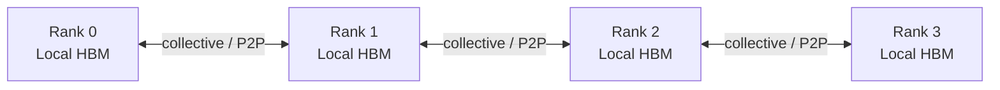
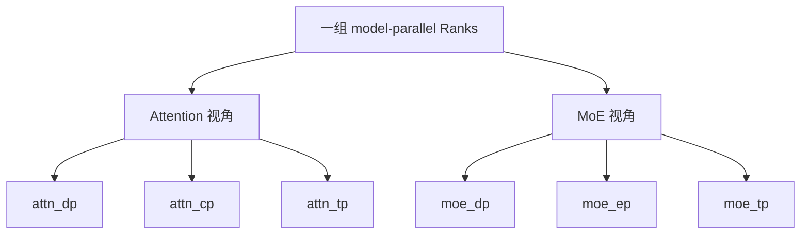
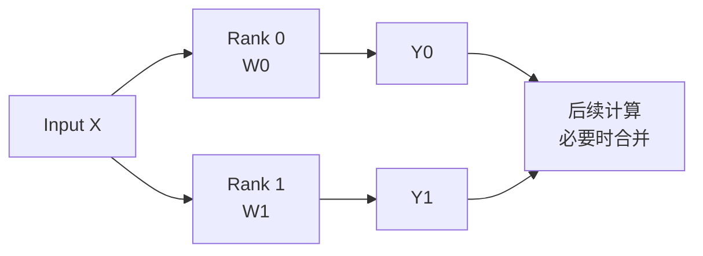
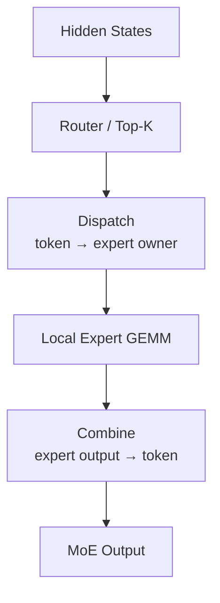
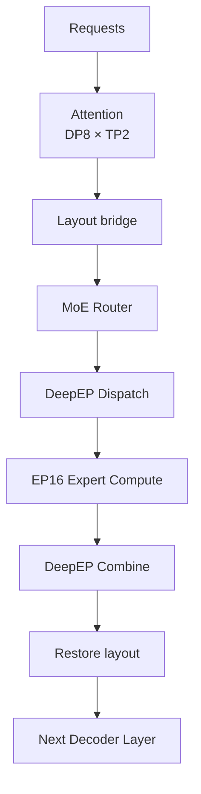

# 模型为什么必须多卡？从一张 Ascend 910C 放不下 DeepSeek-V4 到 TP / DP / EP

第一次接触大模型分布式推理时，最容易把多卡理解成一句话：**一张卡显存不够，所以多插几张卡。**

这句话只说对了一半。对 DeepSeek-V4 这样的超大 MoE 模型，多卡确实首先解决“模型装不下”，但真正进入 SGLang 之后，很快还会碰到另外三个工程问题：权重已经分到多张 NPU 上了，一次矩阵乘法该由谁算、结果怎样合回来；请求并发越来越高，为什么不能让不同设备各自处理一部分请求；MoE 有大量 Expert，为什么还要把所有 Expert 都复制到每张卡？

这三个问题分别把我们带到 **Tensor Parallelism（TP）**、**Data Parallelism（DP）** 和 **Expert Parallelism（EP）**。

本文不从三个术语的定义开始，而是从一笔最简单的 HBM 账出发，一路推到真实的 DeepSeek-V4 并行拓扑。文章中的 SGLang 并行语义固定参考 `sgl-project/sglang @ 176dbcb85d3b7737564e4911947035cc0af65f0a`，核对日期为 2026-09-21；DeepSeek-V4 参数规模与 Ascend 支持情况同时参考当前 SGLang 官方文档。本文只讨论推理，不讨论训练里的梯度同步与 Optimizer State。

---

## 一、先算最朴素的一笔账：为什么一张 910C 装不下 DeepSeek-V4

SGLang 当前 DeepSeek-V4 cookbook 给出的 `DeepSeek-V4-Flash-0731` 规模约为 **304B Total Parameters / 13B Active Parameters**。

这两个数字必须先分清。`304B` 是整套模型的总参数量；`13B` 是 MoE 路由之后，一个 Token 在一次前向中大约真正激活的参数规模。Active Parameters 小，意味着每个 Token 不需要把 304B 参数全部参与计算，但不意味着剩下的 Expert 权重可以从服务进程的可访问内存里消失。下一批 Token 可能路由到完全不同的 Expert，只要这些 Expert 可能被选中，系统就必须能访问它们的权重。

所以对于 MoE，**“每个 Token 算多少参数”与“服务时总共要放多少权重”是两笔不同的账。**

先忽略量化 scale、metadata、对齐、Embedding、Runtime Buffer 等所有额外开销，只算理论下界：

| 权重精度 | 理想化每参数字节数 | 304B 参数的权重下界 |
| --- | ---: | ---: |
| BF16 | 2 Byte | 约 608 GB |
| W8 / INT8 | 1 Byte | 约 304 GB |
| 4 bit | 0.5 Byte | 约 152 GB |

这只是数学下界，不是 checkpoint 的实际文件大小，更不是服务进程的最终 HBM 占用。W8A8 还会有量化 scale、非量化权重、布局与对齐等额外数据；SGLang 的 Ascend 文档也明确把 ModelSlim W8/W4 描述为相对 BF16 降低权重 footprint，而不是把整个 Runtime 压成对应的理论位宽。

这里还要统一一个 Ascend 计数口径。SGLang Ascend 文档当前仍使用 `A3 Series` 的产品命名，并按**每张卡 2 个 die、每个 die 64 GB device memory**描述资源；本文沿用本系列统一的对外称呼 **Ascend 910C**，在引用官方资源口径时保留 `A3 Series` 便于对照。因此 `tp_size` 更接近参与计算的逻辑 device / die 数量，不应直接当成物理卡数。

即便把一张双 die 卡上的两颗 64 GB device memory 合计为 128 GB 容量，这 128 GB 也不是一块统一地址空间，而是两个设备各自的本地 HBM；无论如何，它仍远小于 304B W8 权重约 304 GB 的理论下界。

更重要的是，推理运行时还要给下面这些对象留空间：

```text
HBM
├── Model Weights
├── KV Cache
├── Activations / Hidden States
├── Attention / MoE Workspace
├── Communication Buffers
├── Graph / Static Buffers
└── Allocator Reserved Memory / Fragmentation
```

DeepSeek-V4 又有自己的压缩缓存与 Attention 实现，因此这里不能直接拿传统 MHA 的 KV Cache 公式硬套。我们只需要得到一个更基础的结论：

> **即使已经做 W8 量化，仅 304B 权重的理想下界也约为 304 GB；一张 Ascend 910C 仍无法把这一整份模型连同运行时空间一起容纳。**

于是“多卡”首先不是性能优化，而是一个**可运行性条件**。

但多张 NPU 也不会自动拼成一块更大的统一 HBM。每个 Rank 仍然有自己的本地权重、Tensor 和缓存，跨设备数据必须显式通过 collective 或点对点通信移动。



所以多卡推理真正要解决的是：**哪一份数据属于哪个 Rank，以及什么时候必须跨 Rank 搬数据。** 从这里开始，TP、DP、EP 才真正有意义。

---

## 二、多卡到底在切什么：先把 TP、DP、EP 放到同一张地图上

如果只背缩写，很容易把三种并行都理解成“把任务分给多张卡”。更有用的方式是问：**它们到底在切什么对象？**

| 并行方式 | 主要切分对象 | 最先解决的问题 | 一个 Token 的直觉 |
| --- | --- | --- | --- |
| **TP** | Tensor / Linear 权重维度 | Dense / 共享权重太大，单设备放不下或算不动 | 同一个 Token 由多个 Rank 协作计算 |
| **DP** | Request / Batch | 请求多，需要更高吞吐 | 不同 Replica 处理不同请求 |
| **EP** | MoE Expert ownership | Expert 权重太多，不能全部复制 | Token 被 Router 发给持有目标 Expert 的 Rank |

换成三个工程问题就是：

- **TP**：一个矩阵太大，怎么拆？
- **DP**：一堆请求太多，怎么分？
- **EP**：一堆 Expert 太多，怎么放？

这里还有一个很重要的纠偏：**“模型装不下”并不等于“只能靠 TP”。** 对 DeepSeek-V4 这样的 MoE，Dense / 共享部分可以由 TP 分片，数量巨大的 Expert 权重还可以由 EP 分散。TP 和 EP 都可能降低单 Rank 需要持有的权重，只是它们切的是不同维度。

这也是后面理解 SGLang 的关键。TP、DP、EP 不是三个互斥开关。同一个 DeepSeek-V4 Decoder Layer 完全可能在 Attention 阶段采用一套布局，在 MoE 阶段重新解释同一批 Rank。

当前 SGLang 的并行宽度正是这样组织的。开启 DP Attention 时，Attention 侧满足 `tp_size = attn_dp_size × attn_cp_size × attn_tp_size`；进入 MoE 后，同一个外层 TP world 又可以被解释为 `tp_size = moe_dp_size × moe_ep_size × moe_tp_size`。对应派生逻辑在 [`runtime_context.py`](https://github.com/sgl-project/sglang/blob/176dbcb85d3b7737564e4911947035cc0af65f0a/python/sglang/srt/runtime_context.py#L249-L377)。



物理 Rank 没有凭空增加；变化的是**数据 ownership 与通信 Group**。有了这张总图，再分别看 TP、DP、EP，就不会把三个概念学成互不相干的名词。

---

## 三、TP：一份模型太大，就把一个 Tensor 的计算拆给多个 Rank

Transformer 中大量计算最终都会落到 Linear / GEMM。用最简单的矩阵乘法表示就是 `Y = XW`。

假设 `W` 的输出维很大，可以做 Column Parallel，把它沿输出维切成 `W = [W0 | W1]`。两个 Rank 分别保存自己的 shard，得到 `Y0 = XW0` 和 `Y1 = XW1`。



这带来两个直接收益。第一，参与 TP 分片的权重不再要求每个 Rank 保存完整副本；如果一个矩阵能够均匀做 8-way TP，那么每个 Rank 对这块矩阵只承担大约 `1/8` 的 shard。第二，同一个 Forward 的计算也分散到了多个设备上。

但这里必须加一个限定：

> **不能把“TP=8”直接翻译成“每张卡的总模型显存一定变成 1/8”。**

真实模型里有些权重会 TP-shard，有些权重可能复制；到了 MoE，又可能由 EP 决定 Expert ownership。最终每个 Rank 的模型内存取决于模型结构、TP/EP 布局、量化方式和具体实现。

TP 还有一个代价：切开以后经常要重新交换或归并数据。比如 Row Parallel Linear 中，不同 Rank 可能分别产生 partial output，随后需要 reduction 才能得到后续层需要的结果。根据具体布局，常见 collective 包括 AllReduce、AllGather 和 ReduceScatter；但不是每个 TP Linear 都固定执行同一种 collective，也不是每次矩阵乘法之后都必须马上 AllGather。真正要看的是：**下一步计算需要 replicated Tensor，还是仍然能消费 sharded Tensor。**

所以 TP 的本质是：

> **用更多本地 HBM 和计算单元换取更小的单 Rank shard，同时付出跨 Rank 通信成本。**

这也解释了为什么 `tp_size` 不是越大越好。TP 太小，模型可能放不下；TP 太大，又可能让通信、small GEMM 和同步成本开始吞噬收益。

---

## 四、DP：它不是为了把模型装下；而 DP Attention 更不能按“TP × DP”算卡数

TP 解决了“同一份模型怎么拆”。当模型已经能运行，服务系统还要面对另一个问题：同时来了很多请求怎么办？

最经典的 Data Parallelism 很直接：**复制模型，让不同 Replica 处理不同 Request / Batch。**

假设一份模型本身需要 8 个 device worker 做 `TP=8`，那么经典 DP=2 更接近两套独立的 TP8 模型副本。每个 Replica 内部仍然有自己的 TP shard 集合，只是两套 Replica 处理不同请求。

这说明一个很重要的边界：

> **普通 DP 不能解决“单份模型放不下”的问题。**

单份模型如果必须 TP8 才能装下，那么每个 DP Replica 仍然需要自己的 TP8 shard 集合。DP 解决的是并发和吞吐，而不是把一份权重继续切小。

到了 DeepSeek 场景，SGLang 的 `--dp-size` 还可能出现在另一种完全不同的模式：**DP Attention（DPA）**。官方文档把 DPA 描述为只对 Attention 部分应用数据并行。对于 DeepSeek 这类 MLA 模型，它可以让不同 Attention-DP shard 处理不同请求，并维护各自的 KV Cache；进入后续 FFN / MoE 时，再把数据布局桥接到另一套并行拓扑。

所以同样看到 `TP16 / DP8`，必须先判断 DPA 是否开启：

| 配置 | 含义（忽略 PP 等其他维度） | device worker 直觉 |
| --- | --- | ---: |
| `TP16 + DP8`，普通 Native DP | 8 套完整的 16-way TP Replica | 约 128 |
| `TP16 + DP8 + DPA` | 1 个 16-way model-parallel world，Attention 内重解释为 DP8 × TP2 | 16 |

当前固定版本的派生逻辑非常直接：

```python
attn_dp_size = dp_size if enable_dp_attention else 1
attn_tp_size = tp_size // attn_dp_size // attn_cp_size
```

如果 `tp_size=16`、`dp_size=8`、`enable_dp_attention=True`、`attn_cp_size=1`，那么：

- `attn_dp_size = 8`
- `attn_tp_size = 16 / 8 / 1 = 2`

也就是说，这里首先还是 **16 个 model-parallel Rank**，只是在 Attention 阶段被解释成 8 个 Attention-DP shard，每个 shard 内再有 2 个 Attention-TP Rank：

```text
                    attn_tp_rank
                    0       1
                 ┌───────┬───────┐
attn_dp_rank 0   │  R0   │  R1   │
attn_dp_rank 1   │  R2   │  R3   │
attn_dp_rank 2   │  R4   │  R5   │
attn_dp_rank 3   │  R6   │  R7   │
attn_dp_rank 4   │  R8   │  R9   │
attn_dp_rank 5   │ R10   │ R11   │
attn_dp_rank 6   │ R12   │ R13   │
attn_dp_rank 7   │ R14   │ R15   │
                 └───────┴───────┘
```

这和“8 套完整 TP16 Replica”完全不是一回事。

SGLang 官方 DPA 文档也明确区分了普通 DP 和 DPA：普通 DP 是完整模型 Replica；DPA 则让 Attention 的不同 DP shard 独立处理 batch 与 KV，并在 MoE 场景下经常与 EP 组合。对应文档见 [`dp_dpa_smg_guide.mdx`](https://github.com/sgl-project/sglang/blob/176dbcb85d3b7737564e4911947035cc0af65f0a/docs/docs/advanced_features/dp_dpa_smg_guide.mdx)。

因此以后看到 `dp_size`，第一反应不应该是“复制了多少套模型”，而应该先问：**这是普通 DP，还是已经开启了 DP Attention？** 这个问题不回答，`TP16 / DP8` 几乎没有完整的拓扑含义。

---

## 五、EP：MoE 真正特殊的地方，是 Expert 权重和 Token 会发生跨 Rank 重分布

现在只剩 DeepSeek 最有代表性的一层：MoE。

Dense FFN 可以粗略理解为每个 Token 都经过同一套 MLP；MoE 则先经过 Router，为 Token 选择少量 Expert。这解释了为什么 `304B Total / 13B Active` 可以同时成立：模型拥有大量 Expert，但每个 Token 只命中其中一小部分。

既然不同 Token 只会访问少量 Expert，一个自然的工程选择就是：**不要让每个 Rank 都保存全部 Expert，而是把 Expert ownership 分散出去。** 概念上，Rank 0 可以拥有一组 Expert，Rank 1 拥有另一组，后续 Rank 继续持有剩余 Expert。这就是 Expert Parallelism。

真实系统并不保证“一张卡正好连续放 N 个 Expert”。还可能涉及 shared experts、expert replication、EPLB 重排等机制。但 EP 的核心语义不变：

> **不同 Rank 拥有不同的 Expert 权重集合。**

这样一来，新的问题立刻出现。假设 Token A 当前在 Rank 0，Router 却选择了由 Rank 2 持有的 Expert 37，那么 Hidden State 必须先被送到 Rank 2；Expert 计算完成后，结果还要回到后续计算所需的逻辑位置。

使用 DeepEP 这类 A2A backend 时，典型数据流是：



当很多 Rank 上的 Token 同时命中很多远端 Expert，Dispatch / Combine 自然会形成 All-to-All 类型的数据交换。SGLang 当前 EP 文档也把 DeepEP 定义为用于 MoE token shuffling 的高效 A2A backend。

但同样要避免一个过度简化：

> **EP 不等于 All-to-All。**

EP 描述的是 **Expert ownership 如何分片**；All-to-All 是某些 EP backend 用来完成 Token Dispatch / Combine 的通信方式。SGLang 当前 `none` backend 还可以走基于 AllReduce / AllGather 的路径，而 DeepEP、Ascend FuseEP 等 A2A backend 有自己的限制与实现。

对于当前固定版本，SGLang 文档还明确指出：DeepEP 等 A2A backend 目前要求 `ep_size = tp_size`。因此在一个典型的 `TP16 + DPA8 + EP16` 概念配置里，如果 `moe_dp_size=1`，同一批 16 个 Rank 可以出现两种视角：

| 阶段 | 同一组 16 Rank 的逻辑布局 |
| --- | --- |
| Attention | `8 Attention-DP × 2 Attention-TP` |
| MoE | `1 MoE-DP × 16 EP × 1 MoE-TP` |

这才是 DeepSeek 分布式推理真正有意思的地方：**不是先做完 TP，再额外套一层 EP；而是同一批 Rank 在不同子模块里承担不同的数据 ownership。**

---

## 六、把一次 DeepSeek-V4 Forward 串起来：多卡的本质其实是“放哪里、谁来算、何时通信”

现在可以回到开头的问题。假设有一组 16 个 Rank，概念配置是：

```text
tp_size = 16
dp_size = 8
enable_dp_attention = True
attn_cp_size = 1
ep_size = 16
moe_a2a_backend = deepep
```

先不考虑 PP、PD Disaggregation 和投机解码，只看一个 Decoder Layer。

Attention 阶段，16 个 Rank 被解释成 `8 DP × 2 Attention-TP`。不同 Attention-DP shard 可以处理不同请求与本地 KV；每个 shard 内部，两个 Attention-TP Rank 共同完成需要分片的 Attention 计算。

Attention 结束以后，数据要进入 MoE。此时同一批 Rank 的意义发生变化：Expert 权重按 EP 分布，Router 为每个 Token 选出目标 Expert，DeepEP 负责把 Token Hidden State dispatch 到对应 Expert owner，再把 Expert 输出 combine 回来。随后下一层又要恢复到 Attention 所需要的数据布局。



现在再看 TP、DP、EP，三者已经不只是三个缩写：

- **TP** 回答：一个 Tensor / Linear 太大，权重和计算怎样切到多个 Rank？
- **DP** 回答：不同 Request / Batch 怎样分给不同 Replica 或 Attention shard？
- **EP** 回答：大量 Expert 权重归谁所有，Token 怎样找到真正持有目标 Expert 的 Rank？

而 AllReduce、AllGather、ReduceScatter、All-to-All 这些 collective，本质上都在补同一个代价：**数据一旦被分布到不同 Rank，本地计算结束后，总会有某个时刻需要恢复下一阶段所要求的数据布局。**

所以大模型分布式推理最值得建立的第一性视角不是“背并行名词”，而是连续追问：

> **这份数据现在放在哪里？这一阶段由谁来计算？下一阶段开始前必须搬什么数据？**

只要沿着这三个问题走，后面的 Rank、Group、HCCL、DeepEP、DP Attention、CP、PP 都会逐渐变成同一套系统里的不同答案。

### 继续阅读

这篇只负责回答“为什么需要多卡，以及 TP / DP / EP 分别在解决什么”。继续进入 SGLang 源码时，推荐按下面的顺序阅读：

1. [SGLang 里的 Rank 和 Group 到底是什么？用 DeepSeek-V4 画清 TP Rank、DP Rank、EP Rank](sglang-rank-group-deepseek-v4.md)
2. [SGLang 里的 AllReduce、AllGather、ReduceScatter、All-to-All 到底在搬什么？](sglang-collectives-deepseek-v4.md)
3. [DeepSeek-V4 分布式推理源码解析：TP、EP、DP 三种并行如何共同驱动一次前向计算](../sglang/deepseek-v4-distributed-parallel-source-analysis.md)

### 主要资料

- [SGLang DeepSeek-V4 Cookbook](https://github.com/sgl-project/sglang/blob/main/docs/cookbook/autoregressive/DeepSeek/DeepSeek-V4.mdx)
- [SGLang DP / DPA Guide](https://github.com/sgl-project/sglang/blob/176dbcb85d3b7737564e4911947035cc0af65f0a/docs/docs/advanced_features/dp_dpa_smg_guide.mdx)
- [SGLang Expert Parallelism](https://github.com/sgl-project/sglang/blob/176dbcb85d3b7737564e4911947035cc0af65f0a/docs/docs/advanced_features/expert_parallelism.mdx)
- [SGLang `runtime_context.py`](https://github.com/sgl-project/sglang/blob/176dbcb85d3b7737564e4911947035cc0af65f0a/python/sglang/srt/runtime_context.py)
- [SGLang Ascend Model Support](https://github.com/sgl-project/sglang/blob/main/docs/docs/hardware-platforms/ascend-npus/reference/support_models.mdx)
- [SGLang Ascend Deployment Tutorial：64 GB / die 与双 die 卡的资源口径](https://github.com/sgl-project/sglang/blob/main/docs/docs/hardware-platforms/ascend-npus/model-deployment/tutorials/qwen3_5_397b.mdx)
