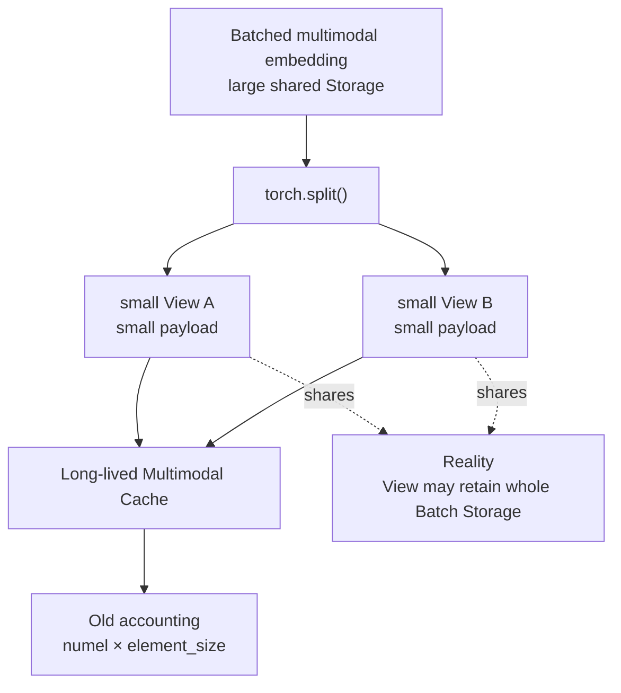
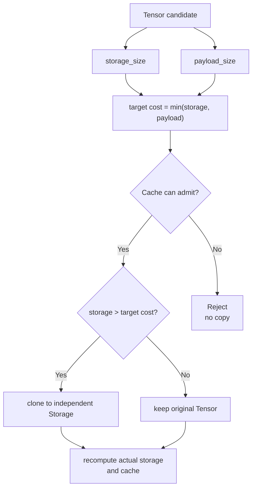

# 一个 Tensor 明明很小，为什么却偷偷占着整个 Batch？

> 从 SGLang PR #39120 理解 PyTorch View、Storage、Ownership 与 Cache Memory Accounting

写推理系统时，我们经常会用一个很自然的公式估算 Tensor 内存：

```text
Tensor bytes = numel × element_size
```

比如一个 BF16 Tensor 有 100 万个元素，那么逻辑 payload 大约就是 2 MB。大多数时候，这个直觉没问题。

但如果这个 Tensor 是从另一个更大的 Tensor `split`、slice 或 view 出来的呢？

这时候可能发生一件很反直觉的事：**你看到的是一个很小的 Tensor，但只要它还活着，整个 Batch 的大块底层 Storage 就可能继续活着。**

SGLang PR [#39120](https://github.com/sgl-project/sglang/pull/39120) 修的就是这样一个问题：

```text
Fix multimodal embedding cache retaining full batches through views
```

| 项目 | 信息 |
| --- | --- |
| PR | [sgl-project/sglang #39120](https://github.com/sgl-project/sglang/pull/39120) |
| 状态 | merged |
| Merge commit | `24b6c1c7f5ba6c95a96acc9e77b4f5efb23eff97` |
| 改动规模 | 2 files / +11 / -10 |
| 难度 | ★★☆☆☆ |
| 类型 | Memory / Correctness |
| 核心知识 | Tensor View、Storage、Ownership、Lifetime、Cache Accounting |
| 为什么值得读 | 用十几行代码暴露“逻辑对象大小 ≠ 实际保活资源”这一类非常典型的系统 Bug |
| 适用边界 | SGLang Multimodal Embedding Cache；本文借此解释通用 PyTorch Storage 语义 |

> **30 秒结论**
>
> SGLang 的批量多模态编码在返回一个整体 Tensor 时，会用 `torch.split()` 拆成多个 item embedding。PyTorch 官方文档将 `split()` 列为 View operation：这些小 Tensor 可以共享同一个底层 Storage，而不是各自拥有独立 allocation。
>
> 旧 Cache 却用 `numel() * element_size()` 统计 Entry 大小。于是一个逻辑上只有 0.8 MiB 的小 View，可能让一次历史 Batch 的 7.8 MiB Storage 继续存活，而 Cache 账面只记 0.8 MiB。
>
> PR #39120 的修复是：让 Cache 看到真实 backing storage；当一个**准备入库**的 Tensor 其 Storage 大于自身 payload 时，先 `clone()` 成独立紧凑 Storage，再缓存。
>
> 核心 invariant 是：**Cache Budget 必须约束 Cache 真正保持存活的资源，而不只是缓存对象表面可见的逻辑 payload。**

本文固定到 `sgl-project/sglang@24b6c1c7f5ba6c95a96acc9e77b4f5efb23eff97`。PyTorch View / Storage 语义参考官方 [Tensor Views](https://docs.pytorch.org/docs/main/tensor_view.html)、[Storage](https://docs.pytorch.org/docs/2.14/storage.html) 与 [`Tensor.expand`](https://docs.pytorch.org/docs/stable/generated/torch.Tensor.expand.html) 文档。

---

## 一、问题：为什么一个 0.8 MiB Tensor，可能让 7.8 MiB 一直活着？

先不看 SGLang。假设一次批量多模态编码处理 10 个 item，每个 item 产生 100 个 token，hidden size 为 4096，dtype 为 BF16。

整个 Batch Embedding 是：

```text
[1000, 4096]

1000 × 4096 × 2 bytes
≈ 7.81 MiB
```

现在把它拆成 10 份：

```python
item_embeddings = torch.split(
    batch_embedding,
    [100, 100, 100, 100, 100, 100, 100, 100, 100, 100],
    dim=0,
)
```

每个 item 的逻辑 shape 是 `[100, 4096]`，所以：

```text
payload
= 100 × 4096 × 2 bytes
≈ 0.78 MiB
```

如果只看 `tensor.numel() * tensor.element_size()`，你自然会认为这个 Entry 大约只占 0.78 MiB。

但 PyTorch Tensor 不只有 shape 和 dtype。更完整地看，一个 strided Tensor 还关联着 Storage、stride、storage offset 等元数据；真正承载底层字节的是 Storage。PyTorch 官方文档也明确说明：View 与 base Tensor 可以共享同一个底层 Storage，而 `split()` 属于 View operation。

所以刚才的结构更接近：

```text
                    one Batch Storage
┌──────────────────────────────────────────────────┐
│ img0 │ img1 │ img2 │ img3 │ ... │ img8 │ img9 │
└──────────────────────────────────────────────────┘
   ↑      ↑      ↑      ↑              ↑      ↑
 view0  view1  view2  view3           view8  view9
```

创建这些 View 本来是好事：没有额外 copy，`split()` 很便宜。

问题出现在：**一个短生命周期计算流里的 View 被放进了长期存在的 Cache。**

假设 Batch 计算结束后，只剩 `view3` 还在 Cache：

```text
batch_embedding 对象不再需要
        │
        ▼
view3 仍然存活
        │
        ▼
它仍引用原来的 Batch Storage
        │
        ▼
整块 Batch Storage 不能释放
```

于是可能出现：

```text
Cache Entry 逻辑 payload：0.78 MiB
实际因它而继续存活的 Storage：7.81 MiB
```

这里有一个非常容易讲错的细节：**如果 10 个 View 都来自同一个 Batch，它们共享的是同一个 7.81 MiB Storage，不能机械算成 10 × 7.81 MiB。**

真正危险的是 Cache 长时间运行之后：

```text
Batch A → 只剩一个小 View 被缓存 → pin 住 Batch A Storage
Batch B → 只剩一个小 View 被缓存 → pin 住 Batch B Storage
Batch C → 只剩一个小 View 被缓存 → pin 住 Batch C Storage
...
```

这时账面上的多个小 Entry，就可能分别延长多个历史 Batch Storage 的生命周期。

这更准确地叫 **unintended retention**，而不是“内存彻底泄漏”：Storage 仍然有合法引用，只是活得比系统真正需要的更久。

---

## 二、最小背景：Payload Size 和 Backing Storage Size 为什么不是一回事？

理解这个 PR，最重要的是分清两个数字。

第一个：

```python
tensor.numel() * tensor.element_size()
```

它描述的是 Tensor 逻辑 view 中有多少元素数据。PyTorch 的 `Tensor.nbytes` 也是按 `numel() * element_size()` 定义。

第二个：

```python
tensor.untyped_storage().nbytes()
```

`untyped_storage()` 返回 Tensor 的底层 UntypedStorage；Storage 是保存实际字节的数据容器。

对一个普通独立 Tensor：

```text
payload bytes ≈ storage bytes
```

但对一个从大 Batch 切出来的 View：

```text
View shape: [100, 4096]
Logical payload: 0.78 MiB

Underlying Storage:
[1000, 4096]
Storage bytes: 7.81 MiB
```

于是：

```text
Logical Tensor Size
        ≠
Physical Backing Storage Size
```

这也解释了旧版 Cache 为什么会低估 retained memory。修复前的 helper 是：

```python
def _get_tensor_size(embedding):
    return embedding.element_size() * embedding.numel()
```

也就是默认：

```text
Cache Cost = Tensor Payload
```

但 Cache 真正需要约束的是：

```text
只要这个 Entry 还活着，哪些底层资源必须继续活着？
```

这里还要注意 `reshape()`：PyTorch 官方文档明确说明 `reshape()` 可能返回 View，也可能返回新 Tensor，因此不能仅凭 API 名字猜是否发生 copy。做资源核算时，更可靠的问题是：**最终到底引用了什么 Storage？**

---

## 三、根因：Cache 记的是 Payload，但真正延长的是 Storage Lifetime

回到固定 merge commit 的 SGLang 源码。

`mm_schedule.py` 在批量多模态编码得到一个整体 Tensor 时，会先：

```python
all_miss_embedding = data_embedding_func(miss_items)
```

如果返回值不是 per-item list，而是一个整体 Tensor，就会执行：

```python
split_embeddings = torch.split(
    all_miss_embedding,
    token_counts,
    dim=0,
)
```

固定版本源码甚至直接写了注释：一个 `torch.split` View 会让整个 concatenated buffer 在任意单个 item 仍被缓存时继续存活。对应源码可见 [`mm_schedule.py`](https://github.com/sgl-project/sglang/blob/24b6c1c7f5ba6c95a96acc9e77b4f5efb23eff97/python/sglang/srt/managers/mm_schedule.py#L380-L410) 和 [per-item 路径](https://github.com/sgl-project/sglang/blob/24b6c1c7f5ba6c95a96acc9e77b4f5efb23eff97/python/sglang/srt/managers/mm_schedule.py#L462-L490)。

数据流是：



真正的问题不是 `torch.split()` 有 Bug，也不是 View 天生浪费内存。View 在短生命周期计算里恰恰很高效。

Root Cause 是：**共享 Storage 的短生命周期 View，被带进了按 Entry 独立记账的长期 Cache，而 accounting model 没有反映这种 ownership / lifetime。**

因此这个 PR 的核心 invariant 可以写成：

> **Invariant：Cache 的内存预算必须能够约束 Cache Entry 实际保持存活的底层资源；当 Cache 采用 per-entry additive accounting 时，Entry 不能悄悄 pin 住远大于自身账面大小的无关 Storage。**

这里真正关键的是两个词：

```text
Accounting
Lifetime
```

一个缓存条目“拥有”的不只是一个 Python Tensor 对象，它还会延长与该 Tensor 关联资源的 lifetime。

---

## 四、修复：为什么既要看 Storage，又不能简单按 Storage Size 记账？

PR #39120 的核心改动位于 [`multimodal_cache.py`](https://github.com/sgl-project/sglang/blob/24b6c1c7f5ba6c95a96acc9e77b4f5efb23eff97/python/sglang/srt/mem_cache/multimodal_cache.py#L65-L130)。

第一步，把 `_get_tensor_size()` 改成：

```python
def _get_tensor_size(embedding):
    return embedding.untyped_storage().nbytes()
```

这让已经入库的 Entry 按真实 backing storage 字节数记账。

但真正值得学的是 `set()`：

```python
tensor = embedding.embedding
storage_size = _get_tensor_size(tensor)
data_size = min(
    storage_size,
    tensor.element_size() * tensor.numel(),
)
```

如果 Entry 能被 Cache 接纳，并且：

```text
storage_size > data_size
```

才做：

```python
embedding = replace(
    embedding,
    embedding=tensor.clone(),
)
```

最后重新按 clone 后的实际 Storage 大小计入 `current_size`。

### 为什么不直接让每个 View 都按完整 `storage_size` 记账？

因为多个 Entry 可能共享同一个 Storage。假设：

```text
View A ─┐
View B ─┼──→ same 100 MiB Storage
View C ─┘
```

如果每个 Entry 都独立记 100 MiB，Cache 账面可能变成 300 MiB，但底层其实只有一块 100 MiB Storage。要彻底做 shared-storage accounting，需要维护 Storage identity、引用关系和 per-storage accounting，复杂度会明显增加。

PR 选择的是另一条更简单的路径：

> **既然 Cache 按 Entry 独立记账，那就让长期缓存的 oversized View 真正拥有自己的独立 Storage。**

也就是：

```text
Before

Batch Storage
████████████████████████████████████
        ↑
      small View

After clone

Batch Storage
████████████████████████████████████

Cached Entry Storage
████
```

这是一个很典型的工程取舍：**通过改变 ownership，让 accounting model 重新变得简单而正确。**

这句话是根据修复结构做出的工程推断，不是 PR 作者原文逐字说明；真正源码事实是：修复会对被接纳且 `storage_size > data_size` 的 Entry 做 clone。

### 为什么只 clone 一部分 Tensor？

PR 没有无脑 `clone()` 所有 Entry。

- 普通独立 Tensor：`storage_size == payload_size`，不 clone；
- duplicate key：在更早的位置直接返回，不 clone；
- Cache 无论如何都无法接纳的 Entry：在 clone 前返回 `False`，不做无意义 copy；
- oversized backing Storage 的被接纳 Entry：clone 成独立 Storage。

所以修复没有否定 View 的价值，而是把 copy 成本推迟到**长期缓存真正需要独立 ownership**的边界上。

### `min(storage_size, payload_size)` 为什么重要？

因为还有反方向的情况：逻辑 payload 可以比真实 Storage 大。

典型例子是 `expand()`。PyTorch 官方文档明确说明 `expand()` 不分配新内存，而是通过 stride=0 创建 View。

因此可能有：

```text
payload_size > storage_size
```

此时并不存在“小 Tensor pin 大 Storage”的问题。用 `min(storage_size, payload_size)` 可以避免把这种 Tensor 错判成需要 compact 的对象。

整个修复流程可以浓缩成：



---

## 五、验证与边界：这次修复证明了什么，又没有证明什么？

PR #39120 很适合练习 Evidence Ladder，因为作者对验证边界写得比较克制。

| 证据层级 | 能支持的结论 |
| --- | --- |
| **Source-confirmed** | Cache 使用 `untyped_storage().nbytes()`；被接纳且 backing storage 大于目标 payload 的 Entry 会 clone |
| **PR-confirmed** | 问题来自 `torch.split` View 保持 Batch allocation；目标是避免 retained storage 超过 Cache budget |
| **Measured / Tested** | PR 报告 CPU smoke checks 覆盖 ordinary、detached、strided、inference-mode slice、expanded Tensor、LRU accounting 等；PR Base / Extra CI 最终通过 |
| **Not measured** | 没有 GPU 性能 benchmark，没有模型 accuracy benchmark |
| **Inference / Transfer** | Memory accounting 应与 ownership / lifetime 对齐，是可迁移到其他 Cache/Pool 的工程规则 |

修复后的 regression test 也从：

```python
test_tensor_cache_entries_share_storage()
```

变成：

```python
test_tensor_cache_entries_own_storage()
```

并直接断言：

```python
emb.untyped_storage().nbytes()
==
emb.numel() * emb.element_size()
```

也就是说，测试不再只验证 Tensor 数值，而是把**缓存 Entry 的 Storage ownership contract**也写进回归测试。对应固定版本测试见 [`test_mm_chunked_embedding_unit.py`](https://github.com/sgl-project/sglang/blob/24b6c1c7f5ba6c95a96acc9e77b4f5efb23eff97/test/registered/chunked_prefill/test_mm_chunked_embedding_unit.py#L150-L180)。

这是一个很重要的测试思想：

```text
Value Correctness
        ≠
Resource Lifetime Correctness
```

一个 Tensor 数值可以完全正确，同时把一大块本不该继续存在的 Storage 保活。

### 这个 PR 没有证明什么？

它没有证明：

- `clone()` 对所有多模态 workload 都没有性能成本；
- GPU 端到端吞吐因此提升；
- 所有 PyTorch View 进入 Cache 前都应该 clone；
- 所有 Cache 都应该无条件使用 `untyped_storage().nbytes()` 作为唯一预算模型；
- 这套实现建立了通用的 shared-storage 去重记账机制。

PR 作者明确说明 GPU performance tests 和 model accuracy tests 没有运行；CPU smoke checks 验证了 Tensor 值和多种 Storage case。作者本地最小环境中的注册 pytest 因依赖缺失在 collection 阶段 blocked，但 PR 的 Base / Extra CI 最终为 green。

所以准确结论是：**#39120 修复了这一条明确的 retained backing-storage 问题，并把“Cache Entry 应拥有紧凑 Storage”的约束写进 regression test。**

不要把它扩大成“所有 Tensor View 内存问题都被解决”。

---

## 六、迁移：这个小 PR 真正教给我们的 AI Infra 方法是什么？

这篇最值得带走的不是 `untyped_storage().nbytes()` 这个 API，而是三层工程直觉。

**第一层：系统里的 Tensor 不只是 shape + dtype。**

做模型数学时，我们常把 Tensor 理解成：

```text
shape + dtype + values
```

做 Runtime 时，更完整的问题是：

```text
logical view
+ storage
+ stride / offset
+ device
+ ownership
+ lifetime
```

因为系统不只关心“它表示什么”，还关心“它真正占哪块资源、谁还引用它、什么时候才能释放”。

**第二层：Memory Accounting 必须和 Ownership / Lifetime 对齐。**

PR #39871 学到的是：

```text
Configured Value ≠ Derived Runtime Value
```

PR #39120 学到的是：

```text
Logical Tensor Payload ≠ Physical Retained Storage
```

它们背后其实是同一种工程能力：**不要只相信对象表面暴露的数字，要追到底层真正发生的资源关系。**

以后看到 Cache、Memory Pool、Pinned Buffer、KV Page、Offload Tensor、Graph Buffer、RDMA Pack Buffer，都值得问：

```text
账本统计的单位是什么？
真正被保活的资源是什么？
两者的 ownership 是否一一对应？
```

如果答案是否定的，就可能存在 under-account、over-account、double-count 或 unintended retention。

**第三层：Code Review 时特别检查“短生命周期 View → 长生命周期容器”。**

看到类似代码：

```python
big_tensor = model(...)
parts = torch.split(big_tensor, ...)

for p in parts:
    cache[key] = p
```

脑子里应该自动出现几个问题：

```text
1. p 是独立 allocation，还是 View？
2. Cache 留下 p，会让多大的 backing Storage 继续活着？
3. Cache budget 按 payload、storage，还是共享 Storage 身份记账？
4. Evict 一个 Entry 后，实际能释放多少资源？
5. copy / clone 应该发生在计算路径，还是长期 ownership 边界？
6. Regression test 检查了 Value，还是也检查了 Ownership / Lifetime？
```

这套检查规则值得迁移到 KV Cache、Activation Cache、Prefix Cache、CPU Offload、Pinned Host Buffer、Graph Input Buffer、Tensor Pool 与通信 staging buffer——但具体实现仍必须逐处核实，不能因为都是 View 就机械 `clone()`。

最后把这篇压成一句话：

> **PR #39120 修的不是“Tensor 太大”，而是“Cache 对自己真正保活了什么资源理解错了”。**

当你开始习惯继续追问：

```text
这个对象真正引用什么？
谁拥有它？
谁决定它什么时候释放？
账本统计的到底是不是这个资源？
```

你就已经不只是会用 Tensor，而是在从推理 Runtime 的资源所有权和生命周期角度看系统了。
