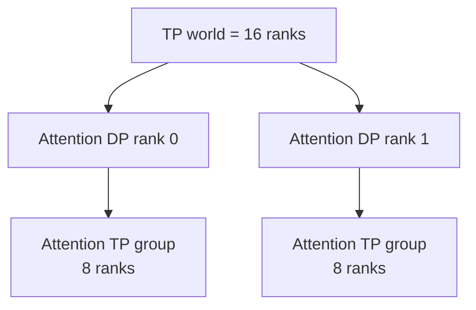
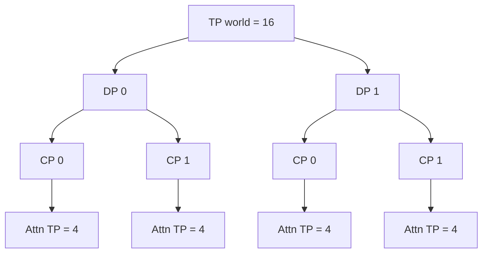
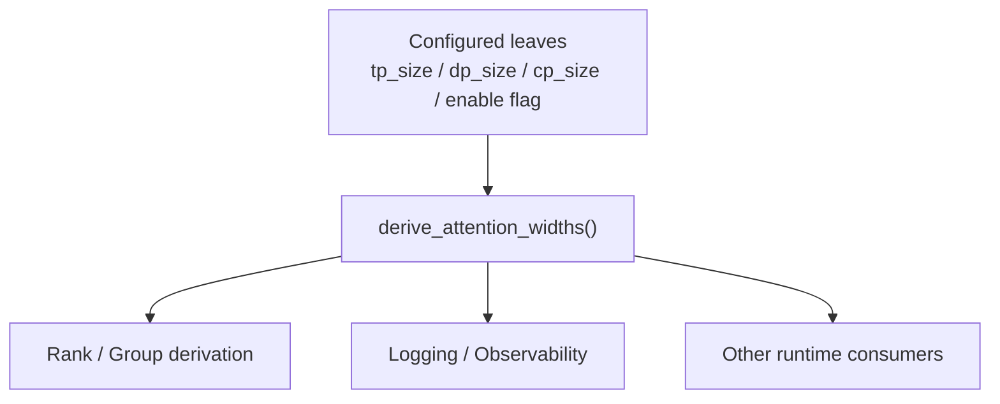

# 从一个 10 行 PR 看懂 SGLang 的 Attention 并行拓扑：PR #39871 为什么 TP16 不是 AttnTP16？

大型 AI Infra 项目最容易把人劝退的地方，是源码一打开就有几千行：Scheduler、Process Group、KV Cache、Kernel、通信、Graph 全堆在一起。于是很多人第一次读 SGLang，会直接挑战最复杂的模块，读了半天却说不清“这一段代码到底在解决什么问题”。

其实还有一种更适合入门的方式：**从一个很小、已经合入主干的真实 PR 出发，只追一个明确问题。**

SGLang PR [#39871](https://github.com/sgl-project/sglang/pull/39871) 就是一个很好的例子。它只改了一个文件，净改动只有几行，而且没有改模型数学、Kernel 或通信行为；它修的是一条日志：

```text
Fix DSA partial DP-TP mode log to use derived attn_tp_size
```

但顺着这条错误日志往下追，我们会自然遇到一整套非常重要的概念：

```text
tp_size
   ↓
DP Attention
   ↓
attn_dp_size
   ↓
Context Parallelism
   ↓
attn_cp_size
   ↓
attn_tp_size
   ↓
Rank / Group
```

这正是小 PR 最有价值的地方：**代码很少，背后的系统知识却很完整。**

本文固定到：

```text
sgl-project/sglang
PR: #39871
merge commit: 803f0c93d20104cf19ff6a95f7ef580b9fe449a2
merged: 2026-09-18
reviewed: 2026-09-21
```

先说明边界：这个 PR 位于 DSA 的 CUDA / ROCm model-specific adjustment 分支，**不是 Ascend 910C 执行路径修复，也没有改变实际并行拓扑**。它只是让日志使用已经正确派生出的 `attn_tp_size`。本文借这个案例解释 SGLang 的 Attention 并行宽度；如果你想系统理解 WORLD / Rank / Group / MoE EP，可以继续阅读仓库里的[《SGLang 里的 Rank 和 Group 到底是什么？》](../distributed/sglang-rank-group-deepseek-v4.md)。

> **先给结论：**在合法的 DP Attention 配置下，`tp_size` 不一定等于 `attn_tp_size`。SGLang 当前的核心关系是：
>
> ```text
> tp_size
> =
> attn_dp_size
> × attn_cp_size
> × attn_tp_size
> ```
>
> 因此 `tp_size=16, dp_size=2, attn_cp_size=1` 且开启 DP Attention 时，真正的 `attn_tp_size=8`。

---

## 一、一个“只是日志错了”的 PR，为什么值得认真读？

PR 描述给出的错误日志非常直接：

```text
DSA with TP mode is active,
dp_size=2,
tp_size=16,
attn_tp_size=16,
attention weights will be sharded across 16 ranks.
```

问题在于：

```text
attn_tp_size=16
```

不对。

这个场景下真正的值应该是：

```text
attn_tp_size=8
```

最容易产生的第一反应是：

> “既然 `tp_size=16`，Attention 不就是在 16 个 TP Rank 上切吗？”

这个直觉在某些配置下碰巧成立，但一旦开启 DP Attention，就不能再直接把全局 `tp_size` 当成 Attention 模块真正的 TP 宽度。

很多人还会进一步把：

```text
TP = 16
DP = 2
```

理解成：

```text
16 × 2 = 32 ranks
```

也就是两套完整 TP16 Replica。那是经典 Native Data Parallelism 很自然的图景，但**不是这个 PR 所在的 DP Attention 语义**。

在这里，同一组 TP world 会被重新解释成 Attention 的多维并行坐标。对于：

```text
tp_size = 16
dp_size = 2
attn_cp_size = 1
enable_dp_attention = true
```

更准确的直觉是：



也就是：

```text
2 × 8 = 16
```

而不是：

```text
2 × 16 = 32
```

所以这个 PR 虽然只修一条日志，却正好戳中了一个非常典型的认知错误：

> **“整个 TP world 有多少 Rank”和“某个具体模块实际跨多少 Rank 做 TP”不是同一个问题。**

---

## 二、顺着源码看：`attn_tp_size` 到底是怎样派生出来的？

PR 没有在日志旁边临时写一个除法，而是复用了 `runtime_context.py` 中已有的：

[`derive_attention_widths()`](https://github.com/sgl-project/sglang/blob/803f0c93d20104cf19ff6a95f7ef580b9fe449a2/python/sglang/srt/runtime_context.py#L138-L148)

核心代码非常短：

```python
def derive_attention_widths(
    *, tp_size: int, attn_cp_size: int, dp_size: int, enable_dp_attention: bool
) -> tuple:
    attn_dp_size = dp_size if enable_dp_attention else 1
    return attn_dp_size, tp_size // attn_dp_size // attn_cp_size
```

先不要背代码，拆成两步。

第一步，决定 Attention 是否真的使用 DP：

```text
如果 enable_dp_attention = true：

attn_dp_size = dp_size
```

否则：

```text
attn_dp_size = 1
```

第二步，把 `tp_size` 这组 Rank 在 Attention 的 DP、CP、TP 三个维度之间拆开：

```text
attn_tp_size
=
tp_size
/
attn_dp_size
/
attn_cp_size
```

所以在合法配置下可以记成：

```text
tp_size
=
attn_dp_size
×
attn_cp_size
×
attn_tp_size
```

带入 PR 的例子：

```text
tp_size = 16
dp_size = 2
attn_cp_size = 1
enable_dp_attention = true
```

得到：

```text
attn_dp_size = 2

attn_tp_size
= 16 / 2 / 1
= 8
```

于是日志真正应该描述的是：

```text
tp_size=16
attn_tp_size=8
```

两者完全不矛盾。

前者描述更上层的 TP world 宽度；后者描述 Attention 模块里一个 TP Group 的实际宽度。

### 为什么 `dp_size=2` 不一定意味着 Attention DP=2？

再换一个配置：

```text
tp_size = 16
dp_size = 2
enable_dp_attention = false
attn_cp_size = 1
```

虽然配置里仍然有：

```text
dp_size = 2
```

但这个模块没有启用 DP Attention，因此：

```text
attn_dp_size = 1
```

最终：

```text
attn_tp_size
= 16 / 1 / 1
= 16
```

这引出一个以后读 SGLang 源码非常实用的习惯：

> **看到一个配置字段存在，不要立刻假设某个模块一定使用了它。先继续追它经过了哪些 enable 条件和 runtime derivation。**

---

## 三、把 CP 和 Rank 放进来：并行不是几个数字相乘，而是在定义 Group

如果只记住“16 除以 2 等于 8”，这个 PR 其实还没有学透。

再加入 Context Parallelism：

```text
tp_size = 16
dp_size = 2
attn_cp_size = 2
enable_dp_attention = true
```

此时：

```text
attn_dp_size = 2

attn_tp_size
= 16 / 2 / 2
= 4
```

拓扑变成：



检查：

```text
DP 2 × CP 2 × AttnTP 4 = 16
```

这时候应该开始从“数字”切换到“Group”的视角。

真正值得问的不是：

> TP、DP、CP 的定义分别是什么？

而是：

```text
当前进程属于哪个 Attention TP Group？
这个 Group 的 world_size 是多少？
谁和谁会一起做 collective？
当前 Rank 在这个 Group 里的 local rank 是多少？
```

这才是分布式源码最终要落到的地方。

### 一个特别有用的极端例子：`TP16 + DP16`

假设：

```text
tp_size = 16
dp_size = 16
attn_cp_size = 1
enable_dp_attention = true
```

那么：

```text
attn_tp_size
=
16 / 16 / 1
=
1
```

这意味着：

```text
attn_tp_size = 1
```

但同时：

```text
tp_size = 16
```

依然成立。

因此以后看到源码判断：

```python
attn_tp_size == 1
```

不能翻译成：

> “整个模型是单卡运行。”

它只表示：

> **到了 Attention 这个并行坐标里，一个 Attention TP Group 的宽度已经是 1。**

这类区别对后续阅读 DSpark、Draft / Target Layout、MoE EP 都非常重要。

---

## 四、回到 PR Diff：为什么正确修法不是手写 `tp_size // dp_size`？

有了前面的背景，再看 PR 本身就非常轻松了。

修复后的代码位于：

[`python/sglang/srt/arg_groups/model_hook.py`](https://github.com/sgl-project/sglang/blob/803f0c93d20104cf19ff6a95f7ef580b9fe449a2/python/sglang/srt/arg_groups/model_hook.py#L280-L299)

核心变化就是先调用统一的派生函数：

```python
_, attn_tp_size = derive_attention_widths(
    tp_size=cfg.tp_size,
    attn_cp_size=cfg.attn_cp_size,
    dp_size=cfg.dp_size,
    enable_dp_attention=cfg.enable_dp_attention,
)
```

然后日志不再打印：

```python
cfg.tp_size
```

而是打印真正派生出的：

```python
attn_tp_size
```

这里有一个特别值得学习的软件工程点。

你可能会想，既然 PR 的例子只是：

```text
16 / 2 = 8
```

为什么不直接写：

```python
attn_tp_size = cfg.tp_size // cfg.dp_size
```

因为这样虽然能修当前例子，却把系统规则复制了一份。

真正的规则还涉及：

```text
enable_dp_attention
attn_cp_size
```

如果不同文件各自写：

```text
A.py → tp / dp
B.py → tp / dp / cp
C.py → DP Attention 开了才除
D.py → 日志直接打印 tp
```

随着代码演进，很容易出现：

```text
Runtime 认为 AttnTP = 8
Logging 认为 AttnTP = 16
另一个模块又认为 AttnTP = 4
```

而 `derive_attention_widths()` 的源码注释恰好明确说明了为什么要把这段算术单独抽出来：DP Attention 的 rank 计算也需要同样的两个宽度，**不能再维护第二份 arithmetic**。

这就是典型的：

```text
Single Source of Truth
```

可以把设计关系理解成：



真正好的修复不是“把这一行数字改对”，而是：

> **让观察系统、运行系统和其他消费者重新回到同一套语义来源。**

---

## 五、严格 Review：这个 PR 修了什么，又没有修什么？

一篇正式的 PR 解读，最容易犯的错误是把一个很小的改动讲成“大规模运行时修复”。所以这里需要明确边界。

### 它修了什么

PR #39871 修复的是 DSA partial DP-TP 场景下的一条 warning：

```text
旧日志：
attn_tp_size = cfg.tp_size

新日志：
attn_tp_size = derive_attention_widths(...)[1]
```

因此 Observability 现在和真正的 Attention width derivation 保持一致。

这不是“纯 cosmetic”到完全没有工程价值。分布式推理排障严重依赖日志，如果日志告诉你：

```text
AttnTP = 16
```

你很可能会沿着 16-way TP communication、AllReduce、带宽压力去查性能；但真实 topology 如果是：

```text
AttnTP = 8
```

整个排查方向从第一步就可能偏掉。

### 它没有修什么

这个 PR：

- 没有改变 Attention Kernel；
- 没有改变 Process Group 的创建；
- 没有改变 Weight Sharding；
- 没有改变 Collective Communication；
- 没有改变模型精度或性能；
- 没有修改 Ascend NPU / XPU 的这个 DSA 分支。

源码里的外层条件明确是：

```python
if not get_platform().is_npu and not get_platform().is_xpu:
    # CUDA or ROCm GPU
```

所以不能把它写成：

> “PR #39871 修复了 Ascend 910C 的 DP Attention Bug。”

准确说法应该是：

> **它修复了 CUDA / ROCm DSA model-specific adjustment 中 partial DP Attention 的日志语义；我们借这个小 PR 学习 SGLang 通用的 Attention width derivation。**

这种“修改事实”和“可迁移知识”分开写，是阅读 PR 时非常重要的习惯。

---

## 六、从这个小 PR 应该带走什么？以及下一步怎么读

PR #39871 最终值得记住的不是某一行日志，而是四个工程习惯。

第一，**Config Value 不等于 Runtime Derived Value**。

```text
cfg.tp_size = 16
```

不能直接推出：

```text
attn_tp_size = 16
```

中间还可能经过：

```text
DP Attention
CP
其他 layout derivation
```

第二，**并行的最终落点是 Rank / Group，而不是缩写本身**。

真正需要理解的是：

```text
Parallelism
   ↓
Rank Layout
   ↓
Process Group
   ↓
Collective Communication
```

第三，**Single Source of Truth 比“这一处公式写对”更重要**。

一个系统规则如果已经由 `derive_attention_widths()` 定义，Logging、Rank Derivation 和其他运行时消费者都应该复用它，而不是各算一遍。

第四，**Observability 也是正确性的一部分**。

程序执行正确但日志描述错误，会让工程师在 Debug、Profiling 和容量分析时看到一个不存在的系统。

如果你读完这篇还想继续深入，可以按下面的顺序走：

1. 先读[《SGLang 里的 Rank 和 Group 到底是什么？》](../distributed/sglang-rank-group-deepseek-v4.md)，把 WORLD、TP / DP / CP / EP 坐标补完整；
2. 再读[《SGLang 里的 AllReduce、AllGather、ReduceScatter、All-to-All 到底在搬什么？》](../distributed/sglang-collectives-deepseek-v4.md)，把 Group 落到真实通信；
3. 最后回到更复杂的 DSpark / DeepSeek-V4 Layout，理解为什么 Draft、Target、Attention 和 MoE 不能只看一个全局 `tp_size`。

### 固定源码入口

- [SGLang PR #39871](https://github.com/sgl-project/sglang/pull/39871)
- [`model_hook.py`：修复后的日志路径](https://github.com/sgl-project/sglang/blob/803f0c93d20104cf19ff6a95f7ef580b9fe449a2/python/sglang/srt/arg_groups/model_hook.py#L280-L299)
- [`runtime_context.py`：`derive_attention_widths()`](https://github.com/sgl-project/sglang/blob/803f0c93d20104cf19ff6a95f7ef580b9fe449a2/python/sglang/srt/runtime_context.py#L138-L148)
- [`runtime_context.py`：派生宽度继续进入 parallel runtime](https://github.com/sgl-project/sglang/blob/803f0c93d20104cf19ff6a95f7ef580b9fe449a2/python/sglang/srt/runtime_context.py#L151-L205)

以后读 PR，也可以重复同样的方法：

```text
现象是什么？
    ↓
哪个 invariant 被破坏？
    ↓
真正的 Single Source of Truth 在哪里？
    ↓
这个 PR 改了行为，还是只改了观察方式？
    ↓
能迁移成什么通用工程知识？
```

这就是这个只有几行改动的 PR 最值得学习的地方：**它没有教我们一个复杂的新算法，却用最小的代码差异，把“配置、派生拓扑、Rank / Group 和 Observability”连成了一条完整的工程链路。**
