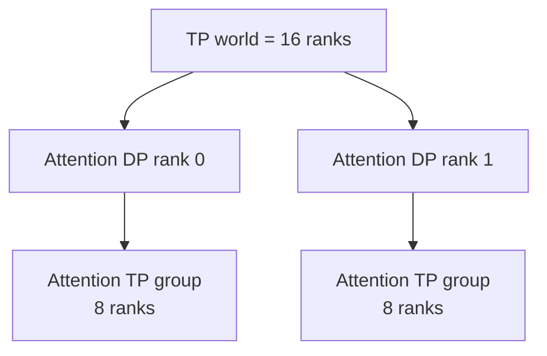
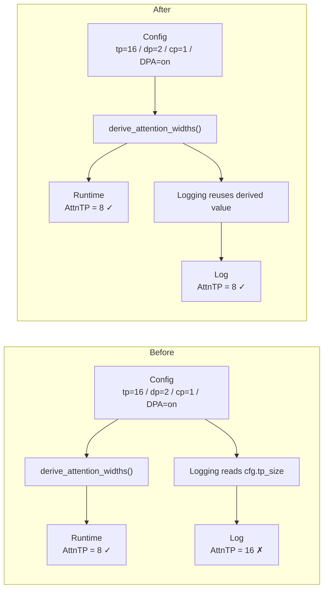
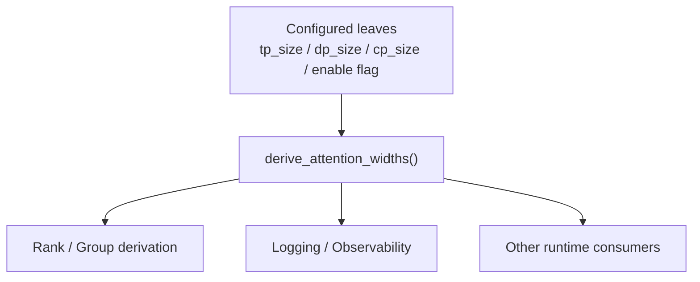

# 从一个 10 行 PR 看懂 SGLang 的 Attention 并行拓扑：PR #39871 为什么 TP16 不是 AttnTP16？

大型 AI Infra 项目最容易把人劝退的地方，是源码一打开就有几千行：Scheduler、Process Group、KV Cache、Kernel、通信、Graph 全堆在一起。于是很多人第一次读 SGLang，会直接挑战最复杂的模块，读了半天却说不清“这一段代码到底在解决什么问题”。

其实还有一种更适合入门的方式：**从一个很小、已经合入主干的真实 PR 出发，只追一个明确问题。**

SGLang PR [#39871](https://github.com/sgl-project/sglang/pull/39871) 就是一个很好的例子。它只改了一个文件，净改动只有几行，而且没有改模型数学、Kernel 或通信行为；它修的是一条日志：

```text
Fix DSA partial DP-TP mode log to use derived attn_tp_size
```

但顺着这条错误日志往下追，我们会自然遇到一整套非常重要的概念：

```text
tp_size
   ↓
DP Attention
   ↓
attn_dp_size
   ↓
Context Parallelism
   ↓
attn_cp_size
   ↓
attn_tp_size
   ↓
Rank / Group
```

这正是小 PR 最有价值的地方：**代码很少，背后的系统知识却很完整。**

| 项目 | 信息 |
| --- | --- |
| PR | [sgl-project/sglang #39871](https://github.com/sgl-project/sglang/pull/39871) |
| 标题 | `Fix DSA partial DP-TP mode log to use derived attn_tp_size` |
| 状态 | merged |
| Merge commit | `803f0c93d20104cf19ff6a95f7ef580b9fe449a2` |
| 改动规模 | 1 file / +8 / -2 |
| 难度 | ★☆☆☆☆ |
| 类型 | Correctness / Observability |
| 核心知识 | DP Attention、Runtime Derivation、Rank / Group、Single Source of Truth |
| 为什么值得读 | 改动极小，却完整暴露了 Configured Value vs Derived Runtime Value 这一类常见系统 Bug |
| 适用边界 | CUDA / ROCm DSA model-specific adjustment；不是 Ascend 910C 执行路径修复 |

> **30 秒结论**
>
> 这个 PR 没有修改并行行为，只修复了错误的 Observability。问题根因是：代码把用户配置的 `tp_size` 直接当成了运行时真正的 `attn_tp_size`。在 DP Attention 下，两者不一定相等。
>
> 对于 `tp_size=16, dp_size=2, attn_cp_size=1, enable_dp_attention=true`，SGLang 当前会派生出 `attn_dp_size=2`、`attn_tp_size=8`。
>
> 核心关系可以先记成：`tp_size = attn_dp_size × attn_cp_size × attn_tp_size`。

如果你想系统理解 WORLD / Rank / Group / MoE EP，可以把本文当成案例入口，再继续阅读[《SGLang 里的 Rank 和 Group 到底是什么？》](../distributed/sglang-rank-group-deepseek-v4.md)。这里我们只讲理解这个 PR 所需的最小背景。

---

## 一、问题：到底哪里不对？为什么一条日志值得专门修？

PR 描述给出的错误日志非常直接：

```text
DSA with TP mode is active,
dp_size=2,
tp_size=16,
attn_tp_size=16,
attention weights will be sharded across 16 ranks.
```

问题在于：

```text
attn_tp_size=16
```

不对。

这个场景下真正的值应该是：

```text
attn_tp_size=8
```

最容易产生的第一反应是：

> “既然 `tp_size=16`，Attention 不就是在 16 个 TP Rank 上切吗？”

这个直觉在某些配置下碰巧成立，但一旦开启 DP Attention，就不能再直接把全局 `tp_size` 当成 Attention 模块真正的 TP 宽度。

很多人还会进一步把：

```text
TP = 16
DP = 2
```

理解成：

```text
16 × 2 = 32 ranks
```

也就是两套完整 TP16 Replica。那是经典 Native Data Parallelism 很自然的图景，但**不是这个 PR 所在的 DP Attention 语义**。

在这里，同一组 TP world 会被重新解释成 Attention 的多维并行坐标。对于：

```text
tp_size = 16
dp_size = 2
attn_cp_size = 1
enable_dp_attention = true
```

更准确的直觉是：



也就是：

```text
2 × 8 = 16
```

而不是：

```text
2 × 16 = 32
```

所以这个 PR 虽然只修一条日志，却正好戳中了一个非常典型的认知错误：

> **“整个 TP world 有多少 Rank”和“某个具体模块实际跨多少 Rank 做 TP”不是同一个问题。**

---

## 二、最小背景：`tp_size` 为什么不一定等于 `attn_tp_size`？

PR 没有在日志旁边临时写一个除法，而是复用了 `runtime_context.py` 中已有的：

[`derive_attention_widths()`](https://github.com/sgl-project/sglang/blob/803f0c93d20104cf19ff6a95f7ef580b9fe449a2/python/sglang/srt/runtime_context.py#L138-L148)

核心代码非常短：

```python
def derive_attention_widths(
    *, tp_size: int, attn_cp_size: int, dp_size: int, enable_dp_attention: bool
) -> tuple:
    attn_dp_size = dp_size if enable_dp_attention else 1
    return attn_dp_size, tp_size // attn_dp_size // attn_cp_size
```

先不要背代码，拆成两步。

第一步，决定 Attention 是否真的使用 DP：

```text
如果 enable_dp_attention = true：

attn_dp_size = dp_size
```

否则：

```text
attn_dp_size = 1
```

第二步，把 `tp_size` 这组 Rank 在 Attention 的 DP、CP、TP 三个维度之间拆开：

```text
attn_tp_size
=
tp_size
/
attn_dp_size
/
attn_cp_size
```

所以在合法配置下可以记成：

```text
tp_size
=
attn_dp_size
×
attn_cp_size
×
attn_tp_size
```

带入 PR 的例子：

```text
tp_size = 16
dp_size = 2
attn_cp_size = 1
enable_dp_attention = true
```

得到：

```text
attn_dp_size = 2

attn_tp_size
= 16 / 2 / 1
= 8
```

于是日志真正应该描述的是：

```text
tp_size=16
attn_tp_size=8
```

两者完全不矛盾。

前者描述更上层的 TP world 宽度；后者描述 Attention 模块里一个 TP Group 的实际宽度。

### 为什么 `dp_size=2` 不一定意味着 Attention DP=2？

再换一个配置：

```text
tp_size = 16
dp_size = 2
enable_dp_attention = false
attn_cp_size = 1
```

虽然配置里仍然有：

```text
dp_size = 2
```

但这个模块没有启用 DP Attention，因此：

```text
attn_dp_size = 1
```

最终：

```text
attn_tp_size
= 16 / 1 / 1
= 16
```

这引出一个以后读 SGLang 源码非常实用的习惯：

> **看到一个配置字段存在，不要立刻假设某个模块一定使用了它。先继续追它经过了哪些 enable 条件和 runtime derivation。**

---

## 三、根因：真正被破坏的是哪个 invariant？

现在回到修改前的数据流。

SGLang Runtime 已经有统一的派生逻辑：

```text
cfg.tp_size
cfg.dp_size
cfg.attn_cp_size
cfg.enable_dp_attention
        │
        ▼
derive_attention_widths()
        │
        ├── attn_dp_size
        └── attn_tp_size
```

在 PR 的例子里，Runtime 这条路径已经会得到：

```text
attn_tp_size = 8
```

真正出问题的是 Logging 走了一条旁路：它没有消费这个派生结果，而是直接把 `cfg.tp_size` 打成了 `attn_tp_size`。



于是同一个进程里同时存在：

```text
Runtime Truth       = 8
Logging Observation = 16
```

这就是这个 PR 的 Root Cause：

> **Logging 直接消费了 configured value，而没有消费 runtime-derived value。**

进一步可以把这个 PR 修复的核心 invariant 写成一句话：

> **Invariant：任何描述 Attention TP 宽度的消费者，都应该与 Runtime Group / Rank 派生使用同一套 Attention width 语义，而不能把原始 `tp_size` 直接当成 `attn_tp_size`。**

这个 invariant 比具体的 `16 → 8` 更重要。以后即使配置变成 `TP32 / DP8 / CP2`，问题本质仍然一样：**不能从某个原始配置字段“猜”运行时模块宽度。**

读 PR 时，因此可以多问一层：

```text
不要只问：哪一行错了？

还要问：哪条系统不变量被破坏了？
```

一旦能准确写出 invariant，通常就已经真正理解了 PR。

---

## 四、修复：Diff 真正做了哪几个设计动作？为什么不是直接除一下？

修复后的代码位于：

[`python/sglang/srt/arg_groups/model_hook.py`](https://github.com/sgl-project/sglang/blob/803f0c93d20104cf19ff6a95f7ef580b9fe449a2/python/sglang/srt/arg_groups/model_hook.py#L280-L299)

如果按“设计意图”而不是逐行翻译 Diff，这次修改其实只有三个动作。

**第一，找到真正的 Single Source of Truth。**

PR 新增：

```python
from sglang.srt.runtime_context import derive_attention_widths
```

它没有在 Logging 层再发明一套并行宽度算法，而是复用 Runtime 已有的派生逻辑。

**第二，用派生值替换错误的配置值。**

```python
_, attn_tp_size = derive_attention_widths(
    tp_size=cfg.tp_size,
    attn_cp_size=cfg.attn_cp_size,
    dp_size=cfg.dp_size,
    enable_dp_attention=cfg.enable_dp_attention,
)
```

日志随后从 `cfg.tp_size` 改成真正的 `attn_tp_size`。

**第三，保持 Runtime 行为完全不变。**

这个 PR 不改 Process Group、不改 Kernel、不改 Collective，只让 Observability 重新对齐 Runtime Truth。

### 为什么不是直接写 `tp_size // dp_size`？

表面看当前例子只需要 `16 / 2 = 8`，所以似乎下面这样也能修：

```python
attn_tp_size = cfg.tp_size // cfg.dp_size
```

但这只是“修当前样例”，不是“修系统语义”。真正的规则还涉及 `enable_dp_attention` 和 `attn_cp_size`。

如果不同文件各自维护一份 arithmetic：

```text
A.py → tp / dp
B.py → tp / dp / cp
C.py → DPA 开启时才除
D.py → 日志直接打印 tp
```

随着代码演进，很容易再次出现 Runtime、Logging、Scheduler 对同一个宽度给出不同答案。

更关键的是，固定 merge commit 下 `derive_attention_widths()` 的源码注释已经明确说明了为什么要把这段算术单独抽出来：DP Attention 的 rank 计算也需要同样的两个宽度，**不能再维护第二份 arithmetic**。

所以正确修法不是“重新算一个正确数字”，而是：

> **让 Logging 回到 Runtime 已经存在的语义源。**



这就是 **Single Source of Truth**。

---

## 五、验证与边界：什么是源码事实，什么不能过度解读？

正式 PR 解读里，最容易犯的错误是把“这个 PR 能证明什么”和“我们从它延伸出的知识”混在一起。

这里把证据分四层：

| 证据层级 | 本文中的结论 |
| --- | --- |
| **Source-confirmed** | `derive_attention_widths()` 按 `tp_size // attn_dp_size // attn_cp_size` 派生 `attn_tp_size`；修复后的日志调用该 helper |
| **PR-confirmed** | PR 作者明确说明错误发生在 partial DP Attention 日志，且改动是 log-only，没有 behavioral impact |
| **Measured** | 这个 PR 没有性能/精度 benchmark，因为没有修改模型计算或 Runtime 行为 |
| **Inference / Transfer** | “配置值与运行时派生值混淆”可以作为其他模块的 Code Review 模式，但每个具体模块仍需重新核源码 |

**这个 PR 实际修了什么：**

```text
旧日志：attn_tp_size = cfg.tp_size

新日志：attn_tp_size = derive_attention_widths(...)[1]
```

因此 Observability 重新与 Attention width derivation 对齐。

**这个 PR 没有修什么：**

- 没有改变 Attention Kernel；
- 没有改变 Process Group 创建；
- 没有改变 Weight Sharding；
- 没有改变 Collective Communication；
- 没有改变模型精度；
- 没有带来性能提升；
- 没有修改 Ascend NPU / XPU 的这个 DSA 分支。

源码里的外层条件明确是：

```python
if not get_platform().is_npu and not get_platform().is_xpu:
    # CUDA or ROCm GPU
```

所以不能把它描述成“PR #39871 修复了 Ascend 910C 的 DP Attention Bug”。更准确的说法是：

> **它修复了 CUDA / ROCm DSA model-specific adjustment 中 partial DP Attention 的日志语义；本文借这个案例学习 SGLang 的 Attention width derivation。**

这也是 PR 精读需要长期坚持的边界：

```text
PR 修改事实
      ≠
可以迁移出的知识
```

---

## 六、迁移：这个 PR 真正教给我们的 AI Infra 方法是什么？

如果读完只记住 `16 / 2 = 8`，那这篇文章的价值其实很有限。真正应该带走的是三个层次。

**第一层：直接知识。**

```text
tp_size
≠
attn_tp_size
```

Attention 的实际并行宽度可能由 DP Attention、CP、TP 共同派生。

**第二层：通用 Bug Pattern。**

这个 PR 属于一个很常见的系统 Bug：

```text
Configured Value
      ≠
Derived Runtime Value
```

原始配置仍然“看起来合理”，所以代码不一定 crash；真正出错的是某个下游消费者直接拿了原始值，而没有经过 Runtime Derivation。

这个模式不只可能出现在并行宽度，也值得在 Buffer capacity、Graph bucket、Effective batch、KV state、Draft / Verify layout、MoE backend、Memory budget 等位置保持警觉——但具体是否存在同类问题，仍然必须逐处按源码确认。

**第三层：Code Review Rule。**

以后在 SGLang 里看到：

```python
cfg.xxx
```

被运行时模块直接使用，可以多问一句：

> **这里真正需要的是用户配置值，还是已经经过 topology / capability / state derivation 的运行时值？**

进一步可以形成一组可复用的检查问题：

```text
1. 这个值是 configured leaf，还是 derived runtime state？
2. 是否已经存在统一 helper / context / coordinator 负责派生？
3. 当前代码是不是复制了一份 arithmetic？
4. Logging / Metrics / Debug 输出和 Runtime 是否共享同一语义源？
5. 这个值在 enable flag、CP、DP、Spec、MoE 等模式下会不会变化？
6. 如果这里错了，影响的是 Runtime behavior，还是 Observability？
```

### 继续阅读

如果想把这条知识链继续往下走，可以按下面的顺序：

1. [《SGLang 里的 Rank 和 Group 到底是什么？》](../distributed/sglang-rank-group-deepseek-v4.md)：把 WORLD、TP / DP / CP / EP 坐标补完整；
2. [《SGLang 里的 AllReduce、AllGather、ReduceScatter、All-to-All 到底在搬什么？》](../distributed/sglang-collectives-deepseek-v4.md)：把 Group 落到真实通信；
3. 再进入 DSpark / DeepSeek-V4 Layout，理解为什么 Draft、Target、Attention 和 MoE 不能只看一个全局 `tp_size`。

固定源码入口：

- [SGLang PR #39871](https://github.com/sgl-project/sglang/pull/39871)
- [`model_hook.py`：修复后的日志路径](https://github.com/sgl-project/sglang/blob/803f0c93d20104cf19ff6a95f7ef580b9fe449a2/python/sglang/srt/arg_groups/model_hook.py#L280-L299)
- [`runtime_context.py`：`derive_attention_widths()`](https://github.com/sgl-project/sglang/blob/803f0c93d20104cf19ff6a95f7ef580b9fe449a2/python/sglang/srt/runtime_context.py#L138-L148)
- [`runtime_context.py`：派生宽度进入 parallel runtime](https://github.com/sgl-project/sglang/blob/803f0c93d20104cf19ff6a95f7ef580b9fe449a2/python/sglang/srt/runtime_context.py#L151-L205)

以后读一个新 PR，也可以重复同样的方法：

```text
现象是什么？
    ↓
理解它需要哪些最小背景？
    ↓
哪个 invariant 被破坏？
    ↓
修改前的数据流 / 状态流在哪里分叉？
    ↓
为什么作者选择这个修法？
    ↓
证据能证明到哪里？
    ↓
什么经验可以迁移成下一次 Code Review 的检查规则？
```

这就是 PR #39871 真正值得学习的地方：**它没有教我们一个复杂的新算法，却用最小的代码差异，把配置、运行时派生、Rank / Group、Single Source of Truth 和 Observability 连成了一条完整的工程链路。**
