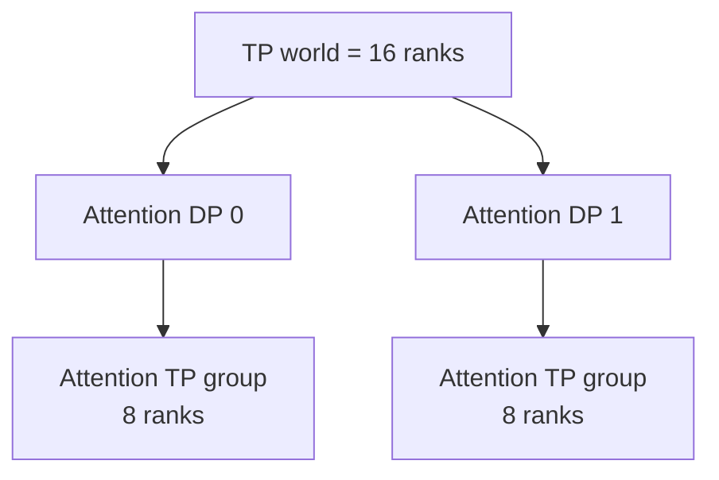
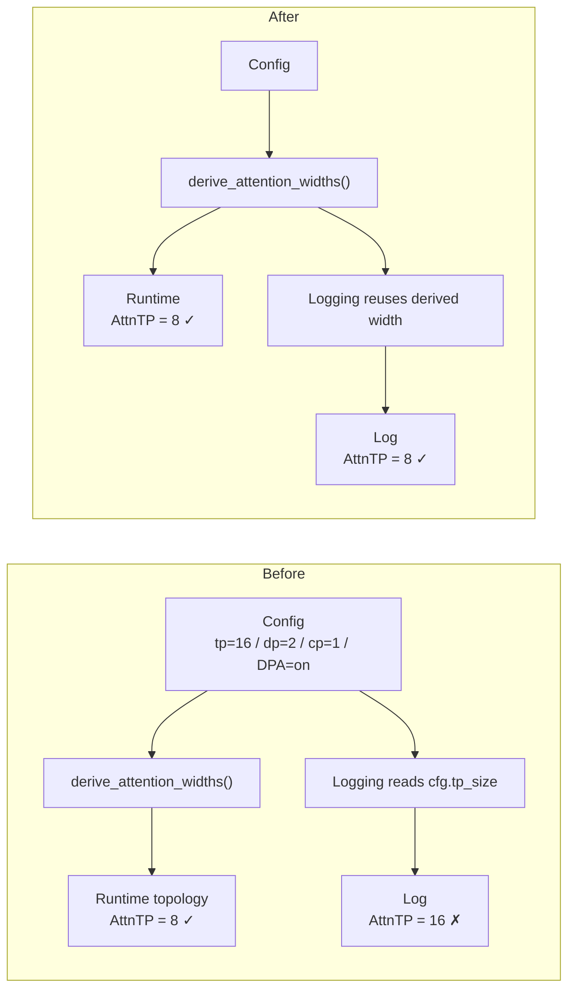

# 从一个 10 行 PR 看懂 SGLang 的 Attention 并行拓扑：PR #39871 为什么 TP16 不是 AttnTP16？

大型 AI Infra 项目里，最值得读的 PR 不一定是改动最大的。

有些 PR 只改几行，却正好暴露一个非常典型的系统错误：**程序真正运行的语义已经经过一层 Runtime Derivation，但某个下游消费者还在直接使用原始配置值。**

SGLang PR [#39871](https://github.com/sgl-project/sglang/pull/39871) 就属于这种案例。它只改 1 个文件、`+8/-2`，没有修改 Attention Kernel、Process Group、Collective 或模型输出；它修的是一条错误日志：

```text
Fix DSA partial DP-TP mode log to use derived attn_tp_size
```

表面问题只是：

```text
tp_size = 16
dp_size = 2

旧日志：attn_tp_size = 16
真实值：attn_tp_size = 8
```

但如果顺着这个差异继续追，会自然连到 SGLang 很重要的一组工程概念：

```text
Configured Value
        ↓
Runtime Derivation
        ↓
Attention Width
        ↓
Rank / Group
        ↓
Observability
```

| 项目 | 信息 |
| --- | --- |
| PR | [sgl-project/sglang #39871](https://github.com/sgl-project/sglang/pull/39871) |
| 标题 | `Fix DSA partial DP-TP mode log to use derived attn_tp_size` |
| 状态 | merged |
| Merge commit | `803f0c93d20104cf19ff6a95f7ef580b9fe449a2` |
| 改动规模 | 1 file / +8 / -2 |
| 难度 | ★☆☆☆☆ |
| 类型 | Correctness / Observability |
| 核心知识 | DP Attention、Runtime Derivation、Rank / Group、Single Source of Truth |
| 为什么值得读 | 改动极小，却完整暴露 `Configured Value ≠ Derived Runtime Value` 这一类常见系统 Bug |
| 适用边界 | DSA 的 CUDA / ROCm model-specific adjustment；不是 Ascend 910C Runtime 修复 |

> **30 秒结论**
>
> `tp_size` 是配置叶子，`attn_tp_size` 是 Attention 拓扑中的派生宽度。开启 DP Attention 后，二者不一定相等。
>
> 对于 `tp_size=16, dp_size=2, attn_cp_size=1, enable_dp_attention=true`：
>
> ```text
> attn_dp_size = 2
> attn_tp_size = 16 / 2 / 1 = 8
> ```
>
> Runtime 的宽度派生本来就是正确的；Bug 在于 Logging 绕过了这套派生语义，直接把 `cfg.tp_size` 打成 `attn_tp_size`。
>
> 所以这个 PR 真正修的不是“并行计算”，而是 **Operational Truth 与 Runtime Truth 不一致**。

本文固定到 `sgl-project/sglang@803f0c93d20104cf19ff6a95f7ef580b9fe449a2`。如果想完整理解 WORLD、Rank、Group、DPA 与 MoE EP，可继续阅读[《SGLang 里的 Rank 和 Group 到底是什么？》](../distributed/sglang-rank-group-deepseek-v4.md)；本文只保留读懂这个 PR 所需的最小背景。

---

## 一、问题与 Impact：日志错一个数字，为什么值得专门修？

PR 给出的原始日志是：

```text
DSA with TP mode is active,
dp_size=2,
tp_size=16,
attn_tp_size=16,
attention weights will be sharded across 16 ranks.
```

真正的问题是最后两处 `16`。在这个配置下，Attention 实际 TP width 应该是 8。

如果只是普通业务日志写错一个数字，可能影响不大；但分布式推理的日志经常承担另一种职责：**它是工程师理解当前拓扑的入口。**

可以把这次 Bug 的 Impact Surface 写得很具体：

| 维度 | #39871 的情况 |
| --- | --- |
| Trigger | DSA、`dp_size < tp_size`、未走 prefill CP 分支，并进入 CUDA / ROCm model-specific adjustment |
| Symptom | warning 把 `attn_tp_size` 打成 `cfg.tp_size` |
| Runtime behavior | 不受影响，真实并行宽度没有被这个日志修改 |
| User-visible impact | Debug / Profiling 时看到错误的 Attention sharding width |
| Blast radius | 主要影响观察与排障认知，不是模型数值正确性 |
| Persistence | 每次进入该启动路径都可能打印同样的错误拓扑信息 |

为什么这会误导排障？

假设你看到：

```text
AttnTP = 16
```

很自然会开始问：

```text
是不是 16-way TP communication 太重？
是不是 16 Rank collective 带宽不够？
是不是 Attention weight 真被切成了 16 份？
```

但真实 topology 如果是：

```text
AttnTP = 8
```

那么整个问题模型从第一步就错了。

所以这个 PR 的影响可以浓缩成：

```text
Runtime Truth       = 8
Operational Truth   = 16
```

这里的 Correctness 不是模型数学 correctness，而是 **Observability Correctness**：人看到的系统必须和机器实际运行的系统一致。

---

## 二、最小背景：为什么 `tp_size=16`，Attention 却可以只做 TP8？

理解这个 PR，只需要先看一个函数：

[`derive_attention_widths()`](https://github.com/sgl-project/sglang/blob/803f0c93d20104cf19ff6a95f7ef580b9fe449a2/python/sglang/srt/runtime_context.py#L138-L148)

固定 merge commit 下的实现是：

```python
def derive_attention_widths(
    *, tp_size: int, attn_cp_size: int, dp_size: int, enable_dp_attention: bool
) -> tuple:
    attn_dp_size = dp_size if enable_dp_attention else 1
    return attn_dp_size, tp_size // attn_dp_size // attn_cp_size
```

先决定 Attention 是否真的使用 DP：

```text
enable_dp_attention = true  → attn_dp_size = dp_size
enable_dp_attention = false → attn_dp_size = 1
```

然后计算 Attention 自己的 TP width：

```text
attn_tp_size
=
tp_size / attn_dp_size / attn_cp_size
```

因此在合法配置里，可以把关系记成：

```text
tp_size
=
attn_dp_size
× attn_cp_size
× attn_tp_size
```

代入 PR 的例子：

```text
tp_size = 16
dp_size = 2
attn_cp_size = 1
enable_dp_attention = true

attn_dp_size = 2
attn_tp_size = 16 / 2 / 1 = 8
```

概念上可以画成：



所以：

```text
tp_size = 16
```

和：

```text
attn_tp_size = 8
```

完全可以同时成立。

这也是为什么看到：

```python
attn_tp_size == 1
```

不能翻译成“整个模型单卡运行”。它只表示 **Attention 这套并行坐标中的 TP width 为 1**。

本文不继续把 DP/CP/Rank/Group 全部展开，因为那会和已有分布式专题重复。对这个 PR 来说，最重要的只有一句：

> **原始配置里的 `tp_size`，不是所有子模块最终运行时都必须直接采用的 TP width。**

---

## 三、History + Root Cause：规则已经统一了，为什么日志还会漂移？

v0.2 的 PR Reviewer 会先问一个以前容易忽略的问题：**这个规则在 #39871 之前是怎样组织的？**

这里能找到一个很有价值的前置设计背景。

在 #39871 之前约两周，SGLang 合入了 [PR #38113](https://github.com/sgl-project/sglang/pull/38113)。那次配置系统整理明确强调：`attn_tp_size` 等 parallel quotients 是由 configured leaves 派生的值，相关 arithmetic 应该有统一来源，而不是让各个消费者各写一份。

PR #38113 不是本文能够证明的“Bug introducing PR”。我没有找到可靠证据说明错误 warning 就是由它引入；因此更准确的 History Chain 是：

```text
#38113
Parallel quotient 语义进一步集中
attn_tp_size 明确属于 derived topology
        │
        ▼
Runtime 已有统一 width derivation
        │
        ▼
某个旧 Logging consumer
仍然直接打印 cfg.tp_size
        │
        ▼
#39871
让 Logging 回到同一个 derivation source
```

也就是说，#39871 很像一种常见的重构尾部 Bug：

> **核心语义已经集中，但还有一个边缘消费者没有迁移到新的 Single Source of Truth。**

固定 merge commit 中，Runtime helper 自己的注释已经把这个意图说得很清楚：

```text
Split out because the rank computation in
dp_attention.compute_dp_attention_world_info
needs the same two numbers and must not carry
a second copy of the arithmetic.
```

Runtime 路径因此已经是：

```text
cfg.tp_size
cfg.dp_size
cfg.attn_cp_size
cfg.enable_dp_attention
        │
        ▼
derive_attention_widths()
        │
        ├── attn_dp_size
        └── attn_tp_size = 8
```

旧 Logging 却旁路了它：



因此这个 PR 的 Root Cause 不是“有人不会算 `16 / 2`”，而是：

> **Logging 直接消费了 configured leaf，而没有消费已经存在的 runtime-derived semantic value。**

进一步可以写出核心 invariant：

> **Invariant：所有描述 Attention TP width 的消费者，都必须与 Rank / Group 构建共享同一套 width derivation；不能让原始配置值和模块派生值各自形成一套事实。**

这个 invariant 比 `16 → 8` 这个具体数字稳定得多。

---

## 四、修复：为什么不是简单写一行 `tp_size // dp_size`？

修复后的代码位于 [`model_hook.py`](https://github.com/sgl-project/sglang/blob/803f0c93d20104cf19ff6a95f7ef580b9fe449a2/python/sglang/srt/arg_groups/model_hook.py#L285-L300)。

如果按设计意图拆，只有三个动作。

**第一，复用现有的权威派生函数。**

```python
_, attn_tp_size = derive_attention_widths(
    tp_size=cfg.tp_size,
    attn_cp_size=cfg.attn_cp_size,
    dp_size=cfg.dp_size,
    enable_dp_attention=cfg.enable_dp_attention,
)
```

**第二，把 Logging 从原始配置值切到 derived value。**

旧逻辑等价于：

```python
attn_tp_size = cfg.tp_size
```

新逻辑变成：

```python
attn_tp_size = derive_attention_widths(...)[1]
```

**第三，保持 Runtime 行为完全不变。**

Process Group、Attention Kernel、Collective、Weight Sharding 都没有被这个 PR 修改。

### 为什么不直接写 `cfg.tp_size // cfg.dp_size`？

因为那只是“把当前样例算对”，却重新复制了一份系统规则。

真实公式还涉及：

```text
enable_dp_attention
attn_cp_size
```

如果不同消费者自己写：

```text
A.py → tp / dp
B.py → tp / dp / cp
C.py → DPA 开了才除
D.py → 直接打印 tp
```

迟早会再次漂移。

而 `derive_attention_widths()` 本身存在的理由，就是让 Rank 计算和其他消费者**不要持有第二份 arithmetic**。

所以这个修复真正重要的不是：

```text
16 / 2 = 8
```

而是：

```text
One semantic rule
      ↓
One derivation home
      ↓
Many consumers reuse it
```

这就是 Single Source of Truth 在 Runtime 代码里的具体样子。

---

## 五、Validation Surface：这个 PR 到底验证了什么，又没有验证什么？

旧版文章只强调“这是 log-only”，v0.2 还要继续问：**证据真正覆盖到了哪里？**

先做 Evidence Ladder：

| 证据类型 | 能支持的结论 |
| --- | --- |
| **Source-confirmed** | merge commit 中 Logging 调用 `derive_attention_widths()`；helper 的公式和共享 arithmetic 目的可直接从源码确认 |
| **PR-confirmed** | PR 作者明确说明错误发生在 partial DP Attention warning，且是 log-only、no behavioral impact |
| **Measured** | 没有 accuracy benchmark，也没有 performance benchmark；PR 明确认为二者不适用于这次 log-only 改动 |
| **Inference / Transfer** | “configured value 绕过 derived runtime value”是一类可迁移的 Review Pattern |

再看 Validation Surface：

| Surface | 状态 | 说明 |
| --- | --- | --- |
| Source diff | covered | 1 个文件、`+8/-2`，修改边界非常清楚 |
| Lint | reported-pass | 对应 PR head 的 Lint workflow 成功 |
| Dedicated topology runtime test | not shown | PR 没有新增针对该 warning 的专门 runtime test |
| Accuracy | not-run | PR 明确标为不需要 |
| Performance / Profiling | not-run | PR 明确标为不需要 |
| Broad PR workflows | mixed / red | 多个 PR Test workflow 在该 head 上记录为 failure，因此不能把“整套 CI green”当成本 PR 的验证证据 |
| Ascend runtime | out of scope | 这段代码被 `not is_npu and not is_xpu` 条件排除 |

这里有一个很重要的 Maintainer 习惯：

> **CI 存在，不等于我们可以笼统写“CI 已验证”。要看目标测试是否真的执行、它验证的又是哪一层 contract。**

对于 #39871，真正能强证实的是：

```text
旧日志读取了错误的 source
新日志复用了正确 derivation
Runtime 行为没有被 diff 修改
```

而不是：

```text
所有 DSA / 所有平台 / 所有 topology
都经过了专门 runtime regression test
```

### Scope：这个 PR没有修什么？

它没有改变：

- Attention Kernel；
- Process Group 创建；
- Weight Sharding；
- Collective Communication；
- 模型精度；
- Runtime 性能；
- Ascend NPU / XPU 的这条 DSA 分支。

固定源码里的外层条件明确是：

```python
if not get_platform().is_npu and not get_platform().is_xpu:
    # CUDA or ROCm GPU
```

因此最准确的表述是：

> **#39871 修复了 CUDA / ROCm DSA model-specific adjustment 中 partial DP Attention 的日志语义；它没有修复或改变 Ascend 910C 的 Runtime Parallelism。**

---

## 六、迁移：以后 Review SGLang 源码时，应该问什么？

如果读完只记住：

```text
TP16 / DP2 = AttnTP8
```

这篇 PR 的学习价值还没有吃完。

真正值得迁移的是这个 Bug Pattern：

```text
Configured Value
        ≠
Derived Runtime Value
```

原始配置值往往没有错，真正的问题是**某个下游消费者选错了语义层级**。

类似风险还可能出现在：

```text
buffer capacity
graph bucket
effective batch size
KV committed length
Draft / Verify layout
MoE backend
memory budget
```

但“可能存在同类风险”不等于这些模块现在真的有 Bug；每个具体结论仍需要重新核源码。

### 可以直接带走的 Review Questions

以后看到运行时代码直接读取 `cfg.xxx`，可以先问：

```text
1. 这个值是 configured leaf，还是 derived runtime state？

2. 是否已经存在 helper / context / coordinator
   定义了同一语义？

3. 当前代码是不是重新复制了一份 arithmetic？

4. Runtime、Logging、Metrics、Debug 输出
   是否共享同一个 truth source？

5. enable flag、DP、CP、EP、Spec、Graph
   会不会改变这个值的最终语义？

6. 如果这里错了，影响的是 Runtime behavior，
   还是只影响 Observability？

7. 这个 contract 是近期重构后集中起来的吗？
   有没有旧 consumer 还没有迁移？

8. CI 真的覆盖到了这个配置和失败路径吗？
```

最后把 #39871 压缩成一句真正可迁移的工程规则：

> **当系统已经存在 Runtime Derivation 时，下游消费者应该依赖派生后的语义，而不是重新从原始配置猜一次答案。**

这也是为什么一个只有 10 行左右改动的 PR 值得认真读：它没有发明新算法，却非常完整地展示了一个大型系统里常见的维护问题——**核心语义已经集中，但边缘消费者仍可能残留旧的事实来源。**

### 固定源码与延伸阅读

- [SGLang PR #39871](https://github.com/sgl-project/sglang/pull/39871)
- [PR #38113：parallel quotients / derived config 的前置设计背景](https://github.com/sgl-project/sglang/pull/38113)
- [`model_hook.py`：修复后的 warning](https://github.com/sgl-project/sglang/blob/803f0c93d20104cf19ff6a95f7ef580b9fe449a2/python/sglang/srt/arg_groups/model_hook.py#L285-L300)
- [`runtime_context.py`：`derive_attention_widths()`](https://github.com/sgl-project/sglang/blob/803f0c93d20104cf19ff6a95f7ef580b9fe449a2/python/sglang/srt/runtime_context.py#L138-L148)
- [`runtime_context.py`：parallel width derivation](https://github.com/sgl-project/sglang/blob/803f0c93d20104cf19ff6a95f7ef580b9fe449a2/python/sglang/srt/runtime_context.py#L151-L205)
- [《SGLang 里的 Rank 和 Group 到底是什么？》](../distributed/sglang-rank-group-deepseek-v4.md)
