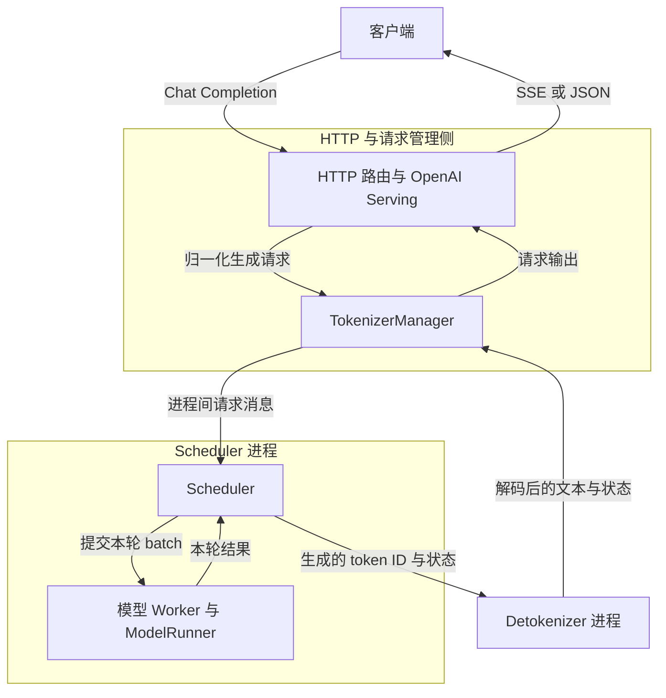
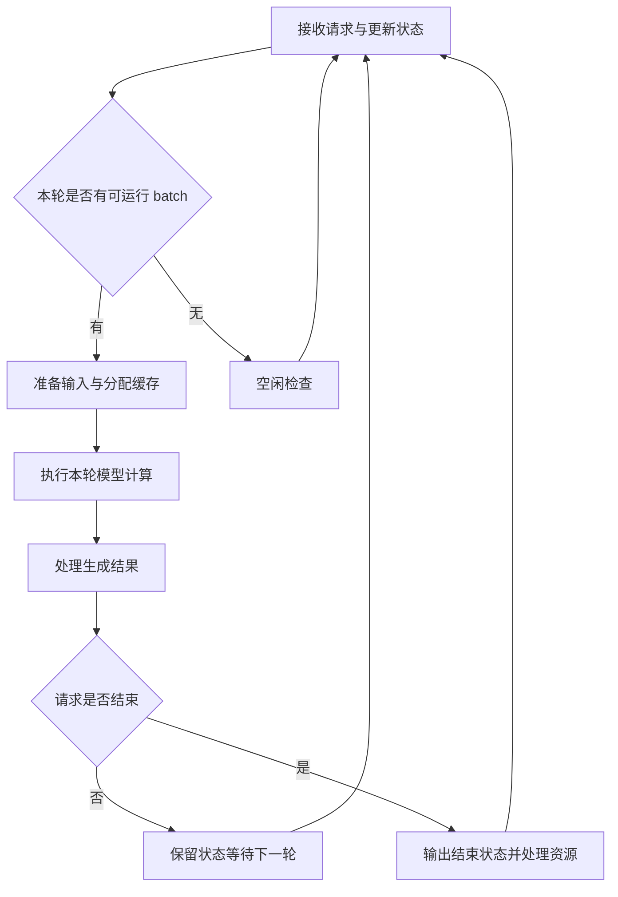
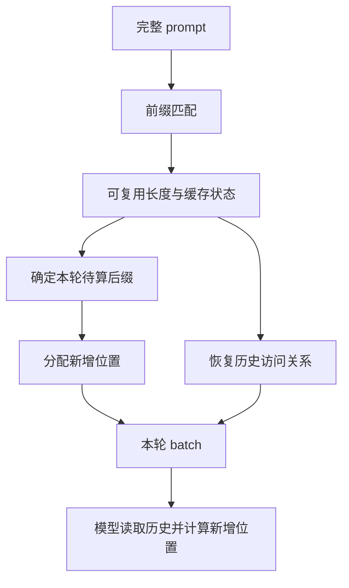
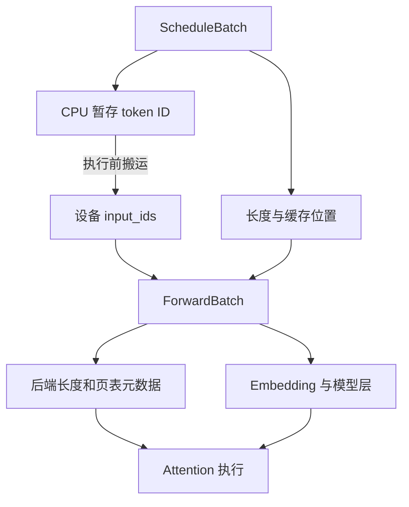
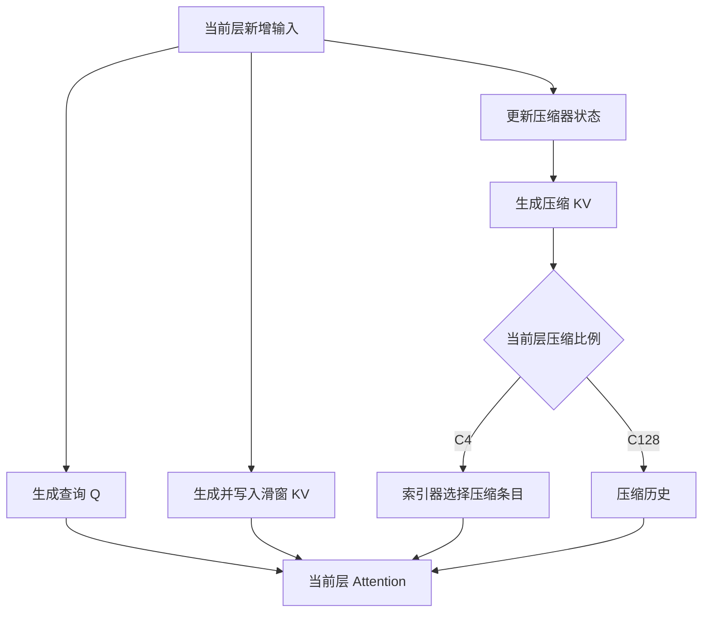
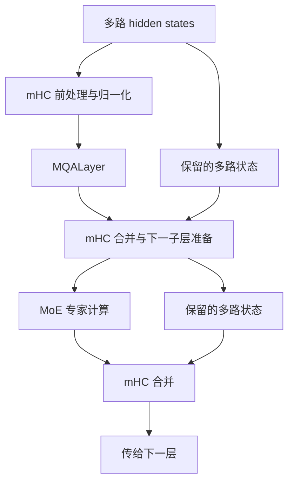
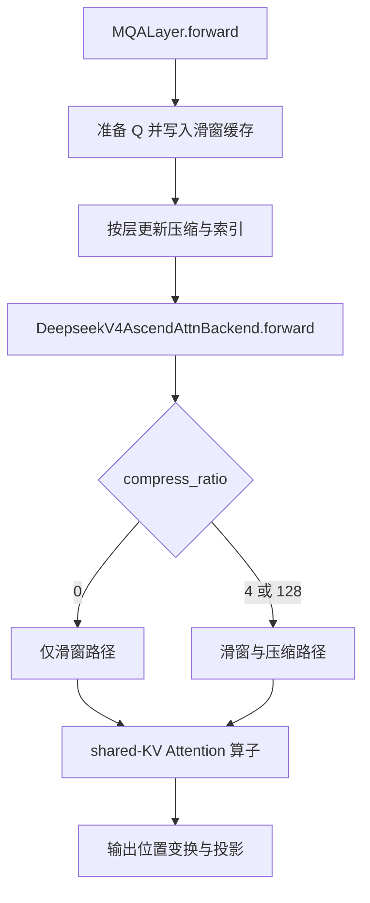
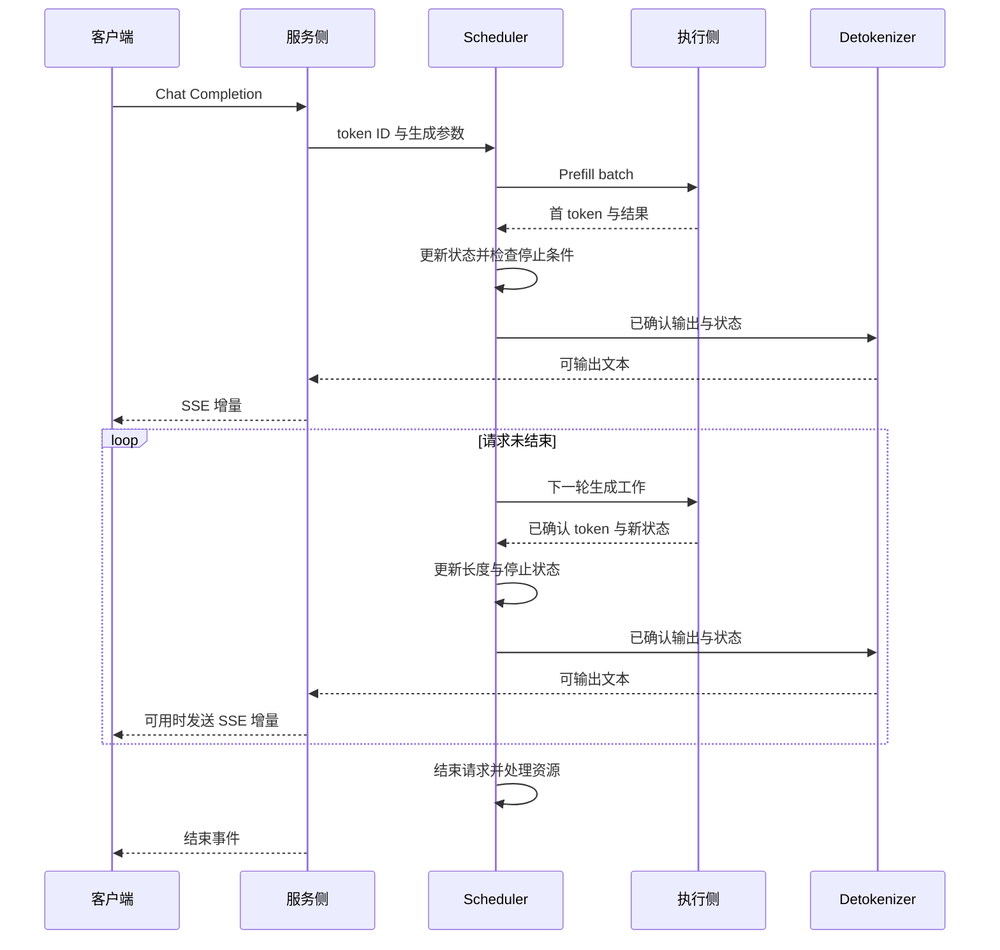
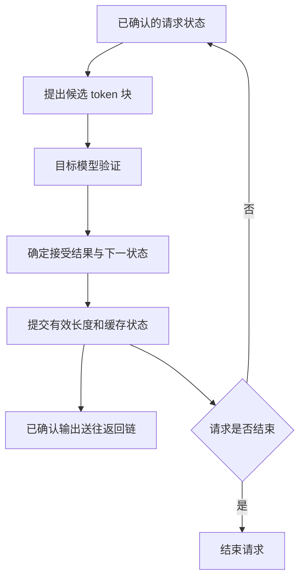

# SGLang 推理执行链路解析：一次 Chat Completion 请求是如何跑到 Ascend NPU 上的

客户端发送一句“中国的首都是哪里？”，服务端过了一会儿开始返回文字。对调用 API 的人来说，这是一次 HTTP 请求；对推理服务来说，它会经历协议转换、分词、排队、缓存匹配、批处理、模型计算和流式输出。生成没有结束时，同一条请求还会反复进入设备执行流程。

这条链路中，请求的表示形式不断变化：聊天消息被转换成 token ID，独立请求被组织成 batch，batch 中的输入与缓存信息再交给模型执行。NPU 每完成一轮计算，结果就回到调度器，成为继续生成或结束请求的依据。

> **源码与适用范围**：基于 `sgl-project/sglang @ dd83b54611897a5f80f4df59e69756bd2fb4b8ab`，核对日期为 2026-09-20。模型案例采用公开源码中的 DeepSeek-V4 文本模型与 NPU `dsv4` 后端，以合设服务、普通自回归和直接执行为主线，展开非 A5 的 BF16 缓存路径，最后说明 DSPARK 如何改变生成循环。Tensor 示例观察一个参与计算的 Rank；多机通信、量化与图回放不逐项展开。本文分析到源码中的算子入口，具体 Flash/Pro 权重尺寸与部署镜像行为需对应配置和源码确认。

## 一、先看请求会经过哪些进程

一次生成请求可能持续数秒，设备上的一个 batch 却只承担其中一轮计算。等待结果的 HTTP 请求始终存在，参与本轮计算的请求集合则不断变化：有的刚开始处理 prompt，有的已经在生成下一个 token，还有的已经结束。

SGLang 将请求接入、调度执行和文本解码分开组织，使这些不同节奏的工作能够协作。

在一个服务实例中，HTTP 与请求管理侧负责接入和返回，Scheduler 侧组织并推进模型执行，Detokenizer 负责将输出 token ID 解码成文本。它们通过以下消息路径连接：



Serving 与 TokenizerManager 衔接协议处理和请求管理；TokenizerManager、Scheduler 与 Detokenizer 之间通过进程间消息传递数据。图中的模型 Worker 是 Scheduler 侧的执行对象，与 ModelRunner 一起承担模型执行职责。

多卡部署时，执行侧包含多个协作的 Rank，图中将它们合并为调度与执行职责；它不表示整个 DeepSeek 模型只占一个进程或一张卡。Scheduler 所在进程通过 Worker 发起设备计算。CPU 组织请求并提交工作，NPU 执行相应算子；在允许重叠执行的路径中，主机侧处理与设备计算可以交错推进。

输入与输出形成两条相连的路径：输入侧把聊天消息变成可调度请求；输出侧把生成结果送回仍在等待的 HTTP 请求。这些职责分别落在 [HTTP 路由](https://github.com/sgl-project/sglang/blob/dd83b54611897a5f80f4df59e69756bd2fb4b8ab/python/sglang/srt/entrypoints/http_server.py)、[TokenizerManager](https://github.com/sgl-project/sglang/blob/dd83b54611897a5f80f4df59e69756bd2fb4b8ab/python/sglang/srt/managers/tokenizer_manager.py) 和 [DetokenizerManager](https://github.com/sgl-project/sglang/blob/dd83b54611897a5f80f4df59e69756bd2fb4b8ab/python/sglang/srt/managers/detokenizer_manager.py) 等实现中。

## 二、一段聊天消息，怎样变成 Scheduler 能处理的请求

假设客户端发送下面这段请求体。其中 `model` 应填写服务实际暴露的模型名称，这里只展示协议结构。

```json
{
  "model": "your-served-model",
  "messages": [
    {"role": "user", "content": "中国的首都是哪里？"}
  ],
  "max_tokens": 32,
  "temperature": 0.7,
  "stream": true
}
```

`messages` 是对话协议中的表达形式。模型所需的输入还包括角色边界、轮次分隔符，以及提示模型继续生成 assistant 内容的标记。这些信息由模型对应的 Chat Template 等处理逻辑组织起来。因此，实际送入模型的序列通常比用户看到的一句话长。

在这一版本中，`OpenAIServingChat._convert_to_internal_request()` 接收 `ChatCompletionRequest`，处理消息，构建采样参数，随后创建 `GenerateReqInput`。后者承载 Runtime 所需的生成输入和控制信息，例如 prompt、采样参数、流式开关以及部分路由或会话信息。对话中的生成要求由此转化为内部接口可以消费的字段。[源码：请求转换](https://github.com/sgl-project/sglang/blob/dd83b54611897a5f80f4df59e69756bd2fb4b8ab/python/sglang/srt/entrypoints/openai/serving_chat.py#L1143-L1268)

内部请求可以携带文本，也可以携带上游模板处理已经生成的 token ID。TokenizerManager 根据输入形式完成必要的分词与请求准备，构造送往调度侧的 `TokenizedGenerateReqInput`。已有 ID 的输入可以直接进入相应处理路径。[源码：TokenizerManager](https://github.com/sgl-project/sglang/blob/dd83b54611897a5f80f4df59e69756bd2fb4b8ab/python/sglang/srt/managers/tokenizer_manager.py)

下文使用一个六 token 的示意 prompt：`[A, B, C, D, E, F]`。字母代表 token ID，便于追踪它们在调度、缓存和模型计算中的位置。

同一请求在不同边界使用的对象，可以放在一张表里理解：

| 对象 | 主要由谁使用 | 此时关心的问题 |
|---|---|---|
| `ChatCompletionRequest` | OpenAI Serving | 用户提交了什么对话和生成要求？ |
| `GenerateReqInput` | Serving、TokenizerManager | 怎样用内部生成接口表达这些要求？ |
| `TokenizedGenerateReqInput` | 输入消息处理链路 | token ID 和执行所需的请求参数是否准备好？ |
| `Req` | Scheduler | 这条请求进行了多少、生成了什么、是否结束？ |
| `ScheduleBatch` | 调度与批处理逻辑 | 这一轮把哪些请求、哪些 token 放在一起计算？ |
| `ForwardBatch` | 模型执行层 | 本轮计算所需的输入 Tensor、位置和执行信息是什么？ |

其中，`Req` 保存单条请求跨越多轮生成的状态，batch 则描述某一轮的计算安排。同一条请求会先后进入多个 batch，与它一起运行的其他请求也可能变化。

当 Scheduler 收到输入后，请求拥有了可持续更新的运行状态。后面每生成一批结果，系统都要更新它的输出、长度和结束条件。至此，聊天协议已经转化成一个等待计算资源的推理任务。

## 三、Scheduler 决定本轮处理谁，以及处理多少 token

聊天请求进入 Scheduler 后，要和其他请求共享计算与缓存资源。刚到达的请求需要处理 prompt，已经开始生成的请求需要继续向后推进。一次 HTTP 请求会持续等待，但设备每轮处理的 batch 可以变化。

这对应两种基本计算节奏。Prefill 处理提示词，为后续生成建立缓存；普通 Decode 消费上一轮生成的 token，利用已有缓存预测下一个 token。缓存保存的是 Attention 后续计算所需的历史表示。对于本文的 DeepSeek-V4，这些表示还涉及滑窗、压缩内容和压缩器状态，第四章会展开它们的关系。

普通调度循环的核心职责如下。这里是省略空闲与暂停检查后的伪代码，不是源文件逐字摘录：

```python
while service_running:
    ingest_requests()
    plan = choose_next_batch(running_requests, previous_batch)
    batch = plan.batch_to_run
    if batch is not None:
        result = run_batch(batch)
        process_batch_result(batch, result)
```

`event_loop_normal()` 持续接收请求、选择 batch、执行并处理结果；重叠调度则允许本轮提交与先前 batch 的结果处理交错进行。调度器会受到 token 预算、缓存容量和请求状态约束，不能把全部等待请求一次塞进模型。[源码：调度循环](https://github.com/sgl-project/sglang/blob/dd83b54611897a5f80f4df59e69756bd2fb4b8ab/python/sglang/srt/managers/scheduler.py#L1932-L2020)



全文继续追踪六个 token 的 prompt `[A, B, C, D, E, F]`。主例假设没有可复用前缀，因此第一次需要处理六个输入，逻辑位置为 `[0, 1, 2, 3, 4, 5]`。这里的字母只是 token ID 的代号，与真实分词结果无关。

前缀缓存可以改变待算数量。若另一条请求已经留下相同前缀，并且缓存实现能够恢复该模型需要的完整状态，命中的部分就不必重新做全部模型计算。例如逻辑上复用了前四个位置，待处理后缀就只剩 E、F。这个例子说明输入如何切分，不表示 DeepSeek-V4 的实际缓存匹配一定允许四 token 粒度。

Radix 索引负责查找可复用前缀，实际 Tensor 保存在设备缓存池。请求准备逻辑通过 `tree_cache.match_prefix()` 获得索引等结果，再确定后缀。对于包含压缩状态的模型，只看到文本前缀一致还不够；缓存粒度、相关状态和实现条件也必须成立。[源码：请求前缀准备](https://github.com/sgl-project/sglang/blob/dd83b54611897a5f80f4df59e69756bd2fb4b8ab/python/sglang/srt/managers/schedule_batch.py#L1585-L1668)



首 token 还需要模型提供下一位置的 logits。通用请求逻辑中的 `_compute_max_prefix_len()` 将匹配上限限制在 `input_len - 1`，请求 logprob 时还有额外约束；具体缓存实现也可能进一步缩短可复用长度。因此，不能由“prompt 全部见过”推导出“完全不执行模型就能采样”。[源码：前缀长度上限](https://github.com/sgl-project/sglang/blob/dd83b54611897a5f80f4df59e69756bd2fb4b8ab/python/sglang/srt/managers/schedule_batch.py#L1677-L1682)

这一轮选中的请求及其输入安排进入 `ScheduleBatch`。一轮结束后，完成的请求退出，新请求可以加入，仍需生成的请求继续运行。这就是 Continuous Batching 在请求生命周期中的作用。

## 四、输入怎样落到 NPU，DeepSeek-V4 又怎样保存历史

六个 token ID 还不是模型向量。调度侧先整理本轮 ID、长度与缓存位置，执行侧再把它们组织成模型所需的 Tensor。

在 `prepare_for_extend()` 中，输入 ID 先进入 CPU 暂存区；序列长度保留设备 Tensor 和 CPU 版本。执行前，`resolve_forward_inputs()` 将暂存 ID 传到设备。Worker 随后构造 `ForwardBatch`，把模型执行所需的输入、位置和模式集中起来。[源码：Extend 输入准备](https://github.com/sgl-project/sglang/blob/dd83b54611897a5f80f4df59e69756bd2fb4b8ab/python/sglang/srt/managers/schedule_batch.py#L2685-L2728)、[设备输入解析](https://github.com/sgl-project/sglang/blob/dd83b54611897a5f80f4df59e69756bd2fb4b8ab/python/sglang/srt/managers/overlap_utils.py#L87-L114)、[Worker 构造 ForwardBatch](https://github.com/sgl-project/sglang/blob/dd83b54611897a5f80f4df59e69756bd2fb4b8ab/python/sglang/srt/managers/tp_worker.py#L631-L685)

| 信息 | 六 token 主例 | 用途 |
|---|---|---|
| `input_ids` | A 到 F 的整数 ID，设备上的 `[6]` Tensor | Embedding 查表 |
| `positions` | `[0, 1, 2, 3, 4, 5]` | 位置编码和相关元数据 |
| `extend_seq_lens_cpu` | `[6]` | 本轮新增输入的长度 |
| `seq_lens` / `seq_lens_cpu` | `[6]` | 请求当前总长度，供设备或主机逻辑使用 |
| `out_cache_loc` | 为六个新位置分配的槽位索引 | 关联本轮输入与缓存写入位置 |
| `out_cache_loc_dsv4` | DeepSeek-V4 专用位置集合 | 关联压缩缓存等独立分配结果 |

如果第二条请求本轮还要处理三个 token，输入可以打包成 `[9]`，Embedding 后对应 `[9, H]`。各请求的长度与映射仍然保留，因此拼接存储不会让两条请求共享上下文。



`positions` 和 `out_cache_loc` 是两套坐标。前者表示 token 在序列中的先后，后者表示系统分配的缓存落点。DeepSeek-V4 的 NPU 后端还会把完整槽位映射到滑窗缓存槽位，不能直接拿序列位置当显存地址。`store_cache()` 通过 `get_swa_out_cache_loc()` 获得对应位置，再写入 SWA 缓存池；已有元数据可提供这组位置，否则由池执行映射转换。[源码：滑窗位置转换与写入](https://github.com/sgl-project/sglang/blob/dd83b54611897a5f80f4df59e69756bd2fb4b8ab/python/sglang/srt/hardware_backend/npu/attention/ascend_dsv4_backend.py#L2192-L2224)

这里的 SWA 是 Sliding Window Attention，即滑窗 Attention。它保留近期内容的细粒度表示，而压缩缓存以另一种形式保留更长历史。该版本的 V4 后端支持按层配置三种压缩比例：

| 当前层的 `compress_ratio` | Attention 使用的历史来源 |
|---|---|
| `0` | 滑窗缓存 |
| `4` | 滑窗缓存，加上索引器选出的 C4 压缩条目 |
| `128` | 滑窗缓存，加上 C128 压缩历史 |

C4、C128 表示压缩比例。压缩器根据模型参数处理输入和中间状态，形成压缩表示；它不是简单地每四个或一百二十八个 token 取平均，也不是把普通 K/V Tensor 改一个 shape。C4 的索引器还要计算候选历史的索引，后续 Attention 根据这些索引读取压缩条目。[源码：压缩器与索引器构造](https://github.com/sgl-project/sglang/blob/dd83b54611897a5f80f4df59e69756bd2fb4b8ab/python/sglang/srt/models/deepseek_v4.py#L1115-L1150)、[压缩历史分发](https://github.com/sgl-project/sglang/blob/dd83b54611897a5f80f4df59e69756bd2fb4b8ab/python/sglang/srt/hardware_backend/npu/attention/ascend_dsv4_backend.py#L2047-L2189)



这张图表示数据之间的依赖。滑窗写入、压缩和索引在具体实现中有自己的调度顺序，开启多流后也可能重叠。它们共同回答一个问题：本轮查询能够访问哪部分历史、以什么表示访问。

缓存本身也与普通多头 Attention 不同。非 A5 的 BF16 路径采用 PA_ND 布局，单个池的 Tensor 可写成 `[页数, 每页槽位数, 1, D]`；其中 `1` 是共享 KV head 维，D 包含非旋转与旋转位置分量。这个实现的 `get_value_buffer()` 返回同一个 key buffer，所以不能继续按“两份完全独立的 K、V 缓存”解释内存布局。[源码：NPU 缓存布局](https://github.com/sgl-project/sglang/blob/dd83b54611897a5f80f4df59e69756bd2fb4b8ab/python/sglang/srt/hardware_backend/npu/dsv4/dsv4_memory_pool.py#L40-L95)、[共享缓存访问与写入](https://github.com/sgl-project/sglang/blob/dd83b54611897a5f80f4df59e69756bd2fb4b8ab/python/sglang/srt/hardware_backend/npu/dsv4/dsv4_memory_pool.py#L481-L569)

滑窗池、C4/C128 压缩池和压缩器状态也不能合并成一张普通页表：滑窗位置有自己的转换，C4 页表由完整 token 映射派生，C128 使用独立的请求页表。专用位置集合 `DSV4OutCacheLoc` 把分配结果传到后续步骤。[源码：C4 与 C128 页表](https://github.com/sgl-project/sglang/blob/dd83b54611897a5f80f4df59e69756bd2fb4b8ab/python/sglang/srt/hardware_backend/npu/attention/ascend_dsv4_backend.py#L316-L391)、[专用分配结果接入](https://github.com/sgl-project/sglang/blob/dd83b54611897a5f80f4df59e69756bd2fb4b8ab/python/sglang/srt/hardware_backend/npu/dsv4/dsv4_common_hooks.py#L1-L65)

回到六 token 主例，新增输入始终是 A 到 F，逻辑位置始终是 0 到 5；不同层根据自己的压缩比例更新相应缓存。序列长度 6 表示请求处理进度，不表示每一层都存着六份完整、多头、彼此独立的 K 和 V。

## 五、沿 DeepSeek-V4 的一层，走到 Ascend 算子

设备输入准备完成后，直接执行路径通过 ModelRunner 和 `EagerRunner` 调用模型。`DeepseekV4ForCausalLM.forward()` 进入内部 `DeepseekV4Model`，后者执行 Embedding、Decoder layers 和末端处理，再由 logits processor 结合 LM Head 产生输出分数。[源码：EagerRunner](https://github.com/sgl-project/sglang/blob/dd83b54611897a5f80f4df59e69756bd2fb4b8ab/python/sglang/srt/model_executor/runner/eager_runner.py#L213-L378)、[DeepSeek-V4 生成入口](https://github.com/sgl-project/sglang/blob/dd83b54611897a5f80f4df59e69756bd2fb4b8ab/python/sglang/srt/models/deepseek_v4.py#L5081-L5155)

DeepSeek-V4 的层内状态不能直接画成普通的单路残差。模型在 Embedding 后把 `[T, H]` 扩展为 `[T, hc_mult, H]`，保留多路表示；层内的 mHC 处理负责在子层前后混合这些表示。对初次阅读调用链的人，可以先抓住它的职责：Attention 和专家网络消费整理后的输入，结果再合入持续向下传递的多路状态。这里的 `hc_mult` 是状态流数量，不是 Attention head 数。[源码：Embedding 与多路状态](https://github.com/sgl-project/sglang/blob/dd83b54611897a5f80f4df59e69756bd2fb4b8ab/python/sglang/srt/models/deepseek_v4.py#L4679-L4701)



图中是层内职责关系，融合实现可能合并相邻操作。代码中的 `DeepseekV4DecoderLayer` 构造 `MQALayer` 作为 Attention，同时复用名为 `DeepseekV2MoE` 的专家模块，并传入 `is_deepseek_v4=True`。这个类名反映代码复用，不表示模型退回了 V2 架构。MoE 将 token 交给选定的专家计算并合并结果；跨设备的专家通信取决于具体并行和后端配置。[源码：Decoder Layer 构造](https://github.com/sgl-project/sglang/blob/dd83b54611897a5f80f4df59e69756bd2fb4b8ab/python/sglang/srt/models/deepseek_v4.py#L2603-L2705)、[子层执行](https://github.com/sgl-project/sglang/blob/dd83b54611897a5f80f4df59e69756bd2fb4b8ab/python/sglang/srt/models/deepseek_v4.py#L3006-L3250)

先沿 Attention 看六个输入怎样变化。以 NPU、未启用多流的准备路径为例：查询侧经过 `wq_a`、归一化和 `wq_b`，形成各个本地 head 的 Q；共享 KV 侧经过 `wkv` 和归一化。RoPE 将逻辑位置信息作用到相关分量。代码也允许融合前段投影，但不会改变这些数据各自承担的职责。[源码：查询前段投影](https://github.com/sgl-project/sglang/blob/dd83b54611897a5f80f4df59e69756bd2fb4b8ab/python/sglang/srt/models/deepseek_v4.py#L1750-L1774)、[NPU Q 与共享 KV 准备](https://github.com/sgl-project/sglang/blob/dd83b54611897a5f80f4df59e69756bd2fb4b8ab/python/sglang/srt/models/deepseek_v4.py#L1955-L1998)

设当前 Rank 的 Attention head 数为 `n_local_heads`，每个 head 的维度为 D，查询中间投影维度为 R。六 token 主例的形状关系是：

| 位置 | Tensor shape | 含义 |
|---|---|---|
| Embedding 输出 | `[6, H]` | 六个 token 的初始向量 |
| mHC 多路状态 | `[6, hc_mult, H]` | 在模型层间传递的多路表示 |
| Attention 子层输入 | `[6, H]` | 经过 mHC 前处理的输入 |
| 查询中间表示 | `[6, R]` | `wq_a` 对应的中间维度 |
| 投影并整理后的 Q | `[6, n_local_heads, D]` | 本 Rank 的有效查询 head |
| 送入 Attention 后端的 Q | `[6, n_kernel_heads, D]` | 可能按内核要求补齐 head 维 |
| 共享 KV 的写入数据 | `[6, D]` | 写入池时补成 `[6, 1, D]` |

这些是从代码操作推得的符号维度，没有把 Flash 或 Pro 的具体配置硬填成同一组数字。启用 Attention TP 时，`n_local_heads` 对应当前组内分片，而非全模型 head 数。当前实现还通过 `_kernel_num_heads()` 决定算子使用的 head 维。Attention TP 下，两者可能不同：入口前将 Q 的 head 维补齐，输出再切回本地有效 head。因此，表中同时列出了本地逻辑 shape 与后端实参 shape。[源码：head 维选择](https://github.com/sgl-project/sglang/blob/dd83b54611897a5f80f4df59e69756bd2fb4b8ab/python/sglang/srt/models/deepseek_v4.py#L960-L980)、[补齐与切片](https://github.com/sgl-project/sglang/blob/dd83b54611897a5f80f4df59e69756bd2fb4b8ab/python/sglang/srt/models/deepseek_v4.py#L2219-L2255)

**新增缓存先在准备阶段写入。** NPU 的 `_forward_prepare()` 调用后端 `store_cache()` 写入滑窗表示，随后按层运行索引器和压缩器。返回后，`MQALayer.forward()` 直接调用 `attn_backend.forward(...)`，并在这条路径上传入 `save_kv_cache=False`，避免重复写入。

这里有一个容易读错的源码细节：`attn_mqa` 虽然是 `RadixAttention` 对象，但本例把它作为描述 head 数、缩放、layer ID 等信息的参数传给后端，主调用边是 **`MQALayer → attn_backend.forward`**。不能套用另一模型的习惯，自动在中间插入一次 `RadixAttention.forward()`。[源码：准备、压缩与索引](https://github.com/sgl-project/sglang/blob/dd83b54611897a5f80f4df59e69756bd2fb4b8ab/python/sglang/srt/models/deepseek_v4.py#L1955-L2095)、[直接调用后端](https://github.com/sgl-project/sglang/blob/dd83b54611897a5f80f4df59e69756bd2fb4b8ab/python/sglang/srt/models/deepseek_v4.py#L2260-L2380)

配置名 `dsv4` 在 NPU 上注册为 `DeepseekV4AscendAttnBackend`。这个后端重写了 `forward()`：比例为 0 时走 `_forward_swa()`，其余受支持的 V4 压缩层走 `_forward_compressed()`。Prefill 与 Decode 的差异则体现在查询数量、长度、页表和压缩状态等元数据中，而非照搬通用 `ascend` 后端的 FIA 分支。[源码：dsv4 后端注册](https://github.com/sgl-project/sglang/blob/dd83b54611897a5f80f4df59e69756bd2fb4b8ab/python/sglang/srt/layers/attention/attention_registry.py#L166-L174)、[V4 后端分发](https://github.com/sgl-project/sglang/blob/dd83b54611897a5f80f4df59e69756bd2fb4b8ab/python/sglang/srt/hardware_backend/npu/attention/ascend_dsv4_backend.py#L2047-L2077)



对非 A5 的目标模型路径，`_sparse_attn_ops()` 选择 `torch.ops.custom.npu_sparse_attn_sharedkv` 及配套 metadata 算子。查询使用 TND 布局，即 token、head、head_dim；缓存使用前文的 PA_ND 分页布局。滑窗路径传入原始窗口缓存，压缩路径还传入压缩缓存与对应页表；C4 额外传入索引器计算的 `cmp_sparse_indices`。[源码：设备算子选择](https://github.com/sgl-project/sglang/blob/dd83b54611897a5f80f4df59e69756bd2fb4b8ab/python/sglang/srt/hardware_backend/npu/attention/ascend_dsv4_backend.py#L41-L55)、[窗口及压缩 Attention 参数](https://github.com/sgl-project/sglang/blob/dd83b54611897a5f80f4df59e69756bd2fb4b8ab/python/sglang/srt/hardware_backend/npu/attention/ascend_dsv4_backend.py#L2078-L2189)

六 token 的 Prefill 中，后端为单请求建立查询边界 `[0, 6]`，当前序列长度为 6。如果还打包了另一条三个 token 的请求，查询边界就是 `[0, 6, 9]`。这些边界标明各段 Q 属于谁，滑窗和压缩页表则标明各段查询的历史在哪里。[源码：查询边界构造](https://github.com/sgl-project/sglang/blob/dd83b54611897a5f80f4df59e69756bd2fb4b8ab/python/sglang/srt/hardware_backend/npu/attention/ascend_dsv4_backend.py#L1837-L1925)

| 算子参数 | 回答的问题 |
|---|---|
| `q`、`cu_seqlens_q` | 本轮有哪些查询，每条请求占哪一段？ |
| `seqused_kv` | 各请求当前推进到多长？ |
| `ori_kv`、`ori_block_table` | 窗口内的历史表示在哪里？ |
| `ori_win_left`、`ori_win_right` | 查询可以访问怎样的窗口？ |
| `cmp_kv`、`cmp_block_table`、`cmp_ratio` | 使用哪种压缩历史，如何定位？ |
| `cmp_sparse_indices` | C4 查询选择哪些压缩条目？ |
| `sinks`、`softmax_scale`、`metadata` | 这层 Attention 需要的其他计算参数 |

因此，有效序列长度为 6 并不等于“每个查询都读取六个完整 KV”。窗口、因果约束、压缩比例和索引结果共同决定访问范围。查询边界、有效长度、缓存池容量分别描述不同事情，也不能互相替代。

Attention 输出随后经过相应位置变换及输出投影，回到层内 mHC 与 MoE 流程。全部层执行完成后，最后一个 prompt 位置提供预测下一 token 所需的表示；LM Head 与 logits processor 产生词表分数，运行时再采样出首枚 token `y1`。[源码：Attention 输出处理](https://github.com/sgl-project/sglang/blob/dd83b54611897a5f80f4df59e69756bd2fb4b8ab/python/sglang/srt/models/deepseek_v4.py#L2380-L2600)、[模型结果与采样](https://github.com/sgl-project/sglang/blob/dd83b54611897a5f80f4df59e69756bd2fb4b8ab/python/sglang/srt/managers/tp_worker.py#L631-L725)

**下一轮普通 Decode 输入 y1，逻辑位置为 6。** 此时本轮只有一个查询，本地有效 Q 为 `[1, n_local_heads, D]`，实际后端输入仍按上述规则组织为 `[1, n_kernel_heads, D]`，查询边界为 `[0, 1]`，序列长度增至 7。后端继续写入新增窗口表示、更新相关压缩状态，并沿相应层的同一 Attention 分支执行。

压缩状态并不意味着每个 Decode 都生成一个新压缩条目。该实现会检查长度是否跨过压缩比例对应的边界；例如在普通 C4 Decode 路径中，长度到 8 才满足新的四 token 边界，到 7 时不会仅因执行了 Decode 就多写一个有效 C4 条目。压缩器仍需维护进行中的状态。[源码：Decode 压缩边界](https://github.com/sgl-project/sglang/blob/dd83b54611897a5f80f4df59e69756bd2fb4b8ab/python/sglang/srt/hardware_backend/npu/attention/ascend_dsv4_backend.py#L393-L408)

至此，“再生成一步”已经落实为确定的设备工作：构造当前查询，更新该层所需状态，按窗口及压缩映射读取历史，计算输出。Python 负责组织调用，`torch_npu` 与 Ascend 执行栈承接设备算子。采用图回放时可以复用已捕获的执行安排，数据依赖仍然存在，但每轮不必重走相同的 Python 调用序列。

## 六、结果怎样回到客户端，DSPARK 又改变了什么

普通自回归主线中，Prefill 结束就可以采样得到 y1。下一轮消费 y1，计算它对应的模型状态并预测 y2；再下一轮消费 y2，预测 y3。

| 轮次 | 新增模型输入 | 本轮查询数 | 当前序列长度 | 采样输出 |
|---|---|---:|---:|---|
| Prefill 完成 | A 到 F | 6 | 6 | y1 |
| 第一次普通 Decode | y1 | 1 | 7 | y2 |
| 第二次普通 Decode | y2 | 1 | 8 | y3 |

表中的长度描述已经作为模型输入处理的位置数。刚采样出的 token 要到下一轮作为输入时，才形成它对应的缓存状态。若 y3 已触发停止条件，请求可以直接结束，不必为了它再执行一轮。采用 chunked prefill 时，prompt 可能分多轮处理，中间 chunk 不一定向用户产出 token。

设备上的结果有两个去向：后续计算需要继续消费 token，主机侧则需要更新请求并输出文本。普通生成路径可以从设备结果缓冲区取得下一轮输入，避免每轮先把 token 传回 CPU 再重新上传；客户端返回链仍需取得可处理的输出数据。[源码：普通生成的后续设备输入](https://github.com/sgl-project/sglang/blob/dd83b54611897a5f80f4df59e69756bd2fb4b8ab/python/sglang/srt/managers/overlap_utils.py#L87-L114)

主机提交、设备完成、CPU 消费结果是三个时间点。普通结果处理中的 Tensor 转列表要取得实际值；重叠路径可以先安排异步复制，再用 `copy_done` 事件等待数据可用。非阻塞提交只表示允许工作继续排队，并不表示 CPU 已经能读取结果。[源码：结果复制](https://github.com/sgl-project/sglang/blob/dd83b54611897a5f80f4df59e69756bd2fb4b8ab/python/sglang/srt/managers/utils.py#L150-L217)、[结果处理](https://github.com/sgl-project/sglang/blob/dd83b54611897a5f80f4df59e69756bd2fb4b8ab/python/sglang/srt/managers/scheduler_components/batch_result_processor.py)



这里的服务侧合并了 HTTP、Serving 和 TokenizerManager，执行侧合并了 Worker、ModelRunner 和设备工作。Scheduler 更新请求后，常规文本路径通过 Detokenizer 将 token ID 转成文本，再由请求管理与 Serving 层返回。一个 token 不一定对应一个汉字，一轮计算也不保证对应一条 SSE 消息；解码缓冲、输出间隔和停止字符串会影响文本增量的边界。[源码：Detokenizer](https://github.com/sgl-project/sglang/blob/dd83b54611897a5f80f4df59e69756bd2fb4b8ab/python/sglang/srt/managers/detokenizer_manager.py#L443-L490)、[Chat 流式返回](https://github.com/sgl-project/sglang/blob/dd83b54611897a5f80f4df59e69756bd2fb4b8ab/python/sglang/srt/entrypoints/openai/serving_chat.py)

启用 DSPARK 后，上图的外部请求生命周期仍然成立，但“下一轮生成工作”需要展开为草稿和验证。公开实现的 worker 在 Prefill 路径调用目标模型，并取得供后续草稿使用的 hidden states；后续生成路径由 proposer 提出候选块，再交给目标模型验证，按验证结果确定本轮接受的输出和新的状态。[源码：DSPARK Prefill](https://github.com/sgl-project/sglang/blob/dd83b54611897a5f80f4df59e69756bd2fb4b8ab/python/sglang/srt/speculative/dspark_components/dspark_worker_v2.py#L528-L640)、[候选、验证与提交](https://github.com/sgl-project/sglang/blob/dd83b54611897a5f80f4df59e69756bd2fb4b8ab/python/sglang/srt/speculative/dspark_components/dspark_worker_v2.py#L689-L939)



候选 token 并不在提出时就成为用户输出。源码中的 `accept_lens`、`new_seq_lens` 等结果决定这一轮推进多少；验证阶段可能为每条请求输入多个位置，后端也为 `TARGET_VERIFY` 构造对应的查询边界。因此，不能把普通 Decode 的 `[0, 1]` 和“一轮一个 token”直接套到 DSPARK。

这也解释了为何投机推理适配会牵涉 Scheduler、batch、模型与缓存：需要协同的不只是草稿模型的 forward，还包括候选输入的组织、目标验证、接受数量以及后续可见状态。本文的普通生成例子提供基础时间线，DSPARK 在这条时间线上增加了候选与提交边界；具体草稿块长度和并行协作由相应配置与实现决定。

请求结束后，运行状态与独占资源进入回收流程，可复用缓存是否保留由缓存策略决定。请求数下降不意味着对应设备内存立即全部归还给分配器。

一次 Chat Completion 最终形成了一个闭环：协议输入变成可调度请求，batch 描述本轮计算，DeepSeek-V4 模型更新多路表示及各类 Attention 状态，`dsv4` 后端把查询、窗口和压缩历史交给 Ascend 算子。执行结果再推动请求继续、接受候选或结束，并沿文本返回链送到客户端。
