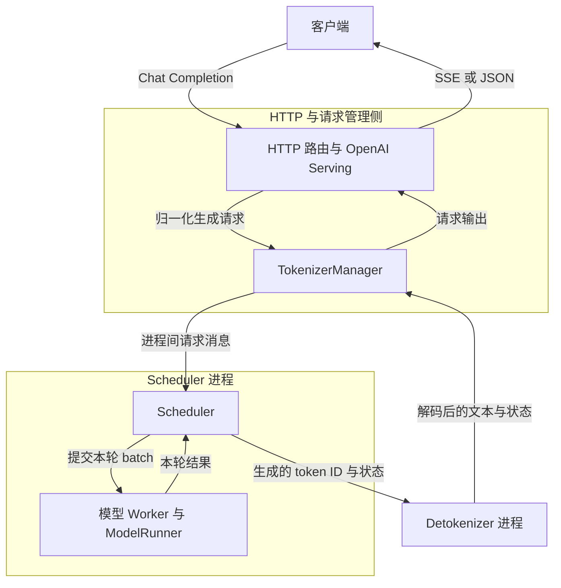
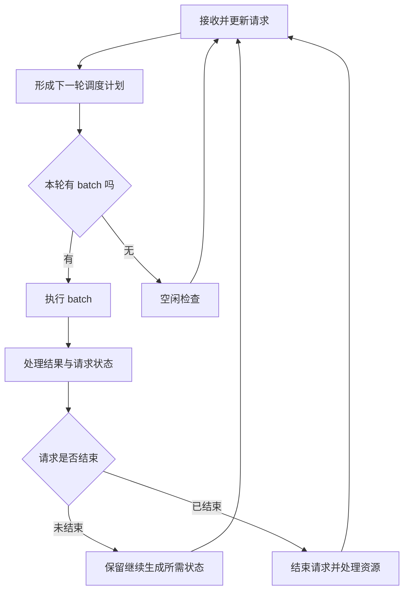
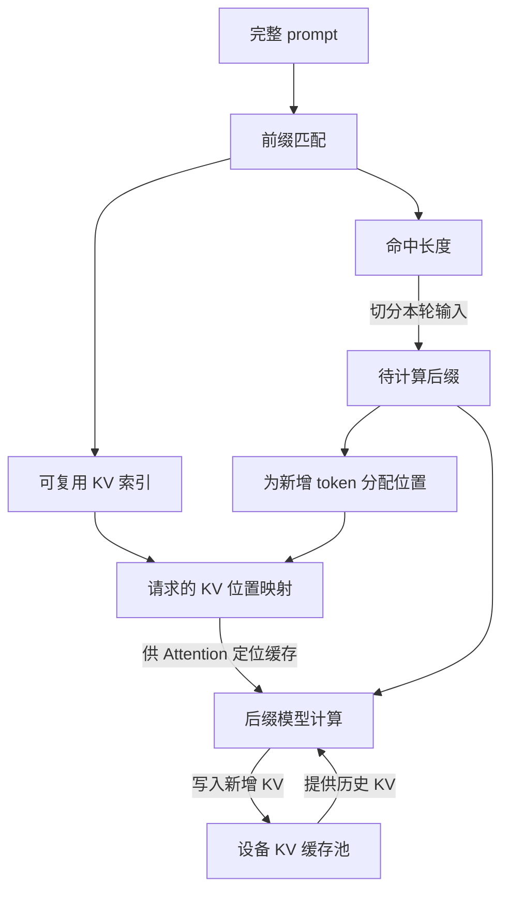
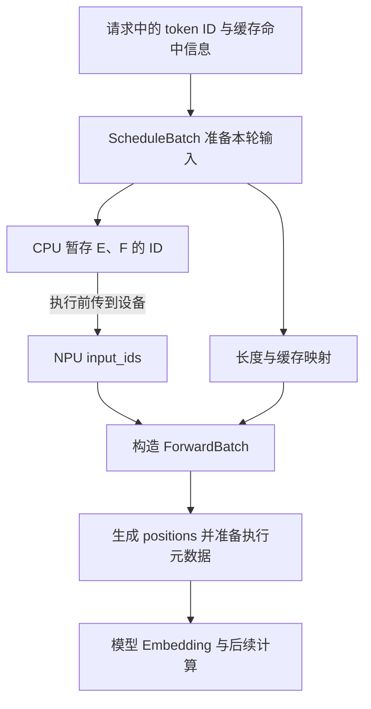
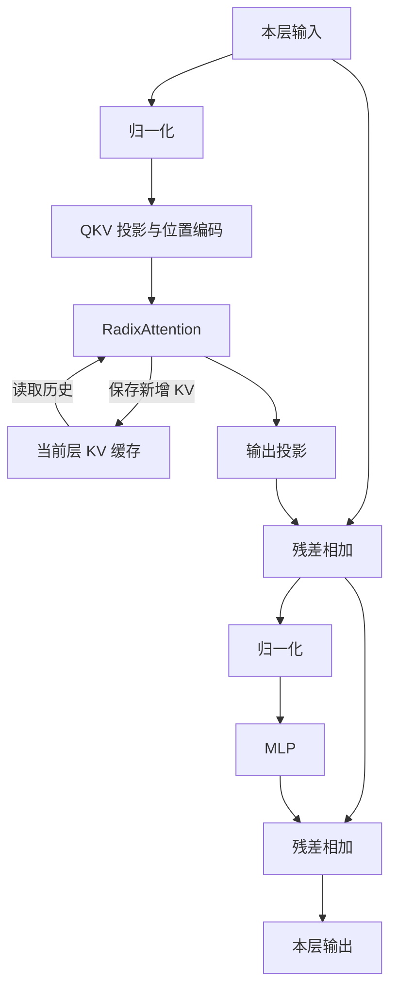
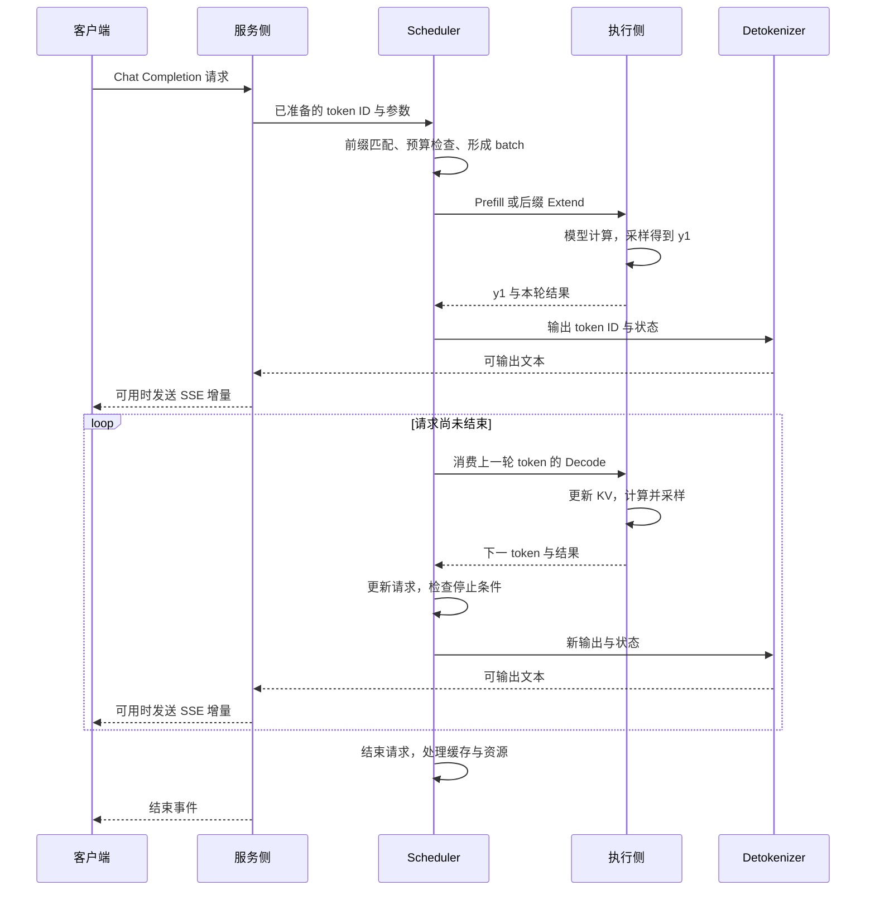
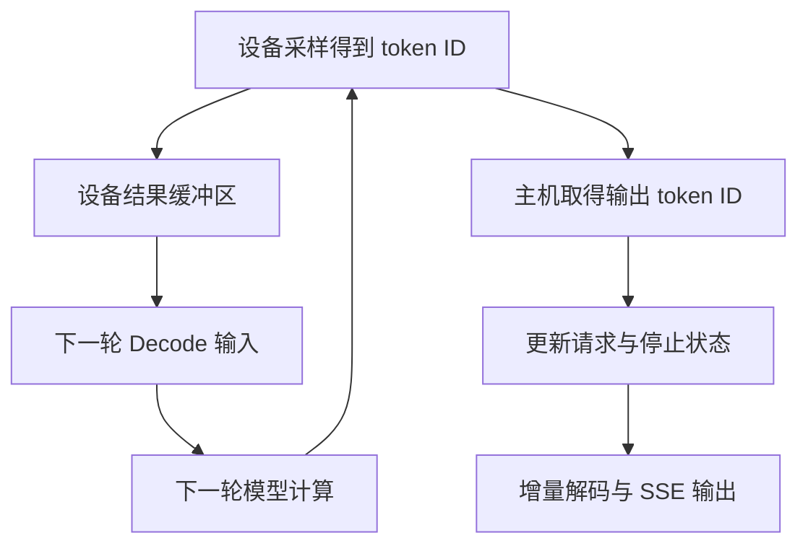

# SGLang 推理执行链路解析：一次 Chat Completion 请求是如何跑到 Ascend NPU 上的

客户端发送一句“中国的首都是哪里？”，服务端过了一会儿开始返回文字。对调用 API 的人来说，这是一次 HTTP 请求；对推理服务来说，它会经历协议转换、分词、排队、缓存匹配、批处理、模型计算和流式输出。生成没有结束时，同一条请求还会反复进入设备执行流程。

这条链路中，请求的表示形式不断变化：聊天消息被转换成 token ID，独立请求被组织成 batch，batch 中的输入与缓存信息再交给模型执行。NPU 每完成一轮计算，结果就回到调度器，成为继续生成或结束请求的依据。

> **源码与适用范围**：基于 `sgl-project/sglang @ dd83b54611897a5f80f4df59e69756bd2fb4b8ab`，核对日期为 2026-09-20。正文以单设备、普通文本自回归生成、Prefill/Decode 合设为主线，采用 Llama 模型实现与通用 `ascend` 后端，沿直接执行路径分析至算子入口。文中的小尺寸 Tensor 和页大小为教学示例，不是实际模型配置或性能实测。`dsv4 + DSPARK` 专用路径、投机推理及多机并行不在本文范围内。

## 一、先看请求会经过哪些进程

一次生成请求可能持续数秒，设备上的一个 batch 却只承担其中一轮计算。等待结果的 HTTP 请求始终存在，参与本轮计算的请求集合则不断变化：有的刚开始处理 prompt，有的已经在生成下一个 token，还有的已经结束。

SGLang 将请求接入、调度执行和文本解码分开组织，使这些不同节奏的工作能够协作。

在典型单服务实例中，HTTP 与请求管理侧负责接入和返回，Scheduler 侧组织并推进模型执行，Detokenizer 负责将输出 token ID 解码成文本。它们通过以下消息路径连接：



Serving 与 TokenizerManager 衔接协议处理和请求管理；TokenizerManager、Scheduler 与 Detokenizer 之间通过进程间消息传递数据。图中的模型 Worker 是 Scheduler 侧的执行对象，与 ModelRunner 一起承担模型执行职责。

Scheduler 所在进程通过 Worker 发起设备计算。CPU 组织请求并提交工作，NPU 执行相应算子；在允许重叠执行的路径中，主机侧处理与设备计算可以交错推进。

输入与输出形成两条相连的路径：输入侧把聊天消息变成可调度请求；输出侧把生成结果送回仍在等待的 HTTP 请求。这些职责分别落在 [HTTP 路由](https://github.com/sgl-project/sglang/blob/dd83b54611897a5f80f4df59e69756bd2fb4b8ab/python/sglang/srt/entrypoints/http_server.py)、[TokenizerManager](https://github.com/sgl-project/sglang/blob/dd83b54611897a5f80f4df59e69756bd2fb4b8ab/python/sglang/srt/managers/tokenizer_manager.py) 和 [DetokenizerManager](https://github.com/sgl-project/sglang/blob/dd83b54611897a5f80f4df59e69756bd2fb4b8ab/python/sglang/srt/managers/detokenizer_manager.py) 等实现中。

## 二、一段聊天消息，怎样变成 Scheduler 能处理的请求

假设客户端发送下面这段请求体。其中 `model` 应填写服务实际暴露的模型名称，这里只展示协议结构。

```json
{
  "model": "your-served-model",
  "messages": [
    {"role": "user", "content": "中国的首都是哪里？"}
  ],
  "max_tokens": 32,
  "temperature": 0.7,
  "stream": true
}
```

`messages` 是对话协议中的表达形式。模型所需的输入还包括角色边界、轮次分隔符，以及提示模型继续生成 assistant 内容的标记。这些信息由模型对应的 Chat Template 等处理逻辑组织起来。因此，实际送入模型的序列通常比用户看到的一句话长。

在这一版本中，`OpenAIServingChat._convert_to_internal_request()` 接收 `ChatCompletionRequest`，处理消息，构建采样参数，随后创建 `GenerateReqInput`。后者承载 Runtime 所需的生成输入和控制信息，例如 prompt、采样参数、流式开关以及部分路由或会话信息。对话中的生成要求由此转化为内部接口可以消费的字段。[源码：请求转换](https://github.com/sgl-project/sglang/blob/dd83b54611897a5f80f4df59e69756bd2fb4b8ab/python/sglang/srt/entrypoints/openai/serving_chat.py#L1143-L1268)

内部请求可以携带文本，也可以携带上游模板处理已经生成的 token ID。TokenizerManager 根据输入形式完成必要的分词与请求准备，构造送往调度侧的 `TokenizedGenerateReqInput`。已有 ID 的输入可以直接进入相应处理路径。[源码：TokenizerManager](https://github.com/sgl-project/sglang/blob/dd83b54611897a5f80f4df59e69756bd2fb4b8ab/python/sglang/srt/managers/tokenizer_manager.py)

下文使用一个六 token 的示意 prompt：`[A, B, C, D, E, F]`。字母代表 token ID，便于追踪它们在调度、缓存和模型计算中的位置。

同一请求在不同边界使用的对象，可以放在一张表里理解：

| 对象 | 主要由谁使用 | 此时关心的问题 |
|---|---|---|
| `ChatCompletionRequest` | OpenAI Serving | 用户提交了什么对话和生成要求？ |
| `GenerateReqInput` | Serving、TokenizerManager | 怎样用内部生成接口表达这些要求？ |
| `TokenizedGenerateReqInput` | 输入消息处理链路 | token ID 和执行所需的请求参数是否准备好？ |
| `Req` | Scheduler | 这条请求进行了多少、生成了什么、是否结束？ |
| `ScheduleBatch` | 调度与批处理逻辑 | 这一轮把哪些请求、哪些 token 放在一起计算？ |
| `ForwardBatch` | 模型执行层 | 本轮计算所需的输入 Tensor、位置和执行信息是什么？ |

其中，`Req` 保存单条请求跨越多轮生成的状态，batch 则描述某一轮的计算安排。同一条请求会先后进入多个 batch，与它一起运行的其他请求也可能变化。

当 Scheduler 收到输入后，请求拥有了可持续更新的运行状态。后面每生成一批结果，系统都要更新它的输出、长度和结束条件。至此，聊天协议已经转化成一个等待计算资源的推理任务。

## 三、Scheduler 的一轮：决定谁运行，也决定哪些内容还需要算

模型每层都会为输入 token 计算供 Attention 使用的 K、V，并把它们保存在设备上的 KV Cache 中，供后续计算读取。Prefill 处理提示词并建立相应缓存；普通 Decode 利用已有缓存，每轮处理上一轮生成的一个 token，预测下一个 token。

请求进入 Scheduler 后，不一定立即执行。设备能容纳的 KV Cache 有限，本轮能接纳的 token 数也有限；与此同时，其他请求可能已经生成到一半，需要继续 Decode。

Scheduler 通过持续运行的事件循环协调这些工作。`event_loop_normal()` 每轮接收输入、选择 batch、提交执行并处理结果，随后继续下一轮。省略暂停和空闲检查后，其职责可以表示为以下伪代码：

```python
while service_running:
    ingest_requests()
    plan = choose_next_batch(running_requests, previous_batch)
    batch = plan.batch_to_run
    if batch is not None:
        result = run_batch(batch)
        process_batch_result(batch, result)
```

一次 forward 只推进请求的一部分工作。结果处理完成后，调度器据此决定哪些请求继续、哪些结束，以及还有多少容量可以接纳新请求。另一条 `event_loop_overlap()` 路径通过结果队列组织本轮提交和上一批结果处理，使两者可以交错进行。下图展示的是普通事件循环的职责关系。[源码：两种事件循环](https://github.com/sgl-project/sglang/blob/dd83b54611897a5f80f4df59e69756bd2fb4b8ab/python/sglang/srt/managers/scheduler.py#L1932-L2020)



其中，“需要计算多少 token”还受到前缀缓存影响。继续使用六个 token 的 prompt：假设当前缓存中已有 `[A, B, C, D]` 对应的有效 KV，且缓存配置、匹配条件和分配粒度允许复用，那么本轮只需为后缀 `[E, F]` 做新增计算。

| Prompt 位置 | A | B | C | D | E | F |
|---|---|---|---|---|---|---|
| 可复用 KV | 有 | 有 | 有 | 有 | 无 | 无 |
| 本轮作为新增输入处理 | 否 | 否 | 否 | 否 | 是 | 是 |
| 后续 Attention 是否仍可能读取其 KV | 是 | 是 | 是 | 是 | 是 | 是 |

缓存复用省去了 A 到 D 的重复前向计算，但 E、F 的 Attention 仍需读取这些历史位置的 KV。在标准因果 Attention 中，E 可以关注 A 到 E，F 可以关注 A 到 F。

Radix Cache 与 KV 存储也有不同职责。Radix 结构用于按前缀组织和查找可复用内容；真正的 KV Tensor 位于设备内存中的缓存池。匹配结果把请求与这些缓存位置连接起来。请求准备逻辑调用 `tree_cache.match_prefix()`，并从结果中取得 `device_indices` 等信息；这些索引随后参与后缀计算与缓存映射。[源码：请求的前缀匹配](https://github.com/sgl-project/sglang/blob/dd83b54611897a5f80f4df59e69756bd2fb4b8ab/python/sglang/srt/managers/schedule_batch.py#L1585-L1668)、[Radix Cache](https://github.com/sgl-project/sglang/blob/dd83b54611897a5f80f4df59e69756bd2fb4b8ab/python/sglang/srt/mem_cache/radix_cache.py)



`EXTEND` 对应的正是这种在已有前缀状态上扩展序列的计算。无前缀命中时，它可以处理完整 prompt；命中一部分时，只处理需要补算的后缀。若启用 chunked prefill，待处理部分还可以分多轮完成。

首 token 的生成还需要下一位置的 logits，单有历史 KV 尚不足以完成采样。`Req._compute_max_prefix_len()` 将最大匹配长度限制到 `input_len - 1`，请求 logprob 时还有进一步限制。因此，这条路径至少保留一个输入位置用于后续计算；分页或其他缓存条件还可能使实际复用长度更短。[源码：匹配长度上限](https://github.com/sgl-project/sglang/blob/dd83b54611897a5f80f4df59e69756bd2fb4b8ab/python/sglang/srt/managers/schedule_batch.py#L1677-L1682)

调度结束时，`ScheduleBatch` 汇集了本轮请求及其计算安排。它既反映“谁被选中”，也包含这些请求要怎样准备输入、使用缓存的批处理状态。Continuous Batching 就发生在这样的循环中：完成的请求退出，适合运行的新请求加入，设备每轮处理的集合随时间变化。

## 四、从调度对象到设备输入：同一请求的两种坐标

缓存匹配确定了本轮要处理 E、F，但模型还需要知道它们在完整序列中的位置，以及新增 K/V 应写到哪块内存。这里同时存在两种坐标：序列位置描述 token 的先后关系，缓存位置描述数据在设备内存中的落点。

继续使用 `[A, B, C, D, E, F]`。以零为起点，E、F 的序列位置是 `[4, 5]`。假设教学缓存每页容纳两个 token，已有前缀位于物理页 7 和页 2，新后缀分配到页 9，则映射如下。页号仅用于展示映射关系，真实后端的页大小须满足对应算子约束。

| Token | 序列位置 | 物理页 | 页内偏移 | 缓存槽位：页号 × 2 + 偏移 |
|---|---:|---:|---:|---:|
| A | 0 | 7 | 0 | 14 |
| B | 1 | 7 | 1 | 15 |
| C | 2 | 2 | 0 | 4 |
| D | 3 | 2 | 1 | 5 |
| E | 4 | 9 | 0 | 18 |
| F | 5 | 9 | 1 | 19 |

位置编码使用 `[4, 5]`，新增 KV 写入使用 `[18, 19]`，按序列顺序访问历史页则需要 `[7, 2, 9]`。这三组数字描述同一批 token 的不同属性。物理页不连续，逻辑上的 A 到 F 仍然有明确顺序。

`ScheduleBatch.prepare_for_extend()` 从每条请求中取出前缀之后的输入，并整理 prefix length、extend length 和总序列长度。此时 E、F 的 token ID 先放在 CPU 暂存 Tensor 中；序列长度既有设备 Tensor，也保留 CPU 版本。执行前的 `resolve_forward_inputs()` 再将暂存 ID 传到 `batch.device`，形成设备上的 `batch.input_ids`。这条路径中，输入准备与设备搬运发生在不同位置。[源码：Extend 输入准备](https://github.com/sgl-project/sglang/blob/dd83b54611897a5f80f4df59e69756bd2fb4b8ab/python/sglang/srt/managers/schedule_batch.py#L2685-L2728)、[执行前输入解析](https://github.com/sgl-project/sglang/blob/dd83b54611897a5f80f4df59e69756bd2fb4b8ab/python/sglang/srt/managers/overlap_utils.py#L87-L114)

| 信息 | 本例中的含义 | 主要准备或使用位置 |
|---|---|---|
| `prefill_input_ids_cpu` | 本轮待算的 E、F | CPU 暂存，准备设备输入 |
| `input_ids` | E、F 的整数 ID | 搬运后位于 NPU，供 Embedding 使用 |
| `positions` | `[4, 5]` | 执行侧构造，供模型的位置编码使用 |
| `seq_lens` / `seq_lens_cpu` | 当前上下文长度 6 | 分别服务于设备计算和主机侧元数据处理 |
| `out_cache_loc` | 本例对应槽位 `[18, 19]` | 指定新增 K/V 的缓存写入位置 |
| 请求到缓存的映射 | `[14, 15, 4, 5, 18, 19]` | 用于定位该请求的逻辑 token 对应的缓存槽位 |

`ForwardBatch` 将输入、位置、缓存信息和执行模式组织成模型可消费的对象。普通生成路径中，`TpModelWorker.forward_batch_generation()` 调用 `ForwardBatch.init_new(batch, self.model_runner, ...)`，随后调用 ModelRunner。Extend 的位置由前缀长度和新增长度计算；本例从 4 开始，连续生成两个位置，得到 `[4, 5]`。[源码：Worker 构造执行 batch](https://github.com/sgl-project/sglang/blob/dd83b54611897a5f80f4df59e69756bd2fb4b8ab/python/sglang/srt/managers/tp_worker.py#L631-L685)、[位置与长度准备](https://github.com/sgl-project/sglang/blob/dd83b54611897a5f80f4df59e69756bd2fb4b8ab/python/sglang/srt/model_executor/forward_batch_info.py#L1018-L1056)



设备侧仍可将多个请求的待算 token 打包。假设请求甲处理 E、F，请求乙处理 U、V、W，则输入共五个 token；hidden size 为 8 时，Embedding 输出可表示为 `[5, 8]`。长度与请求映射保留序列边界，Attention 按各自的上下文计算，不会因为 token 拼在同一个 Tensor 中就混用历史。

回到请求甲，以标准 MHA 小尺寸配置说明一层内部的变化：`H=8`，四个 head，每个 head 两维。本例只用于说明数学维度；实际 Llama 配置也可以采用 Q head 与 KV head 数不同的 GQA。

| 计算步骤 | 数学布局 | 含义 |
|---|---|---|
| E、F 的 hidden states | `[1, 2, 8]` | 两个 token，各八维 |
| Q 投影与 head 拆分 | `[1, 2, 4, 2]` | 顺序为 batch、token、head、head_dim |
| Q 转置 | `[1, 4, 2, 2]` | 按 head 组织查询 |
| 包含 A 到 F 的 K、V | `[1, 4, 6, 2]` | 四个历史位置加两个新增位置 |
| Attention 分数 | `[1, 4, 2, 6]` | 两个查询分别与六个位置比较 |

因果约束使 E 只能关注 A 到 E，F 可以关注 A 到 F。这里的完整 K/V 和分数矩阵是数学表示；分页实现可以按映射读取缓存，融合 Attention 也不必将完整分数矩阵物化到设备内存。

准备到这一步，请求已经具备进入模型的全部关键关系：待算内容是 E、F，逻辑位置是 4、5，历史 KV 可以定位，新增 KV 也有确定的写入位置。

## 五、沿 Llama 的一层，走到 Ascend Attention 算子

现在 E、F 的输入 ID 已经在设备上，位置是 `[4, 5]`，新增 KV 的写入槽位是 `[18, 19]`。接下来，模型需要把这两个整数 ID 变成向量，并在每一层利用 A 到 D 的历史信息更新它们。

在直接执行路径中，ModelRunner 通过 `EagerRunner` 调用模型。后者按 Extend 或 Decode 准备本轮 Attention 所需的长度、页表等元数据，再将 `input_ids`、`positions` 和 `forward_batch` 传给模型的 `forward()`。这些元数据告诉模型“这批 token 属于哪些序列，历史在哪里”，token ID 则决定 Embedding 要取哪些向量。[源码：runner 选择](https://github.com/sgl-project/sglang/blob/dd83b54611897a5f80f4df59e69756bd2fb4b8ab/python/sglang/srt/model_executor/model_runner.py#L1843-L1940)、[EagerRunner](https://github.com/sgl-project/sglang/blob/dd83b54611897a5f80f4df59e69756bd2fb4b8ab/python/sglang/srt/model_executor/runner/eager_runner.py#L213-L378)

以 `LlamaForCausalLM` 为例，它调用内部 `LlamaModel`，完成 Embedding、逐层计算和末端归一化；随后由 logits processor 结合 LM Head 产生预测下一 token 的分数。一层中的 Attention 负责结合上下文更新表示，MLP 则继续变换各 token 的特征，残差连接把本层输入与变换结果相加。[源码：Llama 模型与生成入口](https://github.com/sgl-project/sglang/blob/dd83b54611897a5f80f4df59e69756bd2fb4b8ab/python/sglang/srt/models/llama.py#L339-L595)



图中展开的是一层的数学数据依赖；实现可以融合归一化和残差操作。沿模型源码查阅时，关键入口依次是 `LlamaModel.forward()`、`LlamaDecoderLayer.forward()` 和 `LlamaAttention.forward()`。其中，`qkv_proj` 生成拼接的 Q/K/V，再按各自维度拆开；位置编码作用于 Q、K。Extend 使用普通准备分支，符合 rotary embedding 接口条件的 NPU Decode 可使用专用准备分支，随后都调用 `self.attn(...)`。这个成员就是 `RadixAttention`。[源码：LlamaAttention](https://github.com/sgl-project/sglang/blob/dd83b54611897a5f80f4df59e69756bd2fb4b8ab/python/sglang/srt/models/llama.py#L136-L263)

`RadixAttention` 将模型层计算交给当前 Attention backend。配置名 `ascend` 在注册表中对应 `AscendAttnBackend`，执行模式再决定进入 `forward_extend()` 还是 `forward_decode()`。它与前文的 Radix Cache 分工不同：缓存管理侧查找可复用前缀，Attention 执行侧根据本轮映射读取和更新 KV。[源码：RadixAttention](https://github.com/sgl-project/sglang/blob/dd83b54611897a5f80f4df59e69756bd2fb4b8ab/python/sglang/srt/layers/radix_attention.py#L250-L305)、[后端注册](https://github.com/sgl-project/sglang/blob/dd83b54611897a5f80f4df59e69756bd2fb4b8ab/python/sglang/srt/layers/attention/attention_registry.py#L130-L136)、[模式分发](https://github.com/sgl-project/sglang/blob/dd83b54611897a5f80f4df59e69756bd2fb4b8ab/python/sglang/srt/layers/attention/base_attn_backend.py#L258-L300)

下面固定一条代表路径：单设备 Llama 的普通因果 Attention，使用分开的 K、V 缓存，没有滑窗或 attention sinks，并启用 `ASCEND_USE_FIA`。FIA 是此后端使用的一类融合 Attention 接口。Extend 先看支持 TND 布局的分支：T 是打包后的 token 维，N 是 head 维，D 是每个 head 的维度。这个版本用 head 维度判断是否可走该分支，例如 Q/K 与 V 的 head_dim 都为 128 时满足判断。前面的 head_dim=2 和每页两个 token 只帮助理解数值关系，不作为可直接运行的算子配置。[源码：FIA 开关](https://github.com/sgl-project/sglang/blob/dd83b54611897a5f80f4df59e69756bd2fb4b8ab/python/sglang/srt/hardware_backend/npu/attention/ascend_backend.py#L365-L380)、[TND 判断](https://github.com/sgl-project/sglang/blob/dd83b54611897a5f80f4df59e69756bd2fb4b8ab/python/sglang/srt/hardware_backend/npu/attention/ascend_backend.py#L440-L445)

**先执行 E、F 的后缀 Extend。** `forward_extend()` 将这两个位置的新 K/V 写入当前层缓存，再取出该层的 key buffer 和 value buffer。已有 A 到 D 的缓存保留，因此此时可供读取的有效上下文是 A 到 F，长度为 6。[源码：Extend 写入与读取缓存](https://github.com/sgl-project/sglang/blob/dd83b54611897a5f80f4df59e69756bd2fb4b8ab/python/sglang/srt/hardware_backend/npu/attention/ascend_backend.py#L1361-L1397)

接着调用 `torch_npu.npu_fused_infer_attention_score()`。在这条 TND 分支中，Q 按“本轮 token 数、Q head 数、head_dim”组织，本例只有 E、F 两个查询。K、V 则通过页表访问完整上下文。算子同时接收查询序列边界、有效 KV 长度以及因果 mask；代码使用 `sparse_mode=3`，使后缀查询与完整上下文的因果位置对齐：E 读取 A 到 E，F 读取 A 到 F。[源码：Extend TND 调用](https://github.com/sgl-project/sglang/blob/dd83b54611897a5f80f4df59e69756bd2fb4b8ab/python/sglang/srt/hardware_backend/npu/attention/ascend_backend.py#L1546-L1581)

这里有两个不能混为一谈的长度：**本轮查询长度是 2，当前 KV 长度是 6。** 对单请求，查询的累计边界为 `[2]`；若 batch 还打包了另一条有三个新增 token 的请求，累计边界就是 `[2, 5]`，用来划分两条查询序列。KV 长度则分别描述各请求可读的完整上下文。[源码：查询累计边界](https://github.com/sgl-project/sglang/blob/dd83b54611897a5f80f4df59e69756bd2fb4b8ab/python/sglang/srt/hardware_backend/npu/attention/ascend_backend.py#L526-L550)

各层完成后，F 所在的最后一个位置提供预测下一 token 的表示。LM Head 与 logits processor 将其转成词表分数，再由运行时采样得到首枚输出 `y1`。因此，首枚 token 已经在 Prefill/Extend 完成时产生；这时缓存包含的是 prompt 的 KV，`y1` 的 KV 要等它成为下一轮输入才会生成。使用 chunked prefill 时，需要先推进到可生成的位置，中间 chunk 不一定产出输出 token。[源码：模型执行与采样](https://github.com/sgl-project/sglang/blob/dd83b54611897a5f80f4df59e69756bd2fb4b8ab/python/sglang/srt/managers/tp_worker.py#L631-L725)

**下一轮 Decode 消费 y1。** 它的逻辑位置为 6。延续前文每页两个 token 的教学布局，若分配物理页 5 的第一个槽位，则新 KV 写入槽位 10，有效上下文长度增至 7，页表变为 `[7, 2, 9, 5]`。

| 阶段 | 本轮输入 | positions | 新增 KV 槽位 | 有效 KV 长度 | 按逻辑顺序排列的物理页 |
|---|---|---|---|---:|---|
| 后缀 Extend | E、F | `[4, 5]` | `[18, 19]` | 6 | `[7, 2, 9]` |
| 第一次 Decode | y1 | `[6]` | `[10]` | 7 | `[7, 2, 9, 5]` |

页表在 `init_forward_metadata()` 中由请求到缓存槽位的映射按页取样、再除以页大小得到。新页虽有两个槽位，但有效长度只有 7，尚未写入的第八个位置不属于本轮有效上下文。[源码：页表准备](https://github.com/sgl-project/sglang/blob/dd83b54611897a5f80f4df59e69756bd2fb4b8ab/python/sglang/srt/hardware_backend/npu/attention/ascend_backend.py#L480-L515)

普通 Decode 的 `forward_decode()` 同样先写入新增 K/V，再调用 `torch.ops.npu.npu_fused_infer_attention_score`。这次每条请求只有一个查询，代码将 Q 组织为 BSND 布局：batch、序列长度、head 数、head_dim。对一条请求，前两维就是 `[1, 1]`。[源码：Decode KV 写入与 FIA 调用](https://github.com/sgl-project/sglang/blob/dd83b54611897a5f80f4df59e69756bd2fb4b8ab/python/sglang/srt/hardware_backend/npu/attention/ascend_backend.py#L2813-L2938)

前文的数学 shape 与这里的物理接口可以这样衔接。设 Q head 数为 `n_q`，KV head 数为 `n_kv`，head_dim 均为 `D`，缓存页大小为 `P`，缓存池有 `N_pages` 页：

| 数据 | Extend 的 TND 分支 | 普通 Decode 的 BSND 分支 |
|---|---|---|
| 输入 hidden states | `[2, H]`，两条新增 token 向量 | `[1, H]`，y1 的向量 |
| 传入算子的 Q | `[2, n_q, D]` | `[1, 1, n_q, D]` |
| 分别传入的 K、V 缓存 | `[N_pages, P, n_kv × D]` | 同一布局，新增 y1 的 KV |
| 查询序列信息 | 累计边界 `[2]` | Q 的序列维长度为 1 |
| 有效 KV 长度 | `[6]` | `[7]` |

TND 将新增 token 打包，BSND 则显式保留 batch 与序列维。缓存 Tensor 的第一维覆盖缓存池，页表选出当前请求要读取的页，因此不能把缓存池总容量当成该请求的上下文长度。MHA 中 `n_q=n_kv`，GQA 则允许二者不同；这里的符号布局保留了这种区别。

如果 head 维度不满足 TND 分支判断，同一 FIA 路径会按请求切出 Q，调用 `torch_npu.npu_fused_infer_attention_score_v2()`，采用 BSND 布局并分别传入查询长度与 KV 长度。两个分支都通过分页缓存读取前缀，布局差异不会改变“只计算后缀、仍访问历史”的含义。[源码：Extend BSND 分支](https://github.com/sgl-project/sglang/blob/dd83b54611897a5f80f4df59e69756bd2fb4b8ab/python/sglang/srt/hardware_backend/npu/attention/ascend_backend.py#L1596-L1645)

算子还需要 head 数、缩放系数和布局标记来解释数据。部分长度参数来自主机侧的列表，Q 与 KV 则是设备 Tensor。它们共同把“再生成一步”落实为具体计算：以 y1 的 Q 查询 A 到 F 以及 y1 的 K/V，输出当前层的 Attention 结果，再经后续模型计算产生预测 y2 的 logits。

从这些算子入口往下，PyTorch 设备分发、`torch_npu` 和 Ascend 软件栈承接设备计算。NPU 在模型计算过程中执行线性变换、Attention 等操作；它并非等整个 Python 模型执行完才开始工作。本文展开的是直接执行路径。采用图回放时，运行时可以复用已捕获的执行图，数据依赖仍然存在，但每轮不必重走同样的 Python 调用序列。

## 六、计算结果如何返回，并推动下一轮生成

模型侧已经得到 y1，随后消费 y1 生成 y2。调度器要让这个过程持续下去，同时把能够输出的文本送回客户端。

| 轮次 | 本轮新增模型输入 | 本轮结束后的相关 KV | 采样结果 |
|---|---|---|---|
| Prefill/Extend 完成 | 未命中的 prompt 后缀 | prompt 的有效 KV 已就绪 | `y1` |
| 第一次普通 Decode | `y1` | 增加 `y1` 的 KV | `y2` |
| 第二次普通 Decode | `y2` | 增加 `y2` 的 KV | `y3` |

若 y3 触发停止条件，请求就可以结束，无需再为这个请求计算 y3 的 KV。上表采用标准自回归模式；投机推理一轮可以验证并接受多个 token，节奏不同。

完整生成过程呈现为一次 prompt 处理与多轮增量计算。下图中的“服务侧”包含 HTTP、Serving 和 TokenizerManager，“执行侧”包含 Worker、ModelRunner 及设备计算，按职责合并展示时间关系。



设备上的 logits 和 token ID 产生之后，还要区分两个去向。下一轮 Decode 可以从设备侧的 `FutureMap` 缓冲区获取上一轮采样结果，作为新的 `input_ids`；面向客户端的输出则需要由主机侧取得 token ID，再更新请求并进行文本解码。后续生成的输入因此不必每轮都先回 CPU 再重新上传。[源码：设备结果作为后续输入](https://github.com/sgl-project/sglang/blob/dd83b54611897a5f80f4df59e69756bd2fb4b8ab/python/sglang/srt/managers/overlap_utils.py#L87-L114)

主机提交算子、设备完成计算、CPU 消费结果，是三个不同的时间点。在普通结果处理路径中，token Tensor 转为 Python 列表时需要取得其值；重叠调度还可先安排异步复制，用 `copy_done` 事件标记复制完成，并在结果处理处等待该事件。代码中的非阻塞搬运允许工作排入执行流，并不表示数据在调用返回时已经可供 CPU 使用。[源码：结果复制](https://github.com/sgl-project/sglang/blob/dd83b54611897a5f80f4df59e69756bd2fb4b8ab/python/sglang/srt/managers/utils.py#L150-L217)、[结果处理与等待](https://github.com/sgl-project/sglang/blob/dd83b54611897a5f80f4df59e69756bd2fb4b8ab/python/sglang/srt/managers/scheduler_components/batch_result_processor.py)



这两条路径共同维持请求的进展：设备侧继续计算，主机侧跟踪和输出结果。重叠调度可以交错推进不同 batch 的工作，但同一请求下一 token 对已有生成结果的依赖仍然成立。

在常规文本输出路径上，Scheduler 向 Detokenizer 发送 token ID 与相关信息。`DetokenizerManager` 处理 `BatchTokenIDOutput`，形成 `BatchStrOutput`，再由请求管理和 Serving 层完成面向客户端的输出。[源码：Detokenizer 输出处理](https://github.com/sgl-project/sglang/blob/dd83b54611897a5f80f4df59e69756bd2fb4b8ab/python/sglang/srt/managers/detokenizer_manager.py#L443-L490)

客户端看到的是文本增量，其边界与模型生成的 token 边界并不必然一致。token 可以对应字、词片段、字节片段或特殊符号；增量解码需要积累足够的信息，才能输出稳定文本。流式间隔、停止字符串以及 reasoning/tool parsing 等处理也会影响 SSE 事件粒度。[源码：增量解码](https://github.com/sgl-project/sglang/blob/dd83b54611897a5f80f4df59e69756bd2fb4b8ab/python/sglang/srt/managers/detokenizer_manager.py)、[Chat 输出处理](https://github.com/sgl-project/sglang/blob/dd83b54611897a5f80f4df59e69756bd2fb4b8ab/python/sglang/srt/entrypoints/openai/serving_chat.py)

请求结束后，其运行状态和独占资源需要被处理，但已计算的前缀是否保留，要看缓存策略与可复用条件。保留的缓存以后仍可能被淘汰。因此，运行请求数减少，并不意味着相应 KV 内存立即全部归还到设备分配器。

一次 Chat Completion 就这样跨越了多轮调度和设备计算。请求对象持续保存生成状态，batch 组织本轮输入，缓存映射连接逻辑序列与设备上的 KV，Attention 后端将这些数据交给具体算子执行。每轮结果回到 Scheduler，推动请求继续生成或结束，同时沿文本输出链路返回客户端。
