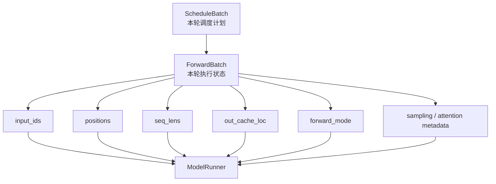
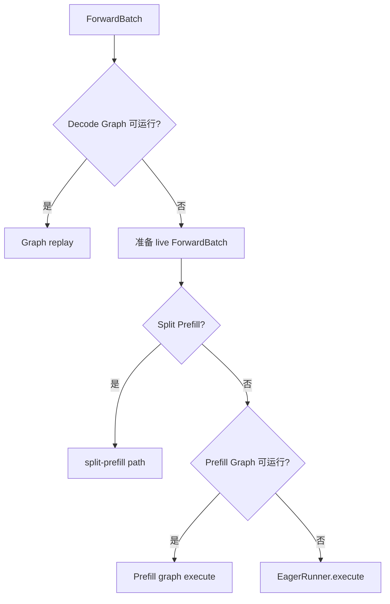
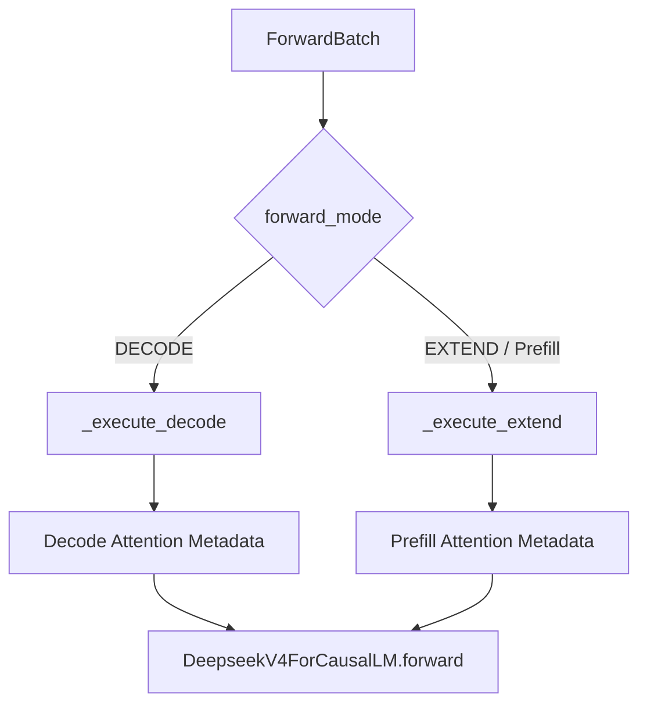
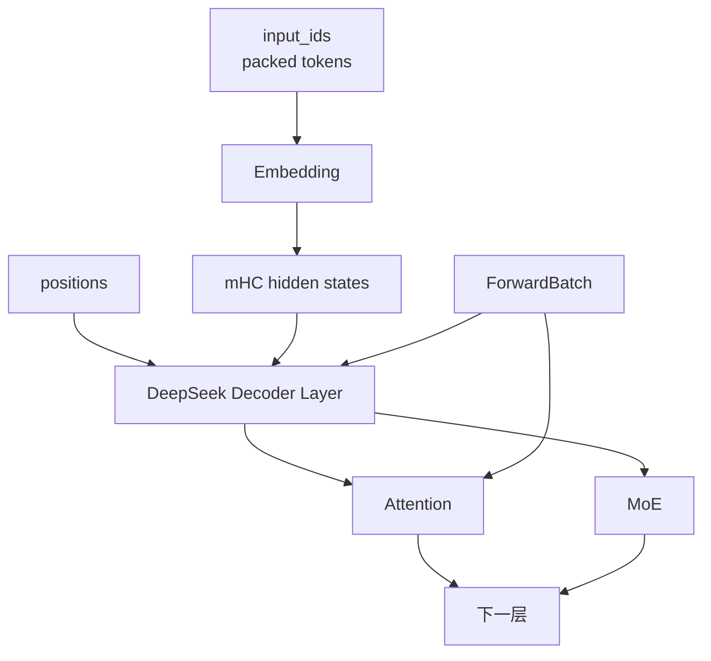
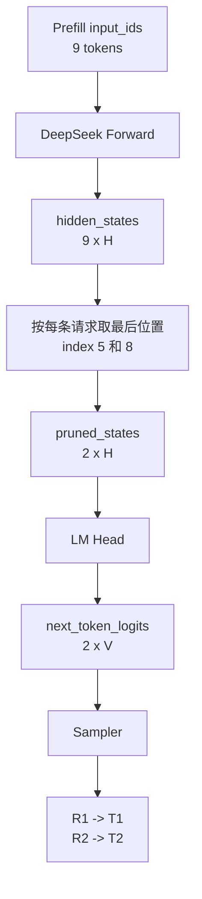
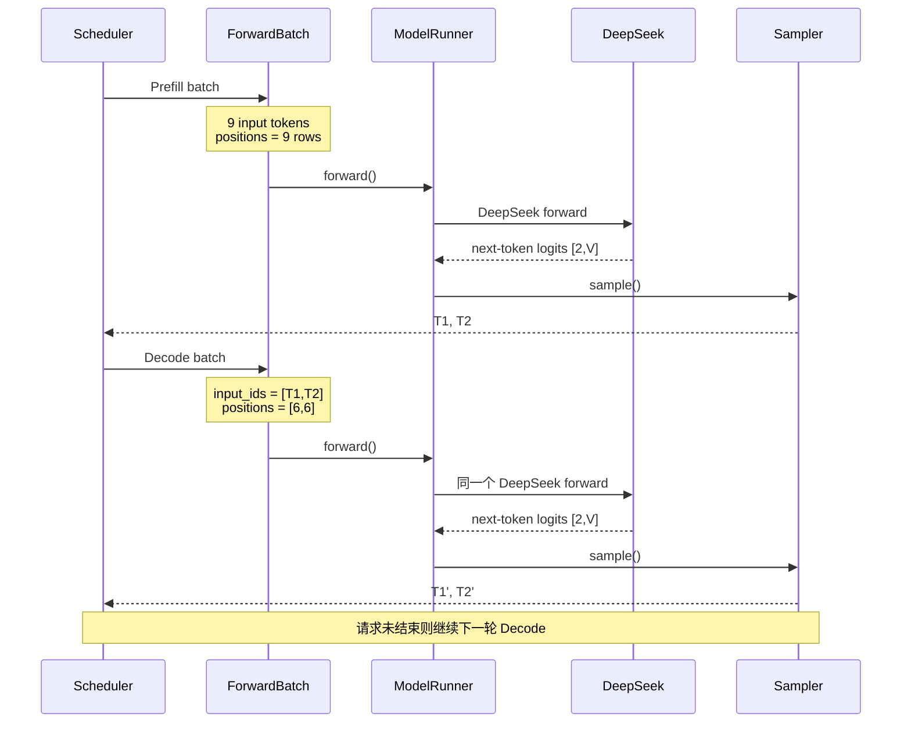

# SGLang ModelRunner 源码解析：ForwardBatch 如何驱动 DeepSeek 完成一次 Prefill / Decode

上一篇《[SGLang Scheduler 源码解析：一个请求是如何被组批、调度并送进 ModelRunner 的](sglang-scheduler-source-analysis.md)》停在了一个明确的边界：Scheduler 已经把长期请求状态整理成了这一轮的 `ScheduleBatch`，Worker 又进一步构造出 `ForwardBatch`。从这里开始，问题不再是“这一轮运行谁”，而是“这一轮到底怎样执行”。

这篇文章只追一个问题：

> 一份 `ForwardBatch` 进入 `ModelRunner` 后，怎样经过执行方式选择、Prefill / Decode 分流、DeepSeek-V4 模型主体、LogitsProcessor 和 Sampling，最终得到下一枚 token？

这条链里有两个很容易被误解的地方。第一，Prefill 和 Decode 并不是两个不同的 DeepSeek 模型入口；在本文的 eager 主线中，它们最终都会进入同一个 `DeepseekV4ForCausalLM.forward()`。第二，`model.forward()` 的输出也不是最终 token，而是 logits；Sampling 发生在模型 forward 之后。

> **源码与适用范围**：本文基于 `sgl-project/sglang @ 5c69e32abe013fa1b913022682a3104c79105f37`，核对日期为 2026-09-20。主线采用普通文本生成、非投机推理、PP=1，并以 eager execution 作为最容易观察的代表路径；Decode Graph、Prefill Graph 只解释到 ModelRunner 的分发边界。DeepSeek 案例使用公开源码中的 `DeepseekV4ForCausalLM`。Ascend 部分只追到可确认的 `DeepseekV4AscendAttnBackend` 接口，不把公开源码路径外推成具体部署镜像的底层运行轨迹。源码中的 `cuda_graph` 命名是框架内部接口名，本文不据此把 NPU 图执行等同于 CUDA。

## 一、ForwardBatch 是 Scheduler 交给执行层的一份“执行合同”

普通生成路径中，`TpModelWorker.forward_batch_generation()` 会先把 `ScheduleBatch` 转成 `ForwardBatch`：

```python
forward_batch = ForwardBatch.init_new(
    batch,
    self.model_runner,
    capture_hidden_mode=capture_hidden_mode,
    return_hidden_states_before_norm=False,
)
```

随后才调用：

```python
out = self.model_runner.forward(
    forward_batch,
    pp_proxy_tensors=pp_proxy_tensors,
)
```

固定版本入口分别在 [`TpModelWorker.forward_batch_generation()`](https://github.com/sgl-project/sglang/blob/5c69e32abe013fa1b913022682a3104c79105f37/python/sglang/srt/managers/tp_worker.py#L631-L749) 和 [`ForwardBatch.init_new()`](https://github.com/sgl-project/sglang/blob/5c69e32abe013fa1b913022682a3104c79105f37/python/sglang/srt/model_executor/forward_batch_info.py#L847-L1073)。

`ForwardBatch` 的源码注释是：

> “Store all inputs of a forward pass.”

这句话比“模型输入对象”更准确。它不仅有 token ID，还把这一轮 forward 所需的模式、长度、位置、缓存映射和采样信息组织到了一起。

| 字段 | 执行层拿它解决什么问题 |
| --- | --- |
| `forward_mode` | 这一轮是 EXTEND / Prefill、DECODE、MIXED 还是其他模式 |
| `input_ids` | 本轮真正参与模型计算的 token |
| `positions` | 每个新增 token 在自己序列中的逻辑位置 |
| `seq_lens` | batch 中每条序列当前推进到多长 |
| `req_pool_indices` | 每条请求在 request-token 映射池中的位置 |
| `out_cache_loc` | 本轮新增缓存写到哪些 slot |
| `extend_prefix_lens` | Prefill 时每条请求已有多少前缀可复用 |
| `extend_seq_lens` | Prefill 时每条请求本轮实际处理多少 token |
| `sampling_info` | temperature、top-p、grammar 等采样状态 |
| `spec_info` | 投机推理路径需要的额外状态；本文主线为空 |

当前实现里，`ForwardBatch.init_new()` 的核心字段仍有一部分直接借用 `ScheduleBatch` 中的 Tensor；源码本身也把这些字段标成 borrowed。随后它再补出执行层需要的派生信息，例如 positions。[源码：ForwardBatch 字段与构造](https://github.com/sgl-project/sglang/blob/5c69e32abe013fa1b913022682a3104c79105f37/python/sglang/srt/model_executor/forward_batch_info.py#L468-L605)

继续使用上一篇的两个请求。为了只观察调度到模型执行的变化，仍然用整数代表 token ID：

```text
R1:
完整输入 6 token
Prefix Cache 命中 0
本轮 Prefill 6 token

R2:
完整输入 6 token
Prefix Cache 命中前 3 token
本轮 Prefill 后 3 token
```

于是本轮 Extend 的关键长度是：

```text
extend_prefix_lens = [0, 3]
extend_seq_lens    = [6, 3]
seq_lens           = [6, 6]
extend_num_tokens  = 9
```

在普通 token-only 主线中，`ForwardBatch.init_new()` 会根据前缀长度和新增长度生成 positions。Torch fallback 的实现就是为每条请求构造：

```python
torch.arange(
    prefix_len,
    prefix_len + extend_len,
)
```

源码见 [`compute_position_torch()`](https://github.com/sgl-project/sglang/blob/5c69e32abe013fa1b913022682a3104c79105f37/python/sglang/srt/model_executor/forward_batch_info.py#L2032-L2046)。

所以这两个请求得到：

```text
R1 positions = [0, 1, 2, 3, 4, 5]
R2 positions = [3, 4, 5]
```

打包后：

```text
input_ids.shape = [9]

positions =
[0, 1, 2, 3, 4, 5, 3, 4, 5]

positions.shape = [9]
```

普通非投机 Extend 中，本轮新增 token 还会对应一组 `out_cache_loc`。对于 DeepSeek-V4 的 NPU 路径，`ForwardBatch` 还可以额外携带 `out_cache_loc_dsv4`，用于专用缓存池的位置集合；它不能简单理解成“只有一张普通 KV 页表”。[源码：DSV4 ForwardBatch 字段](https://github.com/sgl-project/sglang/blob/5c69e32abe013fa1b913022682a3104c79105f37/python/sglang/srt/model_executor/forward_batch_info.py#L487-L505)

这里最重要的结论是：

> **token 被打包到同一个一维 Tensor，不代表请求上下文被混在一起。**

R1 和 R2 的序列边界仍由长度、请求索引和 Attention metadata 保留。后续 Attention 不会因为它们在 `input_ids` 中相邻，就让 R1 读取 R2 的历史。



到这里，Scheduler 已经完成“决定执行什么”的工作，ModelRunner 开始决定“用什么执行路径完成它”。

## 二、ModelRunner 先选择执行路径，再决定是否真正走 Python eager forward

`ModelRunner` 的类注释很短：

> “ModelRunner runs the forward passes of the models.”

但它并不是一个薄薄的 `model.forward()` 包装器。模型、Attention Backend、KV Cache 池、Graph Runner、Eager Runner、Sampler、并行状态和部分 MoE 运行时能力都在这一层附近汇合。

真正入口是 [`ModelRunner.forward()`](https://github.com/sgl-project/sglang/blob/5c69e32abe013fa1b913022682a3104c79105f37/python/sglang/srt/model_executor/model_runner.py#L1703-L1799)。它完成 tracing、expert recorder 等外围处理后，会进入：

```python
output = self._forward_raw(
    forward_batch,
    pp_proxy_tensors,
    reinit_attn_backend,
    split_forward_count,
)
```

执行方式的核心分发在 [`ModelRunner._forward_raw()`](https://github.com/sgl-project/sglang/blob/5c69e32abe013fa1b913022682a3104c79105f37/python/sglang/srt/model_executor/model_runner.py#L1849-L1947)。

把与本文主线无关的分支压掉以后，可以这样理解：



Decode Graph 的判断并不是“只要是 Decode 就一定走图”。当前 batch 还必须满足 runner 的图执行条件。只有 `can_run_graph` 为真时，才调用：

```python
self.decode_cuda_graph_runner.execute(...)
```

如果没有进入 Decode Graph，ModelRunner 会先执行 `_prepare_eager_forward_batch(forward_batch)`，处理 live batch 所需的 padding、DP / MLP-sync 等运行时准备，然后继续判断 Split Prefill、Prefill Graph 或 Eager。

Prefill Graph 同样是条件路径。只有 Extend family、Prefill graph runner 已存在、当前 batch 满足 graph 条件，并通过 Context Parallel 等额外检查时，才会调用 graph runner；否则仍然进入 EagerRunner。

这里需要单独说明源码里的命名。当前类和字段中大量保留 `cuda_graph` 名称，这是 SGLang 的框架实现接口名。本文用“Graph replay / graph path”描述这类路径，只表示框架选择了已捕获的执行结构；不能由字段名推导“Ascend NPU 实际执行的是 CUDA”。

如果进入 Eager，ModelRunner 调用：

```python
ret = self.eager_runner.execute(
    forward_batch,
    pp_proxy_tensors=pp_proxy_tensors,
)
```

“Eager”也不代表什么准备都不做。默认情况下，`EagerRunner.load_batch()` 会把 live batch 填入 eager 的静态 buffer registry，再按实际 batch size / token 数切出当前视图；设置 `SGLANG_EAGER_INPUT_NO_COPY` 时才绕过这类复制。[源码：`EagerRunner.load_batch()`](https://github.com/sgl-project/sglang/blob/5c69e32abe013fa1b913022682a3104c79105f37/python/sglang/srt/model_executor/runner/eager_runner.py#L183-L211)

所以更准确的理解是：

> **Graph path 复用已经捕获好的执行结构；Eager path 则在这一轮现场运行模型 forward。**

这篇文章选择 Eager 作为主线，不是因为线上一定只跑 Eager，而是因为它最适合观察 `ForwardBatch` 如何一步步进入真实模型代码。

## 三、Prefill 和 Decode 在 EagerRunner 中分叉，但最后进入同一个 DeepSeek forward

EagerRunner 收到 `ForwardBatch` 后，首先根据 `forward_mode` 决定路径：

```python
if mode.is_decode():
    return self._execute_decode(...)

if mode.is_extend(include_draft_extend_v2=True):
    return self._execute_extend(...)
```

固定版本见 [`EagerRunner.execute()`](https://github.com/sgl-project/sglang/blob/5c69e32abe013fa1b913022682a3104c79105f37/python/sglang/srt/model_executor/runner/eager_runner.py#L213-L229)。

这里还有一个很容易在概念图里画错的分支：`MIXED` batch 在非 NPU、且没有 CP 的条件下可以被按 EXTEND 形态执行；NPU 会保留 MIXED，因为后端存在专用处理。因此不能把“Mixed 永远等价于 Extend”写成通用规则。

先看本文普通 Decode 主线。EagerRunner 会加载当前 batch，在需要时让模型和 Attention Backend 准备本轮 metadata，随后调用：

```python
model_runner.model.forward(
    forward_batch.input_ids,
    forward_batch.positions,
    forward_batch,
    **kwargs,
)
```

源码见 [`EagerRunner._execute_decode()`](https://github.com/sgl-project/sglang/blob/5c69e32abe013fa1b913022682a3104c79105f37/python/sglang/srt/model_executor/runner/eager_runner.py#L244-L271)。

普通 Prefill / Extend 会做更多准备：构造 Extend 所需 kwargs，按需处理 Context Parallel，再初始化 Prefill Attention metadata 和 shared-read snapshot。可在这些准备完成后，它最终调用的仍然是：

```python
model_runner.model.forward(
    forward_batch.input_ids,
    forward_batch.positions,
    forward_batch,
    **kwargs,
)
```

源码见 [`EagerRunner._execute_extend()`](https://github.com/sgl-project/sglang/blob/5c69e32abe013fa1b913022682a3104c79105f37/python/sglang/srt/model_executor/runner/eager_runner.py#L273-L378)。

所以对普通 eager 生成而言，可以把分流关系画成：



这件事把“Prefill 和 Decode 是什么”从算法概念落到了真实代码上。

它们不是：

```text
deepseek.prefill()
deepseek.decode()
```

两个独立模型函数。

在本文主线中，它们最终都进入同一个：

```text
DeepseekV4ForCausalLM.forward(
    input_ids,
    positions,
    forward_batch,
)
```

真正改变的是本轮执行状态：

| | Prefill / Extend | Decode |
| --- | --- | --- |
| 本轮新增 token | 每请求可以有多个 | 普通非投机时通常每请求 1 个 |
| positions | 一段或多段连续区间 | 每请求当前末尾位置 |
| 历史 KV | 可能有 Prefix Cache | 大量历史通常已经存在 |
| 新增 KV | 为本轮所有新增 token 写入 | 每请求写入当前新增 token |
| Attention metadata | Prefill 形态 | Decode 形态 |
| 模型入口 | 同一个 `forward()` | 同一个 `forward()` |

因此 Prefill / Decode 的差异并不主要由“换一个模型函数”表达，而是由 `ForwardBatch`、Attention metadata 和缓存状态共同表达。

这也是 `ForwardBatch` 为什么会继续一路传入模型层：只有 hidden states 本身，无法告诉 Attention“这些 token 属于哪条请求、当前序列多长、历史 KV 在哪里、本轮新缓存应该写到哪里”。

## 四、进入 DeepSeek-V4 后：从 packed token 到多路 hidden state，再到 Attention Backend

本文主线设定 PP=1，因此当前进程既是第一个 PP stage，也是最后一个 PP stage。这样可以连续观察 Embedding、Decoder Layers 和 LogitsProcessor，而不在中间插入 Pipeline Parallel IPC。

模型入口是：

[`DeepseekV4ForCausalLM.forward()`](https://github.com/sgl-project/sglang/blob/5c69e32abe013fa1b913022682a3104c79105f37/python/sglang/srt/models/deepseek_v4.py#L5081-L5147)

它很快调用真正的模型主体：

```python
hidden_states = self.model.forward(
    input_ids,
    positions,
    forward_batch,
    input_embeds,
    pp_proxy_tensors,
)
```

对应的 `DeepseekV4Model.forward()` 在 [这里](https://github.com/sgl-project/sglang/blob/5c69e32abe013fa1b913022682a3104c79105f37/python/sglang/srt/models/deepseek_v4.py#L4630-L4840)。

对普通 token 输入，第一步是 Embedding：

```python
hidden_states = self.embed_tokens(input_ids)
```

SGLang 这里使用的是 packed token layout，不是为了教学方便而恢复成 `[B,T,H]`。如果本轮一共处理 `T` 个 token，那么概念 shape 是：

```text
input_ids      [T]
      ↓
Embedding
      ↓
hidden_states  [T, H]
```

上一节的 Prefill 主例中：

```text
T = 9
```

所以：

```text
input_ids      [9]
hidden_states  [9, H]
```

DeepSeek-V4 随后会把状态扩展为多路 mHC 表示：

```python
hidden_states = hidden_states.unsqueeze(1).repeat(
    1,
    self.hc_mult,
    1,
)
```

于是 shape 变成：

```text
[9, H]
   ↓
[9, hc_mult, H]
```

这里的 `hc_mult` 是 mHC 状态流的数量，不是 Attention 的 head 数。

随后模型进入 Decoder Layer 循环。当前固定版本的普通路径会把 `positions`、`hidden_states`、`forward_batch` 等继续传给每一层：

```python
hidden_states, ... = layer(
    positions=positions,
    hidden_states=hidden_states,
    forward_batch=forward_batch,
    ...
)
```

这条调用关系非常值得注意：



`ForwardBatch` 并没有在 ModelRunner 入口被“消费完”。它继续深入模型层和 Attention Backend。

以 DeepSeek-V4 的 Ascend NPU 后端为例，公开源码中有专用的 [`DeepseekV4AscendAttnBackend.forward()`](https://github.com/sgl-project/sglang/blob/5c69e32abe013fa1b913022682a3104c79105f37/python/sglang/srt/hardware_backend/npu/attention/ascend_dsv4_backend.py#L2047-L2189)，其签名直接接收：

```python
forward_batch: ForwardBatch
```

后端会根据当前层的 `compress_ratio` 等条件，选择滑窗或压缩历史路径：

```text
compress_ratio = 0
        ↓
SWA

compress_ratio = 4 / 128
        ↓
compressed history
```

它还会读取已经准备好的 sequence length、page table、cache location 等 metadata。需要写缓存时，`store_cache()` 最终会根据本轮位置把新的表示写入对应 SWA buffer。[源码：DSV4 cache write](https://github.com/sgl-project/sglang/blob/5c69e32abe013fa1b913022682a3104c79105f37/python/sglang/srt/hardware_backend/npu/attention/ascend_dsv4_backend.py#L2191-L2219)

因此上一篇 Scheduler 中看似“管理性质”的：

```text
seq_lens
positions
req_pool_indices
out_cache_loc
```

并不是只用来记账。它们最终会影响真实 Attention 的查询边界、历史访问和缓存写入。

所有 Decoder Layers 完成后，DeepSeek-V4 会把多路 mHC 状态做最终组合，并执行 Norm。对本文 PP=1 主线，可以把这一段概念上看成：

```text
[T, hc_mult, H]
        ↓
mHC combine / head
        ↓
[T, H]
        ↓
Norm
        ↓
[T, H]
```

模型主体随后把最终 hidden states 返回给 `DeepseekV4ForCausalLM`，后者再进入 LogitsProcessor。

到这里，“Transformer 计算”基本完成，但 token 还没有被选出来。

## 五、为什么 9 个 Prefill hidden states 最后只产生 2 行 next-token logits

继续沿两个请求的例子：

```text
R1:
extend_len = 6

R2:
extend_len = 3
```

整个 Prefill forward 共处理：

```text
T = 9
```

模型主体结束后，可以把最终 hidden states 理解成：

```text
hidden_states.shape = [9, H]
```

如果直接把全部 9 行都送进 LM Head，确实可以得到 9 个位置的词表分数。但普通生成请求只需要“每条序列的下一个 token”，不需要把所有 prompt 位置都当成采样位置。

这个裁剪发生在 `LogitsProcessor`。

`DeepseekV4ForCausalLM.forward()` 在最后一个 PP stage 调用：

```python
output = self.logits_processor(
    input_ids,
    hidden_states,
    self.lm_head,
    logits_metadata,
    ...
)
```

源码见 [DeepSeek-V4 logits 入口](https://github.com/sgl-project/sglang/blob/5c69e32abe013fa1b913022682a3104c79105f37/python/sglang/srt/models/deepseek_v4.py#L5135-L5147)。

`LogitsProcessor.forward()` 会先从 `ForwardBatch` 构造 `LogitsMetadata`，然后通过 `_get_pruned_states()` 选择真正需要进入 LM Head 的 hidden rows。[源码：`LogitsProcessor.forward()`](https://github.com/sgl-project/sglang/blob/5c69e32abe013fa1b913022682a3104c79105f37/python/sglang/srt/layers/logits_processor.py#L495-L597)

对于**普通 Prefill 且没有请求输入 logprob**的主线，代码计算：

```python
last_index = torch.cumsum(
    logits_metadata.extend_seq_lens,
    dim=0,
) - 1

pruned_states = hidden_states[last_index]
```

源码见 [`LogitsProcessor._get_pruned_states()`](https://github.com/sgl-project/sglang/blob/5c69e32abe013fa1b913022682a3104c79105f37/python/sglang/srt/layers/logits_processor.py#L599-L665)。

我们的：

```text
extend_seq_lens = [6, 3]
```

所以：

```text
cumsum([6, 3]) = [6, 9]
减 1           = [5, 8]
```

也就是只取：

```text
hidden_states[5]
hidden_states[8]
```

它们恰好是两条 packed sequence 各自最后一个新增位置：

```text
packed hidden rows:

R1: 0 1 2 3 4 5
               ↑
             采样位置

R2: 6 7 8
           ↑
         采样位置
```

于是 shape 发生了非常关键的一次变化：

```text
完整 hidden states
[9, H]

      ↓ 每条请求取最后位置

pruned_states
[2, H]

      ↓ LM Head

next_token_logits
[2, V]
```

其中 `V` 是词表大小。源码中的 `LogitsProcessorOutput.next_token_logits` 也明确标注为 `[#seq, vocab_size]`。[源码：LogitsProcessorOutput](https://github.com/sgl-project/sglang/blob/5c69e32abe013fa1b913022682a3104c79105f37/python/sglang/srt/layers/logits_processor.py#L201-L240)



如果请求了 prompt input logprob，LogitsProcessor 会保留更多位置并进入另一条 pruning / logprob 路径，因此不能把“Prefill 永远只做两行 LM Head”当成无条件规则。本文的 9 → 2 只对应普通生成、无输入 logprob 的代表场景。

接下来还有最后一个边界：logits 仍然不是 token。

`DeepseekV4ForCausalLM.forward()` 返回的是 `LogitsProcessorOutput`。在最后一个 PP rank，`TpModelWorker.forward_batch_generation()` 拿到 logits 后，才调用：

```python
self.model_runner.sample(
    logits_output,
    forward_batch,
)
```

`ModelRunner.sample()` 会先应用 logits bias、grammar mask 等采样前处理，再把 logits 和 `sampling_info` 交给 sampler。[源码：`ModelRunner.sample()`](https://github.com/sgl-project/sglang/blob/5c69e32abe013fa1b913022682a3104c79105f37/python/sglang/srt/model_executor/model_runner.py#L1977-L2031)

所以边界应该明确分开：

```text
DeepSeek Transformer
        ↓
hidden states
        ↓
LogitsProcessor / LM Head
        ↓
logits
----------------------------
模型 forward 到这里结束
        ↓
Sampler
        ↓
next_token_ids
```

这也解释了第一枚生成 token 从哪里来：

> **第一枚输出 token 可以直接由 Prefill 最后位置的 logits 采样得到，不需要为了“生成第一个 token”再额外执行一次普通 Decode forward。**

## 六、把 Prefill 和下一轮 Decode 连成一条完整时间线

现在把前面的所有对象重新放回同一个请求生命周期里。

第一轮是 Prefill。

两个请求的执行状态是：

| 字段 | Prefill |
| --- | --- |
| `batch_size` | 2 |
| `input_ids.shape` | `[9]` |
| `extend_prefix_lens` | `[0, 3]` |
| `extend_seq_lens` | `[6, 3]` |
| `seq_lens` | `[6, 6]` |
| `positions` | `[0,1,2,3,4,5,3,4,5]` |
| 最终 hidden states | `[9,H]` |
| 采样前 pruned states | `[2,H]` |
| next-token logits | `[2,V]` |
| 采样结果 | `T1, T2` |

也就是说：

```text
9 个 token 参与模型计算
        ↓
每个请求保留 1 个采样位置
        ↓
2 行 next-token logits
        ↓
2 个首 token
```

Prefill 结果返回 Scheduler 后，`T1`、`T2` 会进入请求的输出状态。如果请求没有结束，它们就成为下一轮 Decode 要消费的新 token。

普通非投机 Decode 的 `prepare_for_decode()` 会让每条请求的 `seq_lens` 向前推进一个位置。于是下一轮可以得到：

```text
seq_lens = [7, 7]
```

`ForwardBatch.init_new()` 对 Decode 使用当前 sequence length 构造位置。当前实现通过 `clamp_position(batch.seq_lens)` 得到逻辑上的 `seq_len - 1`，因此：

```text
positions = [6, 6]
```

两个请求都可以拥有 position 6，因为 position 是**各自序列内部的逻辑位置**，不是 packed batch Tensor 的全局下标。

此时：

```text
input_ids = [T1, T2]
input_ids.shape = [2]
```

模型再次进入同一个：

```text
DeepseekV4ForCausalLM.forward()
```

只是这一次：

```text
forward_mode = DECODE
```

Attention Backend 看到的是两个新的 query token，同时每条请求都已经有自己的历史缓存。概念上：

```text
T1 query
   ↓
读取 R1 自己的历史 KV
   ↓
写入 R1 position 6 对应的新缓存

T2 query
   ↓
读取 R2 自己的历史 KV
   ↓
写入 R2 position 6 对应的新缓存
```

DeepSeek 主体的 token 维从 Prefill 的 9 变成了 Decode 的 2：

```text
input_ids
[2]

   ↓ Embedding

[2, H]

   ↓ mHC

[2, hc_mult, H]

   ↓ Decoder Layers

[2, hc_mult, H]

   ↓ final combine + norm

[2, H]
```

Decode 模式下，每条普通请求本轮本来就只有一个新增位置，所以 `LogitsProcessor._get_pruned_states()` 不需要再像普通 Prefill 那样从多个 prompt 位置中挑出每条请求的最后一行；这些 hidden rows 可以直接进入后续 logits 计算。

最终再次得到：

```text
next_token_logits
[2, V]

   ↓ Sampling

T1'
T2'
```

如果请求仍未结束，下一轮继续消费 `T1'`、`T2'`。



在 overlap schedule 下，下一轮所需 token 可以通过 `FutureMap` 等设备侧 relay 机制提前衔接，CPU 的结果处理也可能与下一轮设备计算交错；这会改变时间上的重叠方式，但不会改变这里的逻辑闭环：

```text
Req 长期状态
    ↓
ScheduleBatch
    ↓
ForwardBatch
    ↓
ModelRunner
    ↓
DeepSeek Model
    ↓
LogitsProcessor
    ↓
Sampler
    ↓
next_token_ids
    ↓
Req 长期状态
```

现在可以更准确地给两个核心对象下定义。

`ForwardBatch` 是：

> **Scheduler / Worker 交给模型执行层的一份单轮执行状态快照。**

而 `ModelRunner` 是：

> **把这份执行状态兑现成一次真实模型执行，并在 Graph / Eager、Attention Backend、Logits 与 Sampling 之间组织运行路径的执行边界。**

这也把上一篇 Scheduler 与模型内部源码真正接了起来。Scheduler 负责回答“这一轮算什么”；ModelRunner 负责回答“这一轮怎么算”；DeepSeek 模型层和 Attention Backend 则继续回答“这些 Tensor 具体怎样经过 Attention、MoE 和 KV Cache 得到下一步表示”。

### 源码阅读入口

| 目标 | 固定版本入口 |
| --- | --- |
| `ScheduleBatch -> ForwardBatch` | [`TpModelWorker.forward_batch_generation()`](https://github.com/sgl-project/sglang/blob/5c69e32abe013fa1b913022682a3104c79105f37/python/sglang/srt/managers/tp_worker.py#L631-L749) |
| `ForwardBatch` 构造 | [`ForwardBatch.init_new()`](https://github.com/sgl-project/sglang/blob/5c69e32abe013fa1b913022682a3104c79105f37/python/sglang/srt/model_executor/forward_batch_info.py#L847-L1073) |
| Prefill positions | [`compute_position_torch()`](https://github.com/sgl-project/sglang/blob/5c69e32abe013fa1b913022682a3104c79105f37/python/sglang/srt/model_executor/forward_batch_info.py#L2032-L2046) |
| ModelRunner 入口 | [`ModelRunner.forward()`](https://github.com/sgl-project/sglang/blob/5c69e32abe013fa1b913022682a3104c79105f37/python/sglang/srt/model_executor/model_runner.py#L1703-L1799) |
| Graph / Eager 分发 | [`ModelRunner._forward_raw()`](https://github.com/sgl-project/sglang/blob/5c69e32abe013fa1b913022682a3104c79105f37/python/sglang/srt/model_executor/model_runner.py#L1849-L1947) |
| Eager batch 装载 | [`EagerRunner.load_batch()`](https://github.com/sgl-project/sglang/blob/5c69e32abe013fa1b913022682a3104c79105f37/python/sglang/srt/model_executor/runner/eager_runner.py#L183-L211) |
| Eager 模式分发 | [`EagerRunner.execute()`](https://github.com/sgl-project/sglang/blob/5c69e32abe013fa1b913022682a3104c79105f37/python/sglang/srt/model_executor/runner/eager_runner.py#L213-L229) |
| Eager Decode | [`EagerRunner._execute_decode()`](https://github.com/sgl-project/sglang/blob/5c69e32abe013fa1b913022682a3104c79105f37/python/sglang/srt/model_executor/runner/eager_runner.py#L244-L271) |
| Eager Prefill | [`EagerRunner._execute_extend()`](https://github.com/sgl-project/sglang/blob/5c69e32abe013fa1b913022682a3104c79105f37/python/sglang/srt/model_executor/runner/eager_runner.py#L273-L378) |
| DeepSeek-V4 主体 | [`DeepseekV4Model.forward()`](https://github.com/sgl-project/sglang/blob/5c69e32abe013fa1b913022682a3104c79105f37/python/sglang/srt/models/deepseek_v4.py#L4630-L4840) |
| DeepSeek-V4 CausalLM 入口 | [`DeepseekV4ForCausalLM.forward()`](https://github.com/sgl-project/sglang/blob/5c69e32abe013fa1b913022682a3104c79105f37/python/sglang/srt/models/deepseek_v4.py#L5081-L5147) |
| Logits 生成 | [`LogitsProcessor.forward()`](https://github.com/sgl-project/sglang/blob/5c69e32abe013fa1b913022682a3104c79105f37/python/sglang/srt/layers/logits_processor.py#L495-L597) |
| Prefill hidden-state pruning | [`LogitsProcessor._get_pruned_states()`](https://github.com/sgl-project/sglang/blob/5c69e32abe013fa1b913022682a3104c79105f37/python/sglang/srt/layers/logits_processor.py#L599-L665) |
| Sampling | [`ModelRunner.sample()`](https://github.com/sgl-project/sglang/blob/5c69e32abe013fa1b913022682a3104c79105f37/python/sglang/srt/model_executor/model_runner.py#L1977-L2031) |
| DeepSeek-V4 Ascend Attention 边界 | [`DeepseekV4AscendAttnBackend.forward()`](https://github.com/sgl-project/sglang/blob/5c69e32abe013fa1b913022682a3104c79105f37/python/sglang/srt/hardware_backend/npu/attention/ascend_dsv4_backend.py#L2047-L2189) |
