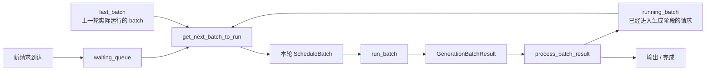
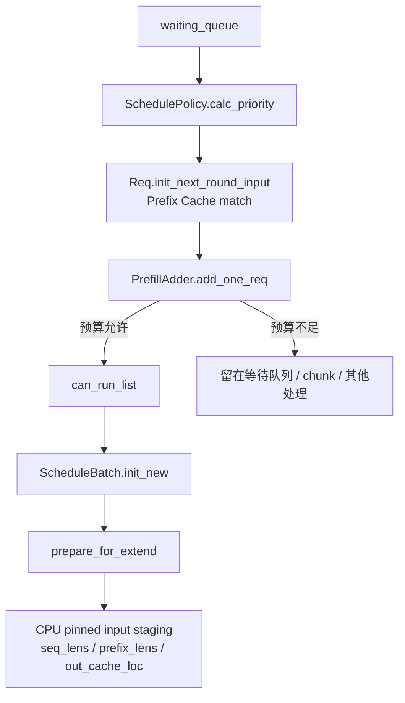
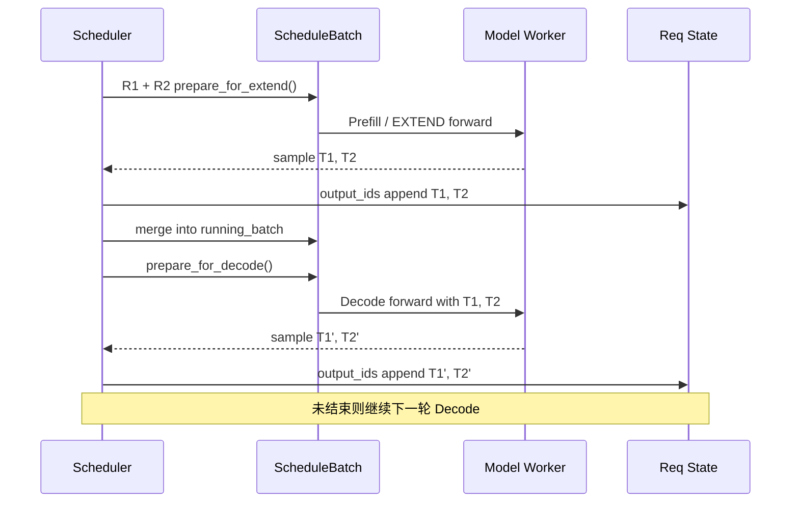
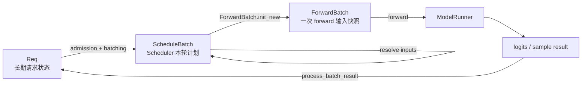
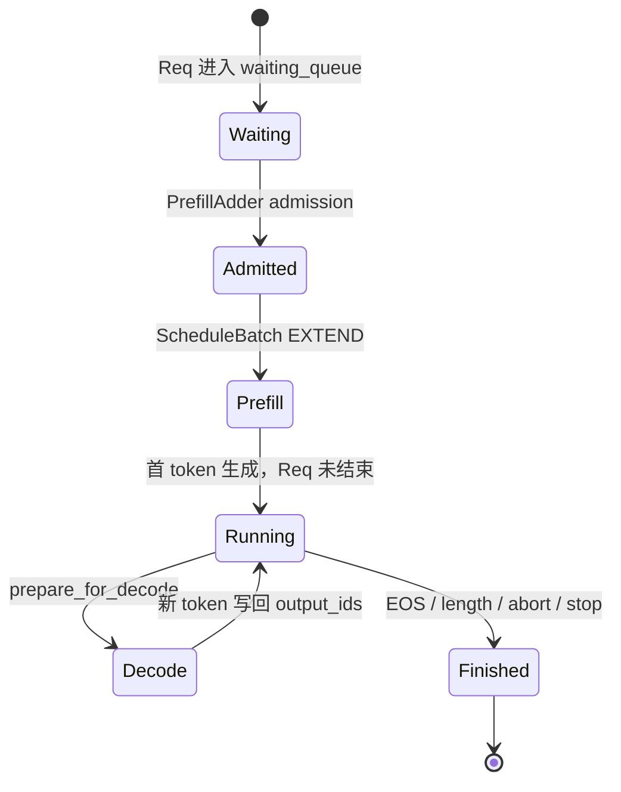

# SGLang Scheduler 源码解析：一个请求是如何被组批、调度并送进 ModelRunner 的

在上一篇《[SGLang 推理执行链路解析：一次 Chat Completion 请求是如何跑到 Ascend NPU 上的](sglang-ascend-request-lifecycle.md)》里，我们从 HTTP 请求一路追到了设备执行。那篇文章解决的是“整条链路在哪里”；这一篇只盯住其中最关键、也最容易被一句“Scheduler 负责调度”带过去的部分：

> 一个已经完成分词的生成请求，进入 Scheduler 以后，究竟怎样从一条 `Req` 变成某一轮的 `ScheduleBatch`，又怎样在真正执行前变成 `ForwardBatch`，最后交给 `ModelRunner`？

如果只看函数名，很容易把这条链路理解成“从队列里拿几个请求，拼成 batch，然后 forward”。当前 SGLang 的真实实现要复杂得多：Scheduler 既要管理等待请求和正在生成的请求，又要考虑 Prefix Cache 命中、Prefill token 预算、KV Cache 可用空间、Chunked Prefill、请求优先级、Decode retraction，以及 CPU 调度和设备计算之间的重叠。

更重要的是，`Req`、`ScheduleBatch`、`ForwardBatch` 并不是同一份数据换了三个名字。它们分别回答三个不同的问题：

| 对象 | 它回答的问题 | 生命周期 |
| --- | --- | --- |
| `Req` | 这一条请求目前进行到哪里了？ | 跨越多轮 Prefill / Decode |
| `ScheduleBatch` | Scheduler 决定这一轮让哪些请求、哪些 token 一起执行？ | 一轮调度计划 |
| `ForwardBatch` | ModelRunner 这一轮真正需要哪些 Tensor、位置和执行元数据？ | 一次 forward |

理解这三个对象之间的边界，基本就抓住了 SGLang Scheduler 的骨架。

> **源码与适用范围**：本文基于 `sgl-project/sglang @ 5c69e32abe013fa1b913022682a3104c79105f37`，核对日期为 2026-09-20。主线分析普通文本生成、非 PD 分离、非投机推理的 Scheduler 路径，并补充 overlap schedule、Chunked Prefill 与 mixed batch 对主线的影响。示例以 DeepSeek serving 请求为背景，但 Scheduler 这一层的大部分机制与具体 Transformer 模型结构解耦。SGLang 源码仍在快速演进，阅读时应以文中固定 commit 为准。

## 一、Scheduler 的核心不是“排队”，而是把长期请求状态压成一轮可执行计划

先从 Scheduler 最外层循环看起。当前普通调度循环 `event_loop_normal()` 的骨架很清楚：

```text
ingest_requests()
      |
      v
get_next_batch_to_run()
      |
      v
run_batch(batch)
      |
      v
process_batch_result(batch, result)
      |
      v
下一轮
```

对应源码在 [`Scheduler.event_loop_normal()`](https://github.com/sgl-project/sglang/blob/5c69e32abe013fa1b913022682a3104c79105f37/python/sglang/srt/managers/scheduler.py#L1932-L1963)。每一轮循环先接收新请求，然后通过 `get_next_batch_to_run()` 产出一个 `NextBatchPlan`；其中 `batch_to_run` 是本轮准备执行的 batch，`running_batch` 则保存需要跨轮继续推进的生成请求。



这里最容易混淆的是 `waiting_queue`、`running_batch` 和 `last_batch`。

`waiting_queue` 里是等待被 admission 的请求；`running_batch` 主要保存已经进入持续生成阶段、后续还要继续 Decode 的请求；`last_batch` 则只是“上一轮实际跑过的 batch”。上一轮如果是 Prefill / Extend，下一轮调度时它可能被并入 `running_batch`，从而开始后续 Decode。这个合并逻辑就在 [`get_next_batch_to_run()`](https://github.com/sgl-project/sglang/blob/5c69e32abe013fa1b913022682a3104c79105f37/python/sglang/srt/managers/scheduler.py#L3648-L3794)。

所以 Scheduler 做的不是简单的 FIFO pop。它每轮都在解决一个动态资源分配问题：现有的 KV 空间够不够、有哪些新请求值得进入、当前正在 Decode 的请求还能不能继续、本轮更适合做 Prefill 还是 Decode，以及这几类工作能不能被合并。

SGLang 还提供 `event_loop_overlap()`，让上一轮结果的 CPU 处理与下一轮设备计算交错推进。[源码](https://github.com/sgl-project/sglang/blob/5c69e32abe013fa1b913022682a3104c79105f37/python/sglang/srt/managers/scheduler.py#L1966-L2021) 这会让 batch 对象的状态管理更谨慎，但不会改变本文要抓住的主干：**Scheduler 持有长期请求状态，按轮次构造执行计划，再把结果写回请求状态。**

## 二、请求进入 Scheduler 后，先从消息变成长期存在的 Req

当上游 TokenizerManager 已经完成必要的请求准备后，Scheduler 收到的是 `TokenizedGenerateReqInput`。在当前源码里，请求分发器把这种输入映射到 `handle_generate_request()`。[源码：dispatcher](https://github.com/sgl-project/sglang/blob/5c69e32abe013fa1b913022682a3104c79105f37/python/sglang/srt/managers/scheduler.py#L1752-L1764)

`handle_generate_request()` 会创建一个 `Req`。这里不是简单保存 input IDs；它还把采样参数、流式输出、LoRA、会话、reasoning、logprob、路由信息等都绑定到这个长期请求对象上。[源码：创建 Req](https://github.com/sgl-project/sglang/blob/5c69e32abe013fa1b913022682a3104c79105f37/python/sglang/srt/managers/scheduler.py#L2776-L2845)

`Req` 自己的注释很直接：

> “The input and output status of a request.”

在 [`Req` 定义](https://github.com/sgl-project/sglang/blob/5c69e32abe013fa1b913022682a3104c79105f37/python/sglang/srt/managers/schedule_batch.py#L977-L1060) 中，可以看到几类关键状态：

| 字段 | 含义 |
| --- | --- |
| `origin_input_ids` | 原始输入 token |
| `output_ids` | 已经生成并确认的输出 token |
| `full_untruncated_fill_ids` | 当前完整输入序列视图 |
| `prefix_indices` | 已被 Prefix Cache 命中的 KV 位置 |
| `extend_range` | 本轮真正需要 Extend / Prefill 的 token 范围 |
| `kv` | 这条请求自己的 KV 相关状态 |
| `finished_reason` | 请求是否以及为什么结束 |

这解释了为什么不能把 `Req` 理解成“HTTP request 的 DTO”。它会活过很多个调度轮次。一次 Prefill 完成之后，第一个生成 token 会进入 `output_ids`；下一轮 Decode 再生成一个；如此反复，直到 EOS、长度限制、abort 等完成条件触发。

通过校验的普通请求最终会调用 `_add_request_to_queue(req)`。在非 PD 分离模式下，请求会进入 `waiting_queue`，同时记录进入等待队列的时间。[源码：入队](https://github.com/sgl-project/sglang/blob/5c69e32abe013fa1b913022682a3104c79105f37/python/sglang/srt/managers/scheduler.py#L3277-L3292)

因此这时系统状态可以先简化成：

```text
TokenizedGenerateReqInput
          |
          v
         Req
          |
          v
    waiting_queue
```

到这里，模型还没有开始算。真正决定“这条请求能不能在这一轮跑”的，是下一步的 admission。

## 三、真正的组批发生在 admission：排序、Prefix Cache、预算和 ScheduleBatch

Scheduler 每轮准备新 Prefill 工作时，会进入 `get_new_batch_prefill()` / `_get_new_batch_prefill_raw()`。[源码](https://github.com/sgl-project/sglang/blob/5c69e32abe013fa1b913022682a3104c79105f37/python/sglang/srt/managers/scheduler.py#L3816-L3901)

第一步不是直接取队头，而是让 `SchedulePolicy.calc_priority()` 重新组织 `waiting_queue`。当前实现支持 FCFS，也存在 LPM、HRRN、shortest-prefill-first 等 cache-aware 策略；当策略需要时，还会在这里计算 Prefix Cache 匹配信息。[源码：调度策略](https://github.com/sgl-project/sglang/blob/5c69e32abe013fa1b913022682a3104c79105f37/python/sglang/srt/managers/schedule_policy.py#L259-L341)

然后 Scheduler 创建 `PrefillAdder`。它初始化时就拿到了 page size、Prefix Cache、KV allocator、当前 `running_batch`、剩余 Prefill token 预算、Chunked Prefill 预算以及最大运行请求数等信息。[源码：PrefillAdder](https://github.com/sgl-project/sglang/blob/5c69e32abe013fa1b913022682a3104c79105f37/python/sglang/srt/managers/schedule_policy.py#L620-L664)

这一步很关键，因为“组 batch”并不是先拼完再看显存够不够，而是 **admission 本身就受内存和计算预算约束**。

Scheduler 随后遍历 `waiting_queue`。对每个候选请求，先执行 `req.init_next_round_input(self.tree_cache)`，刷新当前完整输入，并与 Prefix Cache 做匹配；命中结果会写入 `prefix_indices` 等状态。[源码：Prefix Cache 匹配](https://github.com/sgl-project/sglang/blob/5c69e32abe013fa1b913022682a3104c79105f37/python/sglang/srt/managers/schedule_batch.py#L1556-L1657)

接下来调用 `PrefillAdder.add_one_req()`。当前实现会估算这条请求尚未缓存的输入 token、后续可能生成的 token、分页额外开销等，再进入 `_select_prefill_admission()` 判断预算是否允许；必要时还可能把长 Prefill 截成一个 chunk。[源码：admission](https://github.com/sgl-project/sglang/blob/5c69e32abe013fa1b913022682a3104c79105f37/python/sglang/srt/managers/schedule_policy.py#L1232-L1430)

真正 admission 成功时，`_commit_prefill_admission()` 会把本轮区间写进请求：

```python
req.set_extend_range(
    admission.prefix_len,
    admission.prefix_len + admission.extend_len,
)
```

然后把请求加入 `can_run_list`，并扣减相应预算。[源码](https://github.com/sgl-project/sglang/blob/5c69e32abe013fa1b913022682a3104c79105f37/python/sglang/srt/managers/schedule_policy.py#L1432-L1452)

这时才真正回答了“这一轮有哪些请求能跑”。

为了让这个过程具体一点，假设我们在提供 DeepSeek 文本生成服务，当前有两个候选请求。这里只用整数表示 token ID，不依赖具体 tokenizer：

| 请求 | 当前完整序列 | 已命中的 Prefix Cache | 本轮 `extend_range` | 本轮真正要计算 |
| --- | --- | ---: | --- | ---: |
| R1 | `[11,12,13,14,15,16]` | 0 token | `[0,6)` | 6 token |
| R2 | `[21,22,23,24,25,26]` | 3 token | `[3,6)` | 3 token |

这里 R2 的前 3 个 token 已经有可复用 KV，因此 Scheduler 不需要让模型重新计算这 3 个 token。假设预算允许 R1 和 R2 同时 admission，那么 `can_run_list = [R1, R2]`。

Scheduler 随后执行：

```python
new_batch = ScheduleBatch.init_new(can_run_list, ...)
new_batch.prepare_for_extend()
```

对应源码在 [`Scheduler._get_new_batch_prefill_raw()`](https://github.com/sgl-project/sglang/blob/5c69e32abe013fa1b913022682a3104c79105f37/python/sglang/srt/managers/scheduler.py#L4063-L4111)。

`ScheduleBatch` 的源码注释是：

> “Store all information of a batch on the scheduler.”

[`ScheduleBatch` 定义](https://github.com/sgl-project/sglang/blob/5c69e32abe013fa1b913022682a3104c79105f37/python/sglang/srt/managers/schedule_batch.py#L2305-L2393)

到了 `prepare_for_extend()`，R1 和 R2 的请求级状态开始被整理成真正的 batch 数据。[源码](https://github.com/sgl-project/sglang/blob/5c69e32abe013fa1b913022682a3104c79105f37/python/sglang/srt/managers/schedule_batch.py#L2686-L2753)

在上面的例子里，核心状态可以这样理解：

| Batch 字段 | 示例 |
| --- | --- |
| `forward_mode` | `EXTEND` |
| `prefix_lens` | `[0, 3]` |
| `extend_lens` | `[6, 3]` |
| `seq_lens` | `[6, 6]` |
| `extend_num_tokens` | `9` |
| Prefill 输入 | R1 的 6 个 token + R2 未命中的 3 个 token |
| `out_cache_loc` | 为这 9 个新增 KV token 分配的写入位置 |

这里有一个很值得注意的实现细节：当前版本不会在 `prepare_for_extend()` 里立刻把 Prefill input IDs 全部物化成设备 Tensor。它先把扁平化后的输入保存在 pinned CPU staging 中，`self.input_ids` 暂时保持 `None`，并把 staging 保存到 `prefill_input_ids_cpu`。[源码](https://github.com/sgl-project/sglang/blob/5c69e32abe013fa1b913022682a3104c79105f37/python/sglang/srt/managers/schedule_batch.py#L2686-L2728) [字段写入](https://github.com/sgl-project/sglang/blob/5c69e32abe013fa1b913022682a3104c79105f37/python/sglang/srt/managers/schedule_batch.py#L2870-L2915)

因此此时的 `ScheduleBatch` 不是“模型马上就能吃的最终输入”，而是 **Scheduler 已经完成 admission、KV 分配和批次组织后的执行计划**。



这就是 SGLang Scheduler 中“组批”的真实含义：**它不是简单把请求 concatenate，而是在缓存命中和资源预算约束下，为这一轮决定每条请求到底计算哪一段 token，并提前准备好 KV 写入映射。**

## 四、Prefill 完成以后，请求怎样进入 Decode，Continuous Batching 又发生在哪里

新请求第一次被选中时通常走 Extend / Prefill，但生成式请求不会在一次 forward 后结束。Prefill 会得到第一个待输出 token，随后请求进入逐 token Decode。

当前普通主路径在 `get_next_batch_to_run()` 中做了一个很清楚的选择。Scheduler 先尝试构造新的 Prefill batch：

```python
prefill_plan = self.get_new_batch_prefill(running_batch)
new_batch = prefill_plan.batch_to_run
```

如果成功拿到 `new_batch`，主路径优先让这个新 Prefill batch 运行；如果没有新的 Prefill 工作，且 `running_batch` 还不为空，就调用 `update_running_batch()` 继续 Decode。[源码](https://github.com/sgl-project/sglang/blob/5c69e32abe013fa1b913022682a3104c79105f37/python/sglang/srt/managers/scheduler.py#L3736-L3794)

所以 “continuous batching” 不能简单理解成“每一轮一定把 Prefill 和 Decode 全混在同一个 Tensor 里”。它更本质的含义是：**请求可以动态加入、完成和退出，Scheduler 每轮重新决定实际执行集合。**

`update_running_batch()` 会先过滤已经完成的请求，然后检查 Decode 所需 KV 空间。如果 KV pool 不够，当前实现可以 retract 一部分请求、释放空间并把它们重新放回队列；如果仍能继续，则最后调用 `batch.prepare_for_decode()`。[源码](https://github.com/sgl-project/sglang/blob/5c69e32abe013fa1b913022682a3104c79105f37/python/sglang/srt/managers/scheduler.py#L4193-L4275)

普通非投机 Decode 的 `prepare_for_decode()` 做了几件非常有代表性的事：

| 动作 | 为什么 |
| --- | --- |
| `forward_mode = DECODE` | 这一轮不再处理整段 prompt |
| `alloc_for_decode(..., token_per_req=1)` | 每个活跃请求为一个新 token 分配 KV 写入位置 |
| `seq_lens = seq_lens + 1` | 每条序列向前推进一个位置 |
| 清理 Prefill 专属状态 | 避免上一阶段的输入或 CP 元数据泄漏进 Decode |

[源码：`prepare_for_decode()`](https://github.com/sgl-project/sglang/blob/5c69e32abe013fa1b913022682a3104c79105f37/python/sglang/srt/managers/schedule_batch.py#L3504-L3566)

假设上一节 R1、R2 的 Prefill 分别采样出了 `T1`、`T2`。结果处理阶段会把它们追加到各自的 `req.output_ids`。下一轮如果没有新的 Prefill 进入主路径，这两个请求组成的 `running_batch` 就被准备成 Decode batch：batch size 仍然是 2，但本轮输入不再是 9 个 prompt token，而是每个请求各自最新的那个生成 token。



SGLang 也确实存在把新 Prefill 与正在 Decode 的请求合并到同一轮的路径，但它不是无条件发生的。当前代码在 mixed-style Chunked Prefill 满足一组条件时，会先对 `running_batch` 执行 `prepare_for_decode()`，再通过 `new_batch.mix_with_running(running_batch)` 把 Decode tail 作为 1-token extend 合入新 batch，并把 `forward_mode` 设为 `MIXED`。[源码](https://github.com/sgl-project/sglang/blob/5c69e32abe013fa1b913022682a3104c79105f37/python/sglang/srt/managers/scheduler.py#L4130-L4163) [`mix_with_running()`](https://github.com/sgl-project/sglang/blob/5c69e32abe013fa1b913022682a3104c79105f37/python/sglang/srt/managers/schedule_batch.py#L3096-L3167)

这也是读源码时一个很重要的区分：

**动态请求集合是 continuous batching 的核心；Prefill 和 Decode 是否在同一个物理 batch 内混合，则取决于具体调度模式和条件。**

## 五、ScheduleBatch 为什么还要变成 ForwardBatch：这里才是真正跨进 ModelRunner 的边界

到这里 Scheduler 已经决定了“这一轮算什么”，但 `ModelRunner` 仍然没有直接拿 `ScheduleBatch` 执行。

`Scheduler.run_batch()` 在真正发起模型计算前，先调用 `resolve_forward_inputs()`。[源码：run_batch 主路径](https://github.com/sgl-project/sglang/blob/5c69e32abe013fa1b913022682a3104c79105f37/python/sglang/srt/managers/scheduler.py#L4337-L4598)

这个函数把 Prefill 与 Decode 两种输入来源统一起来：

| 模式 | `input_ids` 从哪里来 |
| --- | --- |
| Prefill | `prefill_input_ids_cpu` 从 pinned CPU staging H2D 到设备 |
| Decode | 从 `FutureMap.output_tokens_buf` 取上一轮采样 token |
| Mixed | Prefill staging 与正在 Decode 的 tail token 拼起来 |

源码注释直接写明了这两个主要来源。[ `resolve_forward_inputs()` ](https://github.com/sgl-project/sglang/blob/5c69e32abe013fa1b913022682a3104c79105f37/python/sglang/srt/managers/overlap_utils.py#L82-L119)

这意味着最新实现里的一个关键边界是：

```text
调度阶段：
ScheduleBatch.input_ids 可能还是 None
        |
        | resolve_forward_inputs()
        v
forward 入口：
ScheduleBatch.input_ids 已物化为本轮设备输入
```

这样做的价值在 overlap schedule 下尤其明显：Prefill 的 H2D、上一轮采样结果的 relay 与下一轮 forward 可以更好地围绕 forward stream 安排，而不是在较早的 Scheduler 准备阶段就强制完成所有输入搬运。

随后 `Scheduler.run_batch()` 调用模型 Worker 的 `forward_batch_generation(batch)`。在普通 Tensor Parallel Worker 中，这里才创建 `ForwardBatch`：

```python
forward_batch = ForwardBatch.init_new(
    batch,
    self.model_runner,
    ...
)

out = self.model_runner.forward(forward_batch)
```

[源码：`TpModelWorker.forward_batch_generation()`](https://github.com/sgl-project/sglang/blob/5c69e32abe013fa1b913022682a3104c79105f37/python/sglang/srt/managers/tp_worker.py#L631-L678)

`ForwardBatch` 自己的源码注释也非常直接：

> “Store all inputs of a forward pass.”

[`ForwardBatch` 定义](https://github.com/sgl-project/sglang/blob/5c69e32abe013fa1b913022682a3104c79105f37/python/sglang/srt/model_executor/forward_batch_info.py#L468-L605)

它的核心字段已经完全是“单次模型执行”视角：

| 字段 | 执行层关心什么 |
| --- | --- |
| `forward_mode` | 这是 Decode、Extend、Mixed 还是其他执行模式 |
| `input_ids` | 本轮真正送入模型的 token |
| `req_pool_indices` | batch 中每条请求在 request-token pool 的位置 |
| `seq_lens` | 每条序列当前长度 |
| `out_cache_loc` | 本轮新 KV 要写到哪里 |
| `positions` | 本轮 token 对应的位置 |
| `sampling_info` | 采样阶段需要的 batch 信息 |
| `spec_info` | 若启用投机推理，本轮需要的额外状态 |

`ForwardBatch.init_new()` 会从 `ScheduleBatch` 借用或整理这些字段，并在 forward 边界上补出执行层需要的派生信息。Decode 的 position 由当前 `seq_lens` 路径计算，Extend 则根据 `extend_prefix_lens`、`extend_seq_lens` 与 `extend_num_tokens` 生成 positions。[源码](https://github.com/sgl-project/sglang/blob/5c69e32abe013fa1b913022682a3104c79105f37/python/sglang/srt/model_executor/forward_batch_info.py#L847-L1073)

到这里，三个对象的边界就非常清楚了：



`ModelRunner.forward()` 收到 `ForwardBatch` 后，再进入真正的模型执行选择。当前 `_forward_raw()` 会根据模式与能力判断是否走 graph replay、Prefill graph 或 eager runner。[源码：`ModelRunner.forward()`](https://github.com/sgl-project/sglang/blob/5c69e32abe013fa1b913022682a3104c79105f37/python/sglang/srt/model_executor/model_runner.py#L1703-L1799) [执行分派](https://github.com/sgl-project/sglang/blob/5c69e32abe013fa1b913022682a3104c79105f37/python/sglang/srt/model_executor/model_runner.py#L1849-L1947)

这也是本文选择在 `ModelRunner` 边界停下来的原因：再往下已经从“Scheduler 怎样构造一次执行”进入“模型层和 backend 怎样完成这次执行”。对于 DeepSeek + Ascend 场景，后面的 Attention、MoE、通信、NPU backend 是另一条更适合单独拆开的源码链。

## 六、把闭环跑完：Scheduler 真正调度的是“状态变化”

现在把前面的代码收回到一个请求上。

假设 DeepSeek 服务收到 R1，prompt token 是 `[11,12,13,14,15,16]`，没有可复用 Prefix Cache。它第一次进入 Scheduler 时，是一个放在 `waiting_queue` 中的 `Req`；admission 成功后，`PrefillAdder` 把它的 `extend_range` 设为 `[0,6)`；随后 `ScheduleBatch.prepare_for_extend()` 为 6 个 token 准备输入与 KV 写入位置。

forward 入口处，`resolve_forward_inputs()` 把 pinned CPU 中的 6 个 token 物化到设备；`TpModelWorker` 用 `ForwardBatch.init_new()` 把 Scheduler 视角的数据转成一次 forward 的输入快照；`ModelRunner` 执行 DeepSeek 模型并产出 logits，Worker 再完成采样。

结果返回 Scheduler 后，Prefill 结果处理会把第一个采样 token 追加到 `req.output_ids`，更新 finish state；如果请求还没结束，就保留或缓存未完成请求所需的状态。[源码：Prefill result](https://github.com/sgl-project/sglang/blob/5c69e32abe013fa1b913022682a3104c79105f37/python/sglang/srt/managers/scheduler_components/batch_result_processor.py#L286-L414)

下一轮调度时，上一轮 Extend batch 可以被并入 `running_batch`。如果这一轮没有新的 Prefill batch 需要执行，`update_running_batch()` 会调用 `prepare_for_decode()`。本轮 Decode 的输入来自上一轮采样 token，新的 KV 位置按每请求 1 token 分配。ModelRunner 再执行一次，得到下一个 token。

普通非投机 Decode 的结果处理最终会把本轮 token 写回长期请求状态：

```python
req.output_ids.extend(next_token_id)
req.update_finish_state(new_accept_len)
```

[源码：Decode result](https://github.com/sgl-project/sglang/blob/5c69e32abe013fa1b913022682a3104c79105f37/python/sglang/srt/managers/scheduler_components/batch_result_processor.py#L921-L1069)

只要 `Req` 还没有 finished，这个闭环就继续：



因此，读完 Scheduler 源码后，更准确的理解不是“Scheduler 负责给请求排队”，而是：

> **Scheduler 是一个把长期请求状态持续转换成单轮可执行状态，再把执行结果写回长期状态的控制循环。**

“组批”只是这个控制循环中的一个动作。真正的难点是：每一轮都要在 Prefix Cache、KV 空间、Prefill / Decode 计算形态、请求优先级和并发请求变化之间维持一致性。

这也解释了为什么 SGLang 要同时存在 `Req`、`ScheduleBatch` 和 `ForwardBatch`。如果所有状态都塞进一个对象，Scheduler 的长期状态、某一轮 admission 决策和 ModelRunner 的单次执行输入就会互相污染；而现在的分层让三种生命周期能够相对独立地演进。

如果继续沿源码向下读，最自然的下一站已经不是再翻 Scheduler，而是追 `ModelRunner.forward()` 之后的执行：**一个 `ForwardBatch` 进入 DeepSeek 模型后，Prefill 和 Decode 分别怎样经过 Attention、KV Cache、MoE 与硬件 backend，最终变成 logits。** 那会把“调度执行什么”和“模型到底怎样执行”真正接起来。

### 源码阅读入口

| 目标 | 固定版本入口 |
| --- | --- |
| Scheduler 主循环 | [`scheduler.py::event_loop_normal`](https://github.com/sgl-project/sglang/blob/5c69e32abe013fa1b913022682a3104c79105f37/python/sglang/srt/managers/scheduler.py#L1932-L1963) |
| 请求进入 `Req` / waiting queue | [`handle_generate_request`](https://github.com/sgl-project/sglang/blob/5c69e32abe013fa1b913022682a3104c79105f37/python/sglang/srt/managers/scheduler.py#L2776-L3130)、[`_add_request_to_queue`](https://github.com/sgl-project/sglang/blob/5c69e32abe013fa1b913022682a3104c79105f37/python/sglang/srt/managers/scheduler.py#L3277-L3306) |
| 选择本轮 Prefill / Decode | [`get_next_batch_to_run`](https://github.com/sgl-project/sglang/blob/5c69e32abe013fa1b913022682a3104c79105f37/python/sglang/srt/managers/scheduler.py#L3648-L3794) |
| Prefill admission | [`get_new_batch_prefill`](https://github.com/sgl-project/sglang/blob/5c69e32abe013fa1b913022682a3104c79105f37/python/sglang/srt/managers/scheduler.py#L3816-L4163)、[`PrefillAdder`](https://github.com/sgl-project/sglang/blob/5c69e32abe013fa1b913022682a3104c79105f37/python/sglang/srt/managers/schedule_policy.py#L620-L664) |
| `ScheduleBatch` | [`schedule_batch.py`](https://github.com/sgl-project/sglang/blob/5c69e32abe013fa1b913022682a3104c79105f37/python/sglang/srt/managers/schedule_batch.py#L2305-L2393) |
| Prefill 准备 | [`prepare_for_extend`](https://github.com/sgl-project/sglang/blob/5c69e32abe013fa1b913022682a3104c79105f37/python/sglang/srt/managers/schedule_batch.py#L2686-L2915) |
| Decode 准备 | [`prepare_for_decode`](https://github.com/sgl-project/sglang/blob/5c69e32abe013fa1b913022682a3104c79105f37/python/sglang/srt/managers/schedule_batch.py#L3504-L3566) |
| Forward 入口输入物化 | [`resolve_forward_inputs`](https://github.com/sgl-project/sglang/blob/5c69e32abe013fa1b913022682a3104c79105f37/python/sglang/srt/managers/overlap_utils.py#L82-L119) |
| `ScheduleBatch -> ForwardBatch` | [`TpModelWorker.forward_batch_generation`](https://github.com/sgl-project/sglang/blob/5c69e32abe013fa1b913022682a3104c79105f37/python/sglang/srt/managers/tp_worker.py#L631-L749) |
| `ForwardBatch` 构造 | [`ForwardBatch.init_new`](https://github.com/sgl-project/sglang/blob/5c69e32abe013fa1b913022682a3104c79105f37/python/sglang/srt/model_executor/forward_batch_info.py#L847-L1073) |
| ModelRunner 执行入口 | [`ModelRunner.forward`](https://github.com/sgl-project/sglang/blob/5c69e32abe013fa1b913022682a3104c79105f37/python/sglang/srt/model_executor/model_runner.py#L1703-L1947) |
| Prefill / Decode 结果写回 | [Prefill](https://github.com/sgl-project/sglang/blob/5c69e32abe013fa1b913022682a3104c79105f37/python/sglang/srt/managers/scheduler_components/batch_result_processor.py#L286-L414)、[Decode](https://github.com/sgl-project/sglang/blob/5c69e32abe013fa1b913022682a3104c79105f37/python/sglang/srt/managers/scheduler_components/batch_result_processor.py#L921-L1069) |
