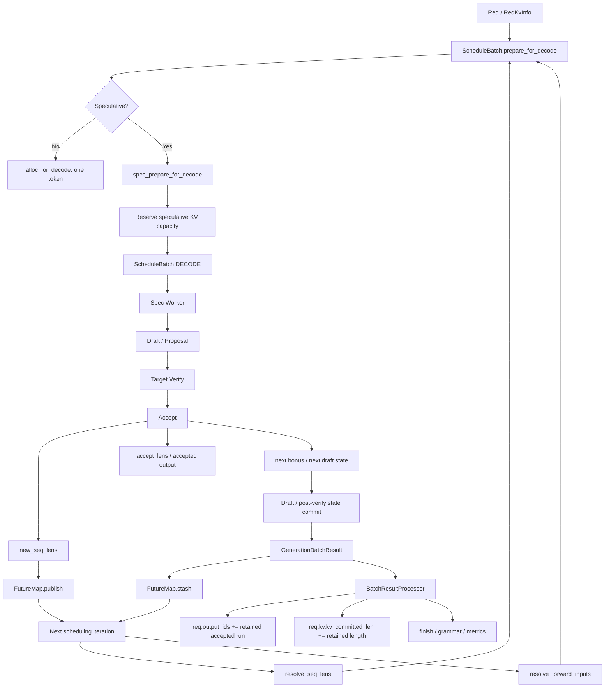

# SGLang Speculative Decoding Scheduler 源码解析：ScheduleBatch 如何管理 Draft、Verify、Accept 状态机？

前面的几篇文章已经分别拆过 Draft、Target Verify、Tree Attention、Accept Decision、KV Commit / Compact / Rollback，以及多卡场景下 Draft / Verify / Accept 如何保持一致。

把这些模块拼起来以后，还剩下一个更底层的问题：

> **到底是谁在驱动这一整轮 Speculative Decoding？**

直觉上很容易把它理解成：

```text
Scheduler
  ↓
调度 Draft Batch
  ↓
调度 Verify Batch
  ↓
调度 Accept Batch
  ↓
调度下一轮
```

但当前 SGLang Spec V2 的实际设计并不是这样。

更准确的结构是：

```text
                    Scheduler

                ScheduleBatch(DECODE)
                        │
                        │ 一次 run_batch()
                        ▼
              Speculative Model Worker
                        │
          ┌─────────────┼─────────────┐
          │             │             │
        Draft        Verify         Accept
          │             │             │
          └─────────────┼─────────────┘
                        │
                  Draft / State Commit
                        │
                        ▼
              GenerationBatchResult
                 /                \
                /                  \
               ▼                    ▼
       CPU Result Settle       Next-round Relay
               │                    │
               ▼                    ▼
          Req / KV ledger      FutureMap / spec_info
```

也就是说：

> **Scheduler 通常调度的是一次 speculative decode iteration，而不是分别调度 Draft、Verify、Accept 三个全局 batch；真正的 Draft → Verify → Accept 微状态机在 Spec Worker 内部展开。**

这篇文章就沿着这个边界讲清楚：

```text
Req / ReqKvInfo
       ↓
ScheduleBatch
       ↓
ForwardBatch
       ↓
Spec Worker
       ↓
GenerationBatchResult
       ↓
FutureMap + BatchResultProcessor
       ↓
下一轮
```

> **源码基线**：本文基于 `sgl-project/sglang @ 5f017ffabb6ab8d214f6a4616ee8bd98a376034a`，核对日期为 2026-09-20。重点覆盖当前 Spec V2 Scheduler、EAGLE / EAGLE3、DSpark、DFLASH、UNO、NGRAM 及 overlap relay。
>
> 本文重点不是再次解释 speculative decoding 算法，而是解释 **Scheduler ownership、跨轮时钟、KV watermark、forward transaction 与 overlap relay**。

---

## 一、先说结论：SGLang 有两层状态机，而不是一个大状态机

理解 Speculative Scheduler 最容易犯的错误，是把 Scheduler 状态和 speculative algorithm 状态混成一层。

实际上至少有两层。

### 第一层：Scheduler Macro State

Scheduler 关心的是：

```text
这个 Request 现在能不能跑？

属于 Prefill 还是 Decode？

这一轮需要多少 KV capacity？

可以和哪些 Request 组 Batch？

有没有 finished / retracted？

下一轮还要不要留在 running_batch？
```

所以 Scheduler 眼里的 Request 生命周期更接近：

```text
WAITING
   │
   ▼
PREFILL / EXTEND
   │
   ▼
RUNNING / DECODE
   │
   ├───────────────┐
   │               │
   ▼               ▼
FINISHED         RETRACT
```

这里最核心的数据结构是：

```text
Req
ScheduleBatch
```

---

### 第二层：Spec Worker Micro State

当 Scheduler 已经决定：

```text
这一轮跑 DECODE
```

以后，Spec Worker 才进一步展开：

```text
Draft / Proposal
       ↓
Target Verify
       ↓
Accept
       ↓
Device-side state commit
       ↓
Draft Extend / next-state preparation
```

例如 EAGLE V2 的入口：

[`EAGLEWorkerV2.forward_batch_generation()`](https://github.com/sgl-project/sglang/blob/5f017ffabb6ab8d214f6a4616ee8bd98a376034a/python/sglang/srt/speculative/eagle_worker_v2.py)

Decode 分支会在同一个 Scheduler iteration 内完成：

```text
draft()
  ↓
verify()
  ↓
eagle_sample()
  ↓
accepted-path commit
  ↓
_draft_extend_for_decode()
```

而 DSpark 则是：

```text
proposer.propose()
        ↓
resolve_verify_token_budget()
        ↓
schedule_layout()
        ↓
Target Verify
        ↓
accept_and_finalize()
        ↓
commit_hidden / state
```

对应：

[`DSparkWorkerV2._forward_decode()`](https://github.com/sgl-project/sglang/blob/5f017ffabb6ab8d214f6a4616ee8bd98a376034a/python/sglang/srt/speculative/dspark_components/dspark_worker_v2.py)

所以同样一个：

```text
ScheduleBatch.forward_mode = DECODE
```

进入 Spec Worker 后，内部可能创建多个不同用途的 `ForwardBatch`：

```text
ScheduleBatch(DECODE)
        │
        ├─ Draft ForwardBatch
        ├─ TARGET_VERIFY ForwardBatch
        └─ DRAFT_EXTEND_V2 ForwardBatch
```

这就是全文最重要的第一层抽象：

> **`ScheduleBatch(DECODE)` 是 Scheduler 的宏观 transaction；Draft / Verify / Accept 是这个 transaction 内部的执行阶段。**

---

### 为什么 `model_worker` 是这个边界的关键

Scheduler 初始化 Worker 时：

```python
if self.spec_algorithm.is_none() or self.draft_worker is None:
    self.model_worker = self.tp_worker
else:
    self.model_worker = self.draft_worker
```

固定源码：

[`Scheduler.init_model_worker()`](https://github.com/sgl-project/sglang/blob/5f017ffabb6ab8d214f6a4616ee8bd98a376034a/python/sglang/srt/managers/scheduler.py)

因此普通生成：

```text
Scheduler
   ↓
TpModelWorker
   ↓
Target Model
```

Speculative Decoding：

```text
Scheduler
   ↓
Spec Worker
   ├─ Draft side
   └─ Target Worker
```

Scheduler 调用的仍然只是：

```python
self.model_worker.forward_batch_generation(batch)
```

但 Spec Worker 会把这一轮展开成完整的 speculative pipeline。

---

### `ForwardMode` 也说明了两层状态

当前源码中：

```text
EXTEND
DECODE
MIXED
IDLE

TARGET_VERIFY
DRAFT_EXTEND_V2
```

其中：

```text
DECODE
```

主要是 Scheduler 层的一轮 decode transaction。

而：

```text
TARGET_VERIFY
DRAFT_EXTEND_V2
```

则是 Worker / ModelRunner 真正执行某个内部 forward 时的设备执行模式。

因此不要把：

```text
ScheduleBatch.forward_mode == DECODE
```

理解成：

> “这一轮 GPU 只做了一次普通 Decode。”

在 Spec V2 中完全不是。

---

## 二、六个核心对象与三套时钟：Overlap 下它们穵竟允许错开多少？

真正理解 Scheduler，要先分清六个对象：

```text
Req
ReqKvInfo
ScheduleBatch
ForwardBatch
GenerationBatchResult
FutureMap
```

源码自己对前两层数据流有非常明确的说明：

```text
ScheduleBatch -> ForwardBatch

ScheduleBatch:
  managed by Scheduler
  high-level scheduling data

ForwardBatch:
  managed by ModelRunner
  low-level tensor data
```

固定源码：

[`schedule_batch.py`](https://github.com/sgl-project/sglang/blob/5f017ffabb6ab8d214f6a4616ee8bd98a376034a/python/sglang/srt/managers/schedule_batch.py)

但 speculative + overlap 后，真正困难的是：

> **这些对象不再保证在任意瞬间都显示同一个 sequence length。**

这不是 bug，而是设计。

---

### `Req.seqlen`：用户逻辑序列时钟

定义非常直接：

```python
@property
def seqlen(self) -> int:
    return len(self.origin_input_ids) + len(self.output_ids)
```

所以它回答：

> **CPU Request 目前已经正式接受了多少逻辑 token？**

注意它依赖：

```text
req.output_ids
```

而 `output_ids` 是在 `BatchResultProcessor` 处理本轮结果时才增加的。

因此 overlap 下它天然是一个 **host-settled clock**。

---

### `kv_committed_len`：Host KV Ledger 的 committed boundary

`ReqKvInfo` 中：

```python
kv_committed_len: int = 0
kv_allocated_len: int = 0
```

源码注释：

```text
kv_committed_len:
KV content committed up to here,
<= kv_allocated_len
```

固定入口：

[`ReqKvInfo`](https://github.com/sgl-project/sglang/blob/5f017ffabb6ab8d214f6a4616ee8bd98a376034a/python/sglang/srt/managers/schedule_batch.py)

它回答：

> **Host bookkeeping 认为当前正式 committed 的 KV boundary 在哪里？**

Spec V2 里一个极其重要的 ownership rule 是：

```text
Draft Worker
不得自己推进 kv_committed_len
```

仓库甚至有专门的 AST-level regression test：

[`test_decode_bookkeeping_ownership.py`](https://github.com/sgl-project/sglang/blob/5f017ffabb6ab8d214f6a4616ee8bd98a376034a/test/registered/unit/spec/test_decode_bookkeeping_ownership.py)

其中明确规定：

```text
spec v2:
no pre-claim;
resolve commits the full accepted run uniformly.
```

`kv_committed_len` 的正常 Spec V2 owner 是：

```text
SchedulerBatchResultProcessor._resolve_spec_v2_tokens()
```

而不是 Draft Worker。

---

### `ScheduleBatch.seq_lens`：本轮 Device Forward Frontier

这一项最容易和前两个混淆。

Spec V2 的约定是：

```text
batch.seq_lens
=
当前这一轮 forward 能安全认为已经 KV-ready 的 prefix boundary
```

在 EAGLE / DSpark decode 中，Verify 完成后会生成：

```python
new_seq_lens = old_seq_lens + accept_lens
```

然后通过 `FutureMap.publish()` 让下一轮 device-side scheduling 提前看到这个新 frontier。

因此在 overlap 下：

```text
ScheduleBatch.seq_lens
```

可以已经是：

```text
Verify N 的新 frontier
```

而 CPU 上：

```text
Req.seqlen
Req.kv.kv_committed_len
```

还没有处理完 Verify N 的结果。

---

### 严格 Review 结论：允许错开“最多一个 Verify iteration”，不是“一个 Token”

这点源码里有非常直接的注释：

```text
kv_committed_len lags device seq_lens
by up to one verify under overlap;
the 2x window absorbs it.
```

固定源码：

[`mamba_lazy_spec_in_window()`](https://github.com/sgl-project/sglang/blob/5f017ffabb6ab8d214f6a4616ee8bd98a376034a/python/sglang/srt/managers/schedule_batch.py)

关键是：

> **one verify，不是 one token。**

如果一次 Verify 接受：

```text
accept_lens = 4
```

那么 overlap 窗口里完全可能出现：

```text
Device frontier:
ScheduleBatch.seq_lens = C + 4

Host ledger:
Req.kv.kv_committed_len = C
```

差距是：

```text
4 tokens
```

但仍然只是：

```text
1 个尚未 CPU settle 的 verify iteration
```

这和 `event_loop_overlap()` 的结构完全一致。

它最多保留一个尚未处理的上一批结果：

```text
run current batch
    ↓
append result
    ↓
process previous batch result
```

所以标准 overlap pipeline 是 **一轮 forward lookahead**。

---

### 为什么 reserve 要做 2x？

答案就在：

[`get_alloc_reserve_per_decode()`](https://github.com/sgl-project/sglang/blob/5f017ffabb6ab8d214f6ee8bd98a376034a/python/sglang/srt/mem_cache/allocation_sizing.py)

源码直接写：

```python
def get_alloc_reserve_per_decode() -> int:
    """
    The 2x is a double-buffer that absorbs
    the kv_committed_len lag in overlap mode.
    """
    return 2 * get_alloc_len_per_decode()
```

这是非常漂亮的一条设计关系。

因为 Scheduler N+1 轮做 memory planning 时：

```text
Host kv_committed_len
```

可能还只到：

```text
C
```

但 Device 实际已经通过 Verify N 前进到了：

```text
C + accepted_N
```

如果 reserve 只按一轮最大 speculative footprint：

```text
1 × alloc_len
```

就可能因为 host committed clock 落后一轮而低估下一轮 workspace。

所以当前设计使用：

```text
2 × alloc_len
```

吸收：

```text
one-verify host lag
+
current speculative working set
```

---

### `Req.seqlen` 与 `kv_committed_len` 为什么经常差 1？

这是和前一篇 root / bonus frontier 文章直接连接的地方。

在一个已经稳定进入 speculative decode 的 request 上，常见状态是：

```text
KV-ready committed prefix
|======================|

                       B
                       ▲
                 pending terminal bonus
```

其中 `B`：

```text
已经存在于 req.output_ids
```

但它自己的 KV 还要在下一轮作为 root 被 materialize。

所以一个典型 steady-state 关系是：

```text
Req.seqlen
≈
kv_committed_len + 1
```

这一格就是 pending bonus。

例如：

```text
kv_committed_len = P

Req logical tokens:
[0 ... P-1] + bonus_at_P

Req.seqlen = P + 1
```

下一轮 Target Verify 把 bonus 当 root 写入位置 `P`。

如果本轮又接受 4 个输出：

```text
D1 D2 D3 B2
```

Device 真正 materialize 的 Verify rows 是：

```text
old_bonus D1 D2 D3
```

也是 4 个。

所以 CPU settle 时：

```python
req.kv.kv_committed_len += 4
req.output_ids.extend([D1, D2, D3, B2])
```

结果仍然是：

```text
Req.seqlen
=
kv_committed_len + 1
```

新的那 `+1` 就是 `B2`。

> 这个关系是理解 active speculative request 的非常好用的心智模型，但不要把它当成所有 transition / mixed / finished 状态的全局 assert；源码真正维护的是各 owner 的 boundary contract。

---

## 三、`prepare_for_decode()`：Speculative Scheduler 先 Reserve，绝不提前 Commit

当 running batch 准备进入下一轮 decode 时：

```python
batch.prepare_for_decode()
```

普通 Decode 和 Speculative Decode 从这里分叉。

普通路径：

```text
alloc 1 token
   ↓
写 req_to_token
   ↓
kv_allocated_len += 1
kv_committed_len += 1
seq_lens += 1
```

Speculative 路径则直接交给：

```python
spec_prepare_for_decode(batch)
```

固定源码：

[`ScheduleBatch.prepare_for_decode()`](https://github.com/sgl-project/sglang/blob/5f017ffabb6ab8d214f6a4616ee8bd98a376034a/python/sglang/srt/managers/schedule_batch.py)

---

### EAGLE 做的是 speculative reserve

`spec_prepare_for_decode()` 对 EAGLE 最终调用：

```python
eagle_prepare_for_decode(batch)
```

其中：

```python
reserve = get_alloc_reserve_per_decode()

cur_kv_lens, nxt_kv_lens, num_needed_tokens =
    page_aligned_decode_alloc_lens(
        batch.reqs,
        reserve=reserve,
        ...
    )
```

随后：

```python
alloc_for_spec_decode(...)
```

固定源码：

[`eagle_prepare_for_decode()`](https://github.com/sgl-project/sglang/blob/5f017ffabb6ab8d214f6a4616ee8bd98a376034a/python/sglang/srt/speculative/eagle_utils.py)

以及：

[`alloc_for_spec_decode()`](https://github.com/sgl-project/sglang/blob/5f017ffabb6ab8d214f6a4616ee8bd98a376034a/python/sglang/srt/mem_cache/allocation.py)

真正更新的是：

```python
req.kv.kv_allocated_len =
    max(req.kv.kv_allocated_len, nxt_kv_len)
```

没有：

```text
kv_committed_len += speculative width
```

所以：

```text
Prepare
=
Reserve Future Capacity
```

而不是：

```text
Prepare
=
Declare Future Correct
```

---

### 两个 watermark 的职责完全不同

```text
kv_allocated_len
```

回答：

> **这一轮 speculative working set 最多可以写到哪里？**

而：

```text
kv_committed_len
```

回答：

> **Target 已经正式确认到哪里？**

因此：

```text
allocation
```

发生在 Draft / Verify 之前。

而：

```text
host commit
```

必须等 Accept 结果 settle 以后。

这就是 speculative memory bookkeeping 最核心的安全边界。

---

### 一个典型状态

```text
0
│
├──────── committed ────────┤──────── reserve ────────┤
│                           │                          │
                            C                          A
                            ▲                          ▲
                    kv_committed_len          kv_allocated_len
```

Draft / Verify 可以在：

```text
[C, A)
```

里临时写 future。

但只有 Accept 决定的那一段最终会成为下一轮 committed prefix。

---

## 四、一轮 `ScheduleBatch(DECODE)` 内部发生什么，以及 `on_publish()` 到底发布的是什么？

现在进入真正的一轮运行。

Scheduler 主循环大致是：

```text
get_next_batch_to_run()
        ↓
prepare_for_decode()
        ↓
run_batch()
        ↓
process_batch_result()
```

开启 Spec V2 后：

```text
run_batch()
   ↓
self.model_worker.forward_batch_generation()
```

这里的 `model_worker` 已经是 speculative orchestrator。

---

### EAGLE：一次 Scheduler DECODE 包含 Draft → Verify → Accept → Draft Extend

Decode 分支：

```text
ScheduleBatch(DECODE)
        ↓
draft()
        ↓
EagleVerifyInput
        ↓
verify()
        ↓
eagle_sample()
        ↓
accept_lens / accept_index / new_seq_lens
        ↓
_draft_extend_for_decode()
        ↓
GenerationBatchResult
```

Verify 内部会临时把 forward 变成：

```text
TARGET_VERIFY
```

并创建 Target Model 用的 `ForwardBatch`。

因此：

```text
Scheduler Macro State:
DECODE

Worker Micro State:
DRAFT
→ TARGET_VERIFY
→ ACCEPT
→ DRAFT_EXTEND
```

两层状态机不能混在一起。

---

### DSpark：内部算法完全不同，但 Scheduler Contract 一样

DSpark `_forward_decode()`：

```text
Proposal
  ↓
Confidence
  ↓
Verify Budget
  ↓
schedule_layout()
  ↓
Target Verify
  ↓
accept_and_finalize()
  ↓
commit_hidden / Mamba state
```

最后仍然返回：

```python
GenerationBatchResult(
    next_token_ids=...,
    accept_lens=...,
    next_draft_input=...,
    new_seq_lens=...,
)
```

这就是 Scheduler abstraction 的价值。

Scheduler 不需要知道：

```text
EAGLE Tree 是怎么长的
```

也不需要知道：

```text
DSpark Planner 怎么决定 verify token budget
```

它只要求算法最后回答：

```text
本轮接受了什么？
下一轮 frontier 在哪？
下一轮 draft state 是什么？
```

---

### 严格 Review：所有 `on_publish(new_seq_lens)` 的语义边界是一致的，但物理位置不完全一致

这是第二个 Review 点最重要的结论。

#### EAGLE / Multi-layer EAGLE / Frozen-KV MTP

它们都是：

```text
Target Verify
    ↓
Accept / new_seq_lens known
    ↓
on_publish(new_seq_lens)
    ↓
Draft Extend
```

源码注释甚至直接写：

```text
Publish before draft_extend
so the fence is at verify-end.
```

因此 publish 边界是：

> **Verify / Accept 已经确定 next frontier。**

不是：

> Draft side 已经全部追平。

---

#### DSpark

DSpark 更能说明这个 distinction。

顺序是：

```text
accept_and_finalize()
        ↓
on_publish(accept.new_seq_lens)
        ↓
_commit_target_mamba_states_after_verify()
        ↓
commit_hidden()
```

也就是说：

> **publish 甚至发生在部分 target-side post-verify state commit 之前。**

固定源码：

[`DSparkWorkerV2._forward_decode()`](https://github.com/sgl-project/sglang/blob/5f017ffabb6ab8d214f6a4616ee8bd98a376034a/python/sglang/srt/speculative/dspark_components/dspark_worker_v2.py)

所以绝不能把：

```text
on_publish
```

解释成：

```text
“本轮所有 device commit 已经完成”
```

---

#### DFLASH

DFLASH 又稍微不同：

```text
Verify / Accept
      ↓
必要时更新 target Mamba state
      ↓
on_publish(new_seq_lens)
      ↓
把 accepted target hidden materialize 到 draft KV
```

因此 publish 仍然位于：

```text
next frontier 已经确定
```

和：

```text
全部后处理都做完
```

之间。

---

#### NGRAM / UNO

NGRAM 在 accepted target KV move 完成后 publish，然后再更新 host-side ngram corpus。

UNO 在 acceptance 算出 `new_seq_lens` 后直接 publish。

它们虽然具体 placement 不同，但共同 contract 一样：

> **`on_publish(new_seq_lens)` 表示“下一轮 Scheduler 已经可以安全知道 sequence frontier 是多少”，而不是“当前 Worker 已经完全 return”。**

---

### 为什么这样仍然安全？

因为 publish 主要允许：

```text
schedule_stream
```

提前做下一轮 host / allocation planning。

它并不会让下一次 model forward 穿越当前 forward stream 中尚未完成的：

```text
Draft Extend
Mamba commit
hidden materialization
```

这些操作仍然按 forward stream 的程序顺序执行。

所以时序可以是：

```text
Forward Stream:
Verify N
   ↓
Accept N
   ↓
publish(frontier N)
   ↓
Draft/State Commit N
   ↓
Forward N+1


Schedule Stream:
             publish fence
                   ↓
          Prepare Schedule N+1
```

真正 overlap 的是：

```text
CPU / schedule preparation
```

和：

```text
当前 Worker 剩余 device work
```

而不是让两个依赖状态的 model forward 乱序。

---

### Prefill 的 publish 也遵守同一个思想

EAGLE / DFLASH / DSpark prefill 路径中：

```text
Target Prefill
      ↓
new_seq_lens = batch.seq_lens
      ↓
publish()
      ↓
Draft prefill / hidden injection
```

为什么这里没有 `+1`？

因为 Spec V2 convention 下：

```text
batch.seq_lens
=
当前已经 KV-ready 的 prompt boundary
```

Target Prefill 采样出来的 next token 只是：

```text
下一轮 pending root / bonus
```

它还不属于 KV-ready prefix。

所以下一轮 Verify 的 frontier 仍然就是：

```text
batch.seq_lens
```

这和 Decode 中 terminal bonus 的 frontier 语义完全一致。

---

## 五、`_forward_isolation()`：Spec Worker 可以临时改 ScheduleBatch，但一律不能偷走 Scheduler Ownership

这是第三个 Strict Review 点。

Spec Worker 在一轮内部会临时修改大量 `ScheduleBatch` 字段：

```text
forward_mode

input_ids

seq_lens
seq_lens_cpu
seq_lens_sum

spec_info

out_cache_loc

sampling_info
...
```

例如：

```text
DECODE
  ↓
TARGET_VERIFY
```

或者临旵：

```text
batch.spec_info = EagleVerifyInput
```

如果这些 worker-internal mutation 泄漏回 Scheduler，下一轮就可能被错误地识别为：

```text
EXTEND
TARGET_VERIFY
```

甚至造成重复 merge / 错误 allocation。

---

### 严格 Review 结论：Spec V2 不是“回滚几个字段”，而是回滚整个 ScheduleBatch dataclass

`Scheduler._forward_isolation()` 当前实现：

```python
snapshot_v2_full = not batch.spec_algorithm.is_none()

sched_snapshot = {
    f.name: getattr(batch, f.name)
    for f in dataclasses.fields(batch)
}
```

退出时：

```python
for name, value in sched_snapshot.items():
    setattr(batch, name, value)
```

固定源码：

[`Scheduler._forward_isolation()`](https://github.com/sgl-project/sglang/blob/5f017ffabb6ab8d214f6a4616ee8bd98a376034a/python/sglang/srt/managers/scheduler.py)

因此最准确的表述不是：

> “forward_mode / spec_info 要 rollback。”

而是：

> **对 Spec V2，ScheduleBatch 的全部 dataclass fields 默认都属于 Scheduler transaction state；Worker forward 期间的 mutation 结束后全部回滚。**

这是一个非常强的 ownership boundary。

---

### `sampling_info` 为什么还要额外换成 forward-only copy？

Isolation 进入前会：

```python
batch.sampling_info =
    sched_sampling_info.copy_for_forward()
```

原因是一个 Spec iteration 内部可能多次：

```text
ForwardBatch.init_new()
```

如果直接复用 Scheduler 的 sampling state，penalty 等状态可能被重复 accumulate。

因此：

```text
Scheduler sampling state
```

和：

```text
forward-local sampling view
```

也被隔离开了。

---

### Overlap 下还要保活两轮 tensor reference

`record_batch_in_overlap()` 会把：

```text
batch
+
attr_snapshot
```

保存在两槽 ring 中。

原因不是状态语义，而是 tensor lifetime。

Spec Worker 可能：

```text
rebind batch.input_ids
rebind batch.out_cache_loc
rebind batch.spec_info
```

旧 tensor Python 引用如果提前丢掉，Caching Allocator 可能在 forward stream 还没读完时复用那块显存。

所以：

```text
semantic rollback
```

和：

```text
GPU tensor lifetime
```

这里同时被 isolation 管住。

---

### 那么哪些字段最终必须显式 re-commit？

关键就在这里。

Isolation 的设计是：

```text
先全部 rollback
```

然后：

```text
只重新提交真正属于 next iteration contract 的状态
```

#### Overlap 路径

Worker 返回以后：

```python
batch.input_ids = None

batch.spec_info =
    batch_result.next_draft_input

batch.spec_info.future_indices =
    future_indices
```

但：

```text
batch.seq_lens
```

不会直接在这里赋成 `new_seq_lens`。

因为它已经通过：

```text
FutureMap.publish(new_seq_lens)
```

进入 device relay。

下一轮：

```python
future_map.resolve_seq_lens_cpu(batch)
```

再把 fresh frontier resolve 回来。

所以 overlap 的显式 commit 是：

```text
ScheduleBatch object:
next_draft_input / relay handle

FutureMap:
new_seq_lens
bonus/topk/hidden...
```

---

#### Non-overlap 路径

没有 FutureMap overlap relay，所以 isolation 结束后 Scheduler 必须显式：

```python
batch.spec_info = batch_result.next_draft_input

batch.seq_lens = batch_result.new_seq_lens

batch.seq_lens_cpu =
    batch_result.new_seq_lens.to("cpu")

batch.seq_lens_sum =
    int(batch.seq_lens_cpu.sum())

batch.input_ids = None
```

这就是同步路径中的 cross-iteration commit。

---

### 哪些字段必须保持 rollback？

最典型的有：

```text
forward_mode
```

Scheduler 外部仍然应该看到：

```text
DECODE
```

而不是 Worker 内部临时的：

```text
TARGET_VERIFY
DRAFT_EXTEND_V2
```

还有：

```text
verify-time input_ids
verify-time out_cache_loc
temporary EagleVerifyInput
temporary verify seq_lens
```

它们都属于当前 forward transaction，不应该跨轮泄漏。

---

### 可以把 `_forward_isolation()` 理解成真正的 Transaction

```text
BEGIN

ScheduleBatch(DECODE)
       │
       ├─ temporary Draft mutation
       ├─ temporary TARGET_VERIFY mutation
       ├─ temporary out_cache_loc
       ├─ temporary spec_info
       └─ temporary seq_lens view

Worker returns GenerationBatchResult

ROLLBACK
all ScheduleBatch fields

COMMIT ONLY:
  next_draft_input
  new_seq_lens relay
  next bonus / topk / hidden state

END
```

这个模型非常适合 Debug Spec V2。

---

## 六、FutureMap 的 `new_seq_lens + 1` 为什么只出现在 Mixed Tail 重建，而且它不是 DP Attention 的通用规则？

这是第四个 Review 点，也是最容易因为代码局部看起来奇怪而误解的地方。

`FutureMap.resolve_mixed_spec_tails()` 中有：

```python
fresh = self.new_seq_lens_buf[idx]

seq_lens = batch.seq_lens.clone()
seq_lens[-n:] = fresh + 1
batch.seq_lens = seq_lens
```

同时：

```python
out_cache_loc[-n:] =
    req_to_token[idx, fresh]
```

为什么这里突然：

```text
new_seq_lens + 1
```

？

前面明明一直说：

```text
new_seq_lens
=
next KV-ready frontier
```

---

### 先看 Mixed Chunk 在做什么

当 chunked prefill 开启 mixed mode 时：

```text
new prefill requests
+
running decode requests
```

会被塞进同一个：

```text
ForwardMode.MIXED
```

batch。

running decode request 此时不是按 speculative Verify 的形态运行，而是被临时改写成：

```text
1-token EXTEND tail
```

`mix_with_running()` 明确写：

```text
a tail's prefix is its row length - 1
```

Spec 路径还写：

```text
Spec rows sit at the committed base
```

---

### 对 speculative request 来说，那个“1 token tail”是什么？

就是当前 pending bonus。

假设 FutureMap fresh frontier 是：

```text
C
```

代表：

```text
[0, C)
```

已经 KV-ready。

而：

```text
bonus
```

位于：

```text
position C
```

还没有 materialize KV。

Mixed EXTEND 要做的正是：

```text
prefix:
[0, C)

extend token:
bonus at C
```

所以 Extend 语义下的 full sequence length 必须是：

```text
C + 1
```

于是：

```python
seq_lens = fresh + 1
```

完全正确。

与此同时：

```python
out_cache_loc =
    req_to_token[idx, fresh]
```

就是 bonus 在位置 `C` 的写入 slot。

可以画成：

```text
FutureMap new_seq_lens = C

KV-ready:
|====================|
0                    C

                     B
                     ▲
               pending bonus


Mixed 1-token EXTEND:

prefix_len = C

input = B

write position = C

full seq_len = C + 1
```

所以这个 `+1` 的本质不是：

> “FutureMap 的 seq_len 定义变了。”

而是：

> **同一个 KV-ready frontier 被转换成 one-token EXTEND 的 post-write length。**

---

### 为什么 Result Processor 还要专门 `kv_committed_len += 1`？

因为这次 Mixed EXTEND 真的把 pending bonus 的 KV materialize 了。

`process_batch_result_prefill()` 有唯一的特殊 owner：

```python
if (
    not req.finished()
    and batch.decoding_reqs
    and req in batch.decoding_reqs
    and not batch.spec_algorithm.is_none()
):
    req.kv.kv_committed_len += 1
```

源码注释：

```text
A mixed spec tail committed its pending bonus token;
advance so the next spec prepare_for_decode
reserves from the right base.
```

固定源码：

[`SchedulerBatchResultProcessor.process_batch_result_prefill()`](https://github.com/sgl-project/sglang/blob/5f017ffabb6ab8d214f6a4616ee8bd98a376034a/python/sglang/srt/managers/scheduler_components/batch_result_processor.py)

这再次证明：

```text
+1
```

是 “pending bonus 被当前 EXTEND 真正 commit” 的局部语义。

---

### 为什么不是所有 FutureMap resolve 都 `+1`？

普通 speculative decode 下一轮仍然要把 pending bonus 当：

```text
Verify root
```

它需要的 prefix frontier 就是：

```text
C
```

而不是：

```text
C + 1
```

如果你提前把：

```text
ScheduleBatch.seq_lens = C + 1
```

那等于宣称 bonus 的 KV 已经存在。

但实际上它还没 forward。

所以普通 next-spec iteration 必须：

```text
seq_lens = new_seq_lens
```

只有：

```text
Mixed batch 把 bonus 直接变成一枚 EXTEND input
```

时才需要：

```text
new_seq_lens + 1
```

---

### 这个 `+1` 也不是 DP Attention 的通用规则

这次 Review 还发现一个需要特别澄清的点。

当前 Scheduler 在：

```text
spec + DP Attention
```

下明确写：

```text
make sure prefill and decode batches
will not be mixed
```

在 `get_next_batch_to_run()` 中，Spec + DP-attention 会在 merge 前先协调 prefill/decode mode，避免把它们走成普通 mixed chunk。

固定源码：

[`Scheduler.get_next_batch_to_run()` 附近](https://github.com/sgl-project/sglang/blob/5f017ffabb6ab8d214f6a4616ee8bd98a376034a/python/sglang/srt/managers/scheduler.py)

DP Attention 还有另一条路径：

```python
maybe_convert_decode_to_extend()
```

当别的 DP rank 正在跑 extend、而当前 rank 是 decode 时，为了保持 mode-homogeneous、复用 extend graph，它会把整个 decode batch 临时转换成：

```text
1-token EXTEND view
```

对应：

[`SchedulerDPAttnAdapter.maybe_convert_decode_to_extend()`](https://github.com/sgl-project/sglang/blob/5f017ffabb6ab8d214f6a4616ee8bd98a376034a/python/sglang/srt/managers/scheduler_components/dp_attn.py)

这条路径调用：

```python
batch.convert_decode_to_extend()
```

它直接把当前 prepared `seq_lens` 解释成 full sequence length：

```text
prefix = seq_len - 1
extend_len = 1
```

它不是：

```text
FutureMap.resolve_mixed_spec_tails()
```

因此更准确的结论是：

> **`new_seq_lens + 1` 是“overlap mixed-chunk speculative tail late-binding”的局部转换规则，不是 FutureMap 的通用 seq_len 定义，也不是 DP Attention 的通用规则。**

---

### 为什么要 late-bind？

因为 mixed batch 在 schedule time 构造时：

```text
CPU Req clock
```

可能还落后于 GPU 最新 verify。

所以 `mix_with_running()` 只能先拿 host request state 做一个 provisional tail。

到了真正 forward entry：

```python
resolve_forward_inputs()
```

才有资格等待 `publish_ready` 并读取：

```text
FutureMap.new_seq_lens_buf
```

于是重新绑定：

```text
fresh prefix
fresh out_cache_loc
fresh seq_lens
```

这就是：

```text
late binding
```

真正存在的原因。

---

## 七、把整个 Scheduler 状态机串起来：它管理的是 Past、Present 与 Future 三个边界

现在可以把全文压缩成一张图。



这张图里真正存在三类“时间”。

### Past：CPU 已经 settle 的事实

```text
Req.output_ids

Req.kv.kv_committed_len
```

这是：

```text
Committed Past
```

---

### Present：这一轮 Scheduler Transaction

```text
ScheduleBatch

ForwardBatch

temporary TARGET_VERIFY / DRAFT_EXTEND states
```

这是：

```text
Executing Present
```

---

### Future：CPU 还没 settle，但下一轮 GPU 已经可以依赖的结果

```text
FutureMap.new_seq_lens

FutureMap.output_tokens_buf

next_draft_input

topk / hidden / confidence ...
```

这是：

```text
Safe Future
```

Spec V2 Scheduler 的核心价值，就是允许：

```text
Past
Present
Future
```

短暂不同步，但每一个 owner 都只能修改自己的那只时钟。

---

### 最值得记住的四个 Strict Review 结论

**第一，Overlap 下 `ScheduleBatch.seq_lens` 可以领先 `Req.kv.kv_committed_len` 最多一个 Verify iteration，而不是一个 token。**

一次 Verify 可能接受多个 token，所以数值差可以大于 1。2x speculative reserve 正是为了吸收这一轮 host committed lag。

**第二，`on_publish(new_seq_lens)` 的统一语义是“next forward frontier 已经确定”，不是“所有 device-side post-verify commit 已结束”。**

不同算法 publish 后仍可能继续 Draft Extend、Mamba commit、hidden → draft KV materialization。

**第三，`_forward_isolation()` 对 Spec V2 默认 rollback 的是整个 `ScheduleBatch` dataclass。**

Worker 的所有 mid-forward mutation 都是 transaction-local；真正跨轮的状态只能通过 `GenerationBatchResult / FutureMap / explicit recommit` 重新进入 Scheduler state。

**第四，`new_seq_lens + 1` 只属于 mixed speculative tail 的 1-token EXTEND 语义。**

`new_seq_lens` 本身仍是 KV-ready base；`+1` 表示当前 mixed forward 正在把 base 上的 pending bonus 作为一枚 extend token materialize。它既不是普通 spec decode 规则，也不是 DP Attention 的统一规则。

---

### Debug Scheduler 时建议同时打印这些字段

以后如果你真正去 Debug Spec V2 Scheduler，我会优先打印：

```text
rid

len(origin_input_ids)
len(output_ids)
Req.seqlen

req.kv.cache_protected_len
req.kv.kv_committed_len
req.kv.kv_allocated_len

batch.forward_iter
batch.forward_mode
batch.seq_lens
batch.seq_lens_cpu

type(batch.spec_info)
future_indices

result.accept_lens
result.new_seq_lens

FutureMap.new_seq_lens_buf[req_pool_idx]
FutureMap.output_tokens_buf[req_pool_idx]
```

然后先问四个问题：

```text
1. 现在看的是 Host clock 还是 Device clock？

2. 这个 field 的 owner 是 Scheduler、
   Worker、ResultProcessor 还是 FutureMap？

3. 这个值代表 committed boundary，
   allocated boundary，还是 pending bonus？

4. 当前是在普通 Decode、
   TARGET_VERIFY、
   Mixed 1-token Extend，
   还是 DP decode→extend view？
```

只要这四个问题先回答，绝大多数“为什么差 1 / 为什么多一轮 / 为什么 seq_len 不一样”的问题都会变得清楚。

---

## 源码阅读入口

固定版本：

```text
sgl-project/sglang
5f017ffabb6ab8d214f6a4616ee8bd98a376034a
```

推荐按下面顺序阅读：

| 目标 | 固定版本源码 |
| --- | --- |
| `Req / ReqKvInfo / ScheduleBatch` | [`schedule_batch.py`](https://github.com/sgl-project/sglang/blob/5f017ffabb6ab8d214f6a4616ee8bd98a376034a/python/sglang/srt/managers/schedule_batch.py) |
| `ForwardMode / ForwardBatch.init_new()` | [`forward_batch_info.py`](https://github.com/sgl-project/sglang/blob/5f017ffabb6ab8d214f6a4616ee8bd98a376034a/python/sglang/srt/model_executor/forward_batch_info.py) |
| Scheduler Event Loop / `run_batch()` | [`scheduler.py`](https://github.com/sgl-project/sglang/blob/5f017ffabb6ab8d214f6a4616ee8bd98a376034a/python/sglang/srt/managers/scheduler.py) |
| Spec Worker dispatch | [`Scheduler.init_model_worker()`](https://github.com/sgl-project/sglang/blob/5f017ffabb6ab8d214f6a4616ee8bd98a376034a/python/sglang/srt/managers/scheduler.py) |
| `_forward_isolation()` | [`scheduler.py`](https://github.com/sgl-project/sglang/blob/5f017ffabb6ab8d214f6a4616ee8bd98a376034a/python/sglang/srt/managers/scheduler.py) |
| Spec Decode Preparation | [`spec_utils.py::spec_prepare_for_decode()`](https://github.com/sgl-project/sglang/blob/5f017ffabb6ab8d214f6a4616ee8bd98a376034a/python/sglang/srt/speculative/spec_utils.py) |
| EAGLE reserve | [`eagle_utils.py::eagle_prepare_for_decode()`](https://github.com/sgl-project/sglang/blob/5f017ffabb6ab8d214f6a4616ee8bd98a376034a/python/sglang/srt/speculative/eagle_utils.py) |
| Spec KV sizing / double reserve | [`allocation_sizing.py`](https://github.com/sgl-project/sglang/blob/5f017ffabb6ab8d214f6a4616ee8bd98a376034a/python/sglang/srt/mem_cache/allocation_sizing.py) |
| Spec KV allocation | [`allocation.py::alloc_for_spec_decode()`](https://github.com/sgl-project/sglang/blob/5f017ffabb6ab8d214f6a4616ee8bd98a376034a/python/sglang/srt/mem_cache/allocation.py) |
| EAGLE V2 micro-state machine | [`eagle_worker_v2.py`](https://github.com/sgl-project/sglang/blob/5f017ffabb6ab8d214f6a4616ee8bd98a376034a/python/sglang/srt/speculative/eagle_worker_v2.py) |
| Shared EAGLE Verify | [`eagle_worker_common.py`](https://github.com/sgl-project/sglang/blob/5f017ffabb6ab8d214f6a4616ee8bd98a376034a/python/sglang/srt/speculative/eagle_worker_common.py) |
| DSpark decode state machine | [`dspark_worker_v2.py`](https://github.com/sgl-project/sglang/blob/5f017ffabb6ab8d214f6a4616ee8bd98a376034a/python/sglang/srt/speculative/dspark_components/dspark_worker_v2.py) |
| DFLASH publish / draft-KV materialization | [`dflash_worker_v2.py`](https://github.com/sgl-project/sglang/blob/5f017ffabb6ab8d214f6a4616ee8bd98a376034a/python/sglang/srt/speculative/dflash_worker_v2.py) |
| UNO publish contract | [`uno_worker_v2.py`](https://github.com/sgl-project/sglang/blob/5f017ffabb6ab8d214f6a4616ee8bd98a376034a/python/sglang